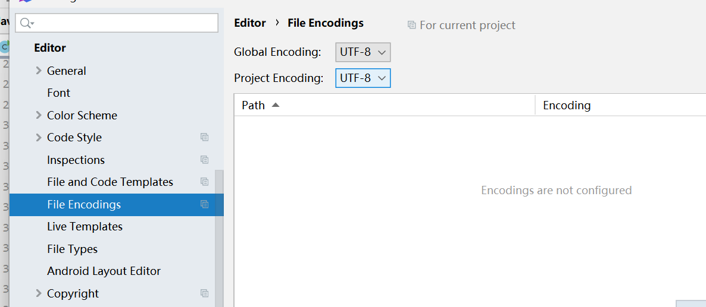

##### 课堂笔记

- 百度面试题画图弹栈

- 数组练习 
  - for求数组的最大值最小值 
  - 求最大值最小值的下标（难点多练）
  - for循环实现冒泡排序
- 快捷键
  - soutv:快捷打印输出变量
  - sout：快捷打印语句
- 面向对象练习
- 垃圾对象--被垃圾收集

## idea使用

## 快捷操作

main  产生主方法

sout 产生打印语句

soutv 打印变量名及它的值.

##### 数组求能被13整除的数据的平均值

~~~java
    public static void main1(String[] args) {
        int[] arr;
        arr = new int[8];
        for (int i = 0; i < arr.length; i++) {
            arr[i] = (int)(Math.random() * 50);
        }
        // 遍历
        for (int i = 0; i < arr.length; i++) {
            System.out.print(arr[i] + " ");
        }
        System.out.println();
        //求能被13整除的数的平均值.
        int sum = 0;
        int count = 0;
        for (int i = 0; i < arr.length; i++) {
            if (arr[i] % 13 == 0) {
                sum += arr[i];
                count++;
            }
        }
        if (count != 0) {
            int avg = sum / count;
            System.out.println("avg = " + avg);
        } else {
            System.out.println("没有能被13整除的数");
        }
    }
~~~

##### 遍历数组求最大值

~~~java
    public static void main2(String[] args) {
        int[] arr = new int[8];
        for (int i = 0; i < arr.length; i++) {
            arr[i] = (int)(Math.random() * 20);
        }
        // 遍历
        for (int i = 0; i < arr.length; i++) {
            System.out.print(arr[i] + " ");
        }
        System.out.println();
        // 0 1  2  3 4 5  6  7
        //15 11 18 0 4 19 2 16
        //找出最大值
        int max = arr[0]; // 假定第一个元素的值最大
        // 不一定它真的最大, 需要再次遍历数组的所有元素, 让所有元素再比较
        for (int i = 0; i < arr.length; i++) {
            if (arr[i] > max) { // 如果数组中某个元素的值比max还大
                max = arr[i]; // 把最大值再刷新为更大的值.
            }
        }
        System.out.println("max = " + max);
        // 找出最小值
        int min = arr[0];
        for (int i = 0; i < arr.length; i++) {
            if (arr[i] < min) {
                min = arr[i];
            }
        }
        System.out.println("min = " + min);
    }
~~~

##### 数组下标求最大最小值

~~~java
    public static void main5(String[] args) {
        int[] arr = new int[8];
        for (int i = 0; i < arr.length; i++) {
            arr[i] = (int) (Math.random() * 20);
        }
        // 遍历
        for (int i = 0; i < arr.length; i++) {
            System.out.print(arr[i] + " ");
        }
        System.out.println();
        // 0 1 2 3 4 5  6  7
        //10 5 2 8 3 8 17 15
        //找出最大值的下标
        int maxIndex = 0; // 假定0下标位置的值最大
        for (int i = 0 ; i < arr.length; i++) {
            if (arr[i] > arr[maxIndex]) { // 如果i下标位置的值大于 maxIndex下标位置的值
                maxIndex = i; // 记录下标
            }
        }
        System.out.println("最大值 : " + arr[maxIndex]);
        // 找出最小值的下标
        int minIndex = 0; // 假定0下标的值最小
        for (int i = 0; i < arr.length; i++) {
            if (arr[i] < arr[minIndex]) {
                minIndex = i;
            }
        }
        System.out.println("最小值 : " + arr[minIndex]);
    }
~~~

##### 两个for循环翻转数组

~~~java
    public static void main6(String[] args) {
        int[] arr = new int[8];
        for (int i = 0; i < arr.length; i++) {
            arr[i] = (int) (Math.random() * 20);
        }
        // 遍历
        for (int i = 0; i < arr.length; i++) {
            System.out.print(arr[i] + " ");
        }
        System.out.println();
        //0 1 2 3  4 5  6 7
        //9 0 15 8 9 14 8 4
        //反转
        //4 8 14 9 8 15 0 9
        for (int i = 0; i < arr.length / 2; i++) {
            // 交换 i和length - 1 - i位置
            int tmp = arr[i];
            arr[i] = arr[arr.length - 1 - i];
            arr[arr.length - 1 - i] = tmp;
        }
        // 遍历
        for (int i = 0; i < arr.length; i++) {
            System.out.print(arr[i] + " ");
        }
        System.out.println();
    }
~~~

##### 数组下标求能被7整除的最大最小值

~~~java
    public static void main7(String[] args) {
        int[] arr = new int[8];
        for (int i = 0; i < arr.length; i++) {
            arr[i] = (int) (Math.random() * 20);
        }
        // 遍历
        for (int i = 0; i < arr.length; i++) {
            System.out.print(arr[i] + " ");
        }
        System.out.println();
        // 以下标方式找特定数据的最大值
        int maxIndex7 = -1; // 非法下标, 意思是能被7整除的数不存在.
        for (int i = 0; i < arr.length; i++) {
            if (arr[i] % 7 == 0) {
                if (maxIndex7 == -1) { // if (第一个满足的数据) {
                    // 无条件刷新maxIndex7
                    maxIndex7 = i;
                } else { // 后面的其他的满足条件的数据
                    if (arr[i] > arr[maxIndex7]) {
                        maxIndex7 = i;
                    }
                }
            }
        }
        if (maxIndex7 == -1) {
            System.out.println("没有能被7整除的数");
        } else {
            System.out.println("能被7整除的数的最大 = " + arr[maxIndex7] + ", 下标 : " + maxIndex7);
        }
        // 找出能被7整除的数的最小值的下标.
        int minIndex7 = -1;
        for (int i = 0; i < arr.length; i++) {
            if (arr[i] % 7 == 0) {
                if (minIndex7 == -1) {
                    minIndex7 = i;
                } else {
                    if (arr[i] < arr[minIndex7]) {
                        minIndex7 = i;
                    }
                }
            }
        }
        if (minIndex7 != -1) {
            System.out.println("最小值 : " + arr[minIndex7]);
        } else {
            System.out.println("没有满足条件的数据");
        }

    }
~~~

##### 嵌套for循环遍历冒泡排-

- 注意内外层循环的次数变化

~~~java
    public static void main(String[] args) {
        int[] arr = new int[8];
        for (int i = 0; i < arr.length; i++) {
            arr[i] = (int) (Math.random() * 20);
        }
        // 遍历
        for (int i = 0; i < arr.length; i++) {
            System.out.print(arr[i] + " ");
        }
        System.out.println();
        // 冒泡排序
        for (int j = 0; j < arr.length - 1; j++) { // 外循环控制比较的趟数
            for (int i = 0; i < arr.length - 1 - j; i++) { // 内循环控制每趟的比较交换, 交换次数越来越少.
                if (arr[i] > arr[i + 1]) { // 如果左大右小, 就交换
                    int tmp = arr[i];
                    arr[i] = arr[i + 1];
                    arr[i + 1] = tmp;
                }
            }
        }
        // 遍历
        for (int i = 0; i < arr.length; i++) {
            System.out.print(arr[i] + " ");
        }
        System.out.println();
    }
~~~

## 第三章 面向对象上

#### 面向对象3条主线

​	1) 类和类的成员的研究(memeber)

​		1) 属性(field)

​		2) 方法(method)

​		3) 构造器(constructor)

​		4) 语句块(block)

​		5) 内部类(nested class)

​	2) 面向对象的三大特征

​		1) 封装(encapsulation)

​		2) 继承(inheritance)

​		3) 多态(polymorphism)

​	3) 其他关键字

​		this, super, package, import, static, final, native, abstract .....

面向对象原则  :

 	1) 有现成的对象, 直接拿来用

​	 2) 没有现成的对象, 制造一个这样的对象

总而言之就是要通过对象来完成任务

##### cpu执行时间

- 程序的 CPU 执行时间 = 指令数×CPI×Clock Cycle Time 
- CPI 每条指令的平均时钟周期数 CPI 
- 每条指令的平均时间