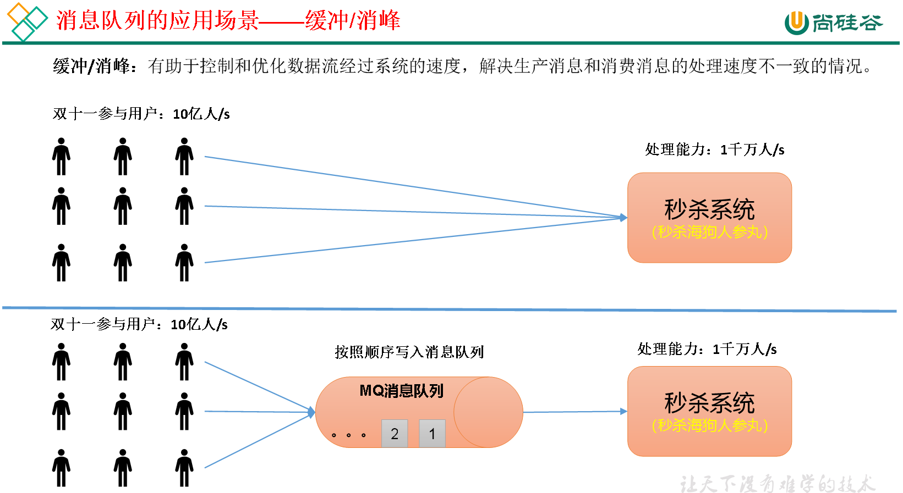
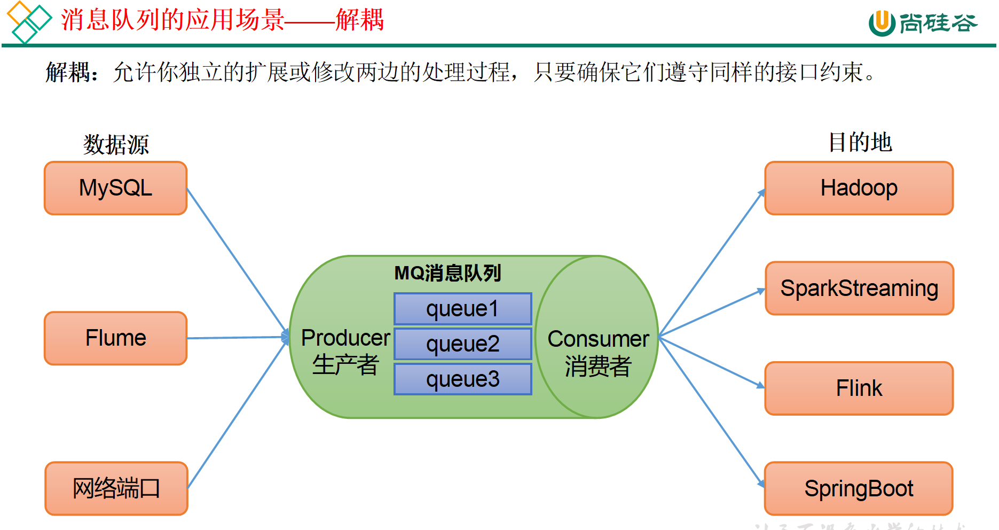
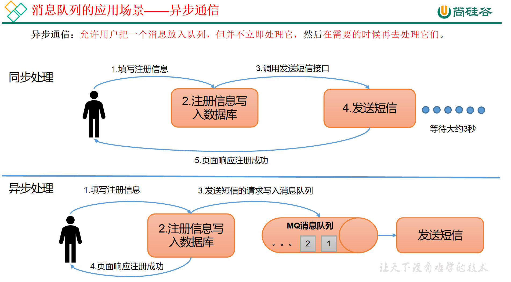
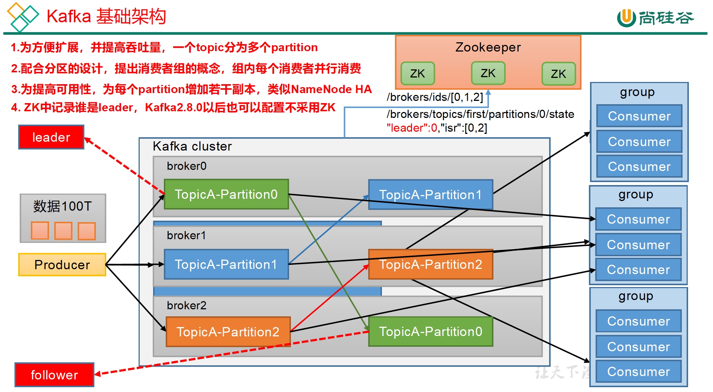
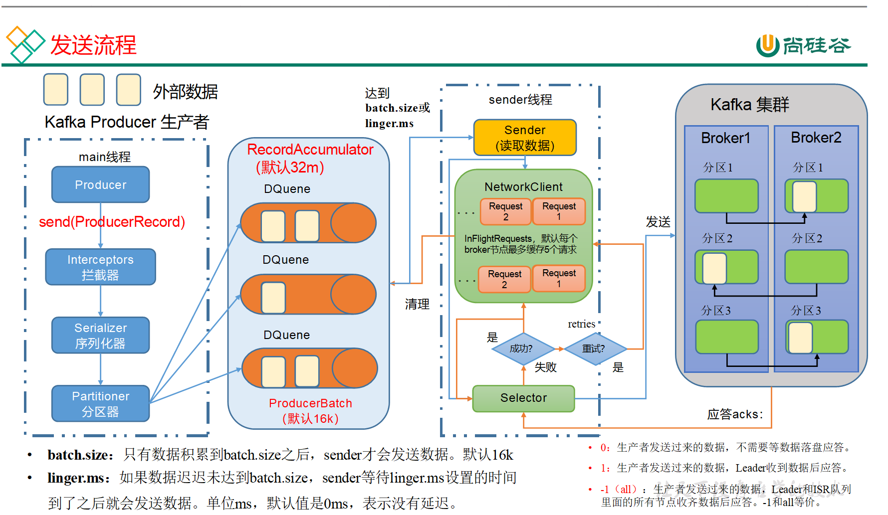
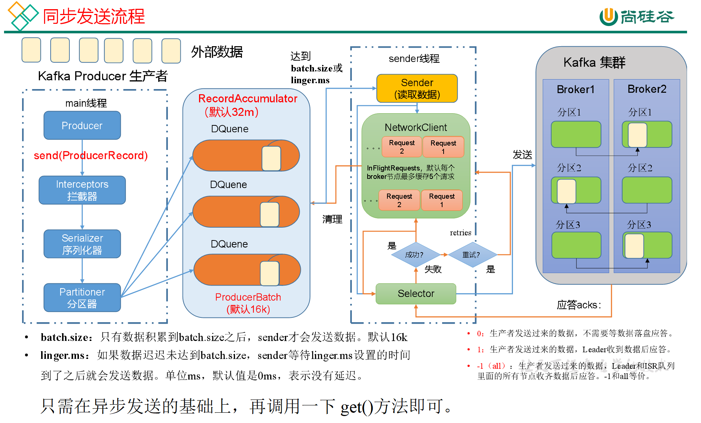
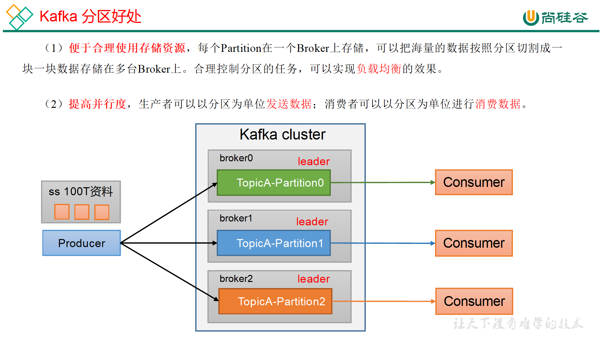
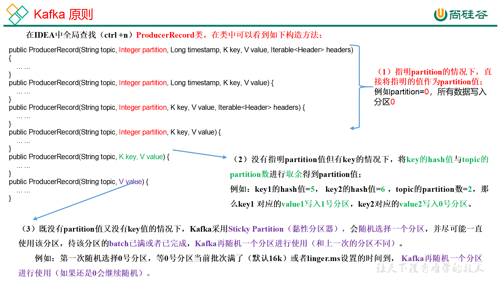

# 第1章 Kafka概述

## 1.1 定义


### 1.2.1 传统消息队列的应用场景

​		传统的消息队列的主要应用场景包括：缓存/消峰、解耦和异步通信。








### 1.2.2 消息队列的两种模式


## 1.3 Kafka基础架构



​	（1）Producer：消息生产者，就是向Kafka broker发消息的客户端。
​	（2）Consumer：消息消费者，向Kafka broker取消息的客户端。
​	（3）Consumer Group（CG）：消费者组，由多个consumer组成。消费者组内每个消费者负责消费不同分区的数据，一个分区只能由一个组内消费者消费；消费者组之间互不影响。所有的消费者都属于某个消费者组，即消费者组是逻辑上的一个订阅者。
​	（4）Broker：一台Kafka服务器就是一个broker。一个集群由多个broker组成。一个broker可以容纳多个topic。
​	（5）Topic：可以理解为一个队列，生产者和消费者面向的都是一个topic。
​	（6）Partition：为了实现扩展性，一个非常大的topic可以分布到多个broker（即服务器）上，一个topic可以分为多个partition，每个partition是一个有序的队列。
​	（7）Replica：副本。一个topic的每个分区都有若干个副本，一个Leader和若干个Follower。
​	（8）Leader：每个分区多个副本的“主”，生产者发送数据的对象，以及消费者消费数据的对象都是Leader。
​	（9）Follower：每个分区多个副本中的“从”，实时从Leader中同步数据，保持和Leader数据的同步。Leader发生故障时，某个Follower会成为新的Leader。

# 第2章 Kafka快速入门

## 2.1 安装部署

### 2.1.1 集群规划

​		**3）进入到/opt/module/kafka目录，修改配置文件**

- broker.id=0
- log.dirs=/opt/module/kafka/datas
- zookeeper.connect=hadoop102:2181,hadoop103:2181,hadoop104:2181/kafka

```shell
#broker的全局唯一编号，不能重复，只能是数字。
broker.id=0
#处理网络请求的线程数量
num.network.threads=3
#用来处理磁盘IO的线程数量
num.io.threads=8
#发送套接字的缓冲区大小
socket.send.buffer.bytes=102400
#接收套接字的缓冲区大小
socket.receive.buffer.bytes=102400
#请求套接字的缓冲区大小
socket.request.max.bytes=104857600
#kafka运行日志(数据)存放的路径，路径不需要提前创建，kafka自动帮你创建，可以配置多个磁盘路径，路径与路径之间可以用"，"分隔
log.dirs=/opt/module/kafka/datas
#topic在当前broker上的分区个数
num.partitions=1
#用来恢复和清理data下数据的线程数量
num.recovery.threads.per.data.dir=1
# 每个topic创建时的副本数，默认时1个副本
offsets.topic.replication.factor=1
#segment文件保留的最长时间，超时将被删除
log.retention.hours=168
#每个segment文件的大小，默认最大1G
log.segment.bytes=1073741824
# 检查过期数据的时间，默认5分钟检查一次是否数据过期
log.retention.check.interval.ms=300000
#配置连接Zookeeper集群地址（在zk根目录下创建/kafka，方便管理）
zookeeper.connect=hadoop102:2181,hadoop103:2181,hadoop104:2181/kafka
```

- 配置环境变量
- 分发配置文件，kafka

**7）启动集群**
	（1）**先启动Zookeeper集群，然后启动Kafka。**

```bash
[atguigu@hadoop102   kafka]$ zk.sh start 
```

（2）依次在hadoop102、hadoop103、hadoop104节点上启动Kafka。

```shell
[atguigu@hadoop102 kafka]$ bin/kafka-server-start.sh -daemon config/server.properties
[atguigu@hadoop103 kafka]$ bin/kafka-server-start.sh -daemon config/server.properties
[atguigu@hadoop104 kafka]$ bin/kafka-server-start.sh -daemon config/server.properties
```

注意：配置文件的路径要能够到server.properties。
**8）关闭集群**

```shell
[atguigu@hadoop102 kafka]$ bin/kafka-server-stop.sh 
[atguigu@hadoop103 kafka]$ bin/kafka-server-stop.sh 
[atguigu@hadoop104 kafka]$ bin/kafka-server-stop.sh 
```

​		**注意：停止Kafka集群时，一定要等Kafka所有节点进程全部停止后再停止Zookeeper集群。因为Zookeeper集群当中记录着Kafka集群相关信息，Zookeeper集群一旦先停止，Kafka集群就没有办法再获取停止进程的信息，只能手动杀死Kafka进程了。**

## 2.2 Kafka命令行操作


| 参数                                              | 描述                                 |
| ------------------------------------------------- | ------------------------------------ |
| --bootstrap-server <String: server toconnect to>  | 连接的Kafka Broker主机名称和端口号。 |
| --topic <String: topic>                           | 操作的topic名称。                    |
| --create                                          | 创建主题。                           |
| --delete                                          | 删除主题。                           |
| --alter                                           | 修改主题。                           |
| --list                                            | 查看所有主题。                       |
| --describe                                        | 查看主题详细描述。                   |
| --partitions <Integer: # of partitions>           | 设置分区数。                         |
| --replication-factor<Integer: replication factor> | 设置分区副本。                       |
| --config <String: name=value>                     | 更新系统默认的配置。                 |

​	**2）**查看当前服务器中的所有topic

```shell
[atguigu@hadoop102 kafka]$ bin/kafka-topics.sh --bootstrap-server hadoop102:9092 --list
```

3）创建first topic

```properties
[atguigu@hadoop102 kafka]$ bin/kafka-topics.sh --bootstrap-server hadoop102:9092 --create --partitions 1 --replication-factor 3 --topic first
```

**选项说明：**
	--topic 定义topic名
	--replication-factor  定义副本数
	--partitions  定义分区数
4）查看first主题的详情

```shell
[atguigu@hadoop102 kafka]$ bin/kafka-topics.sh --bootstrap-server hadoop102:9092 --describe --topic first
```

5）修改分区数（注意：分区数只能增加，不能减少）

```shell
[atguigu@hadoop102 kafka]$ bin/kafka-topics.sh --bootstrap-server hadoop102:9092 --alter --topic first --partitions 3
```

6）再次查看first主题的详情

```shell
[atguigu@hadoop102 kafka]$ bin/kafka-topics.sh --bootstrap-server hadoop102:9092 --describe --topic first
```

7）删除topic（学生自己演示）

```shell
[atguigu@hadoop102 kafka]$ bin/kafka-topics.sh --bootstrap-server hadoop102:9092 --delete --topic first
```

### 2.2.2 生产者命令行操作

1）查看操作生产者命令参数

- console： 控制台

```shell
[atguigu@hadoop102 kafka]$ bin/kafka-console-producer.sh
```

| 参数                                             | 描述                                 |
| ------------------------------------------------ | ------------------------------------ |
| --bootstrap-server <String: server toconnect to> | 连接的Kafka Broker主机名称和端口号。 |
| --topic <String: topic>                          | 操作的topic名称。                    |

2）发送消息

```shell
[atguigu@hadoop102 kafka]$ bin/kafka-console-producer.sh --bootstrap-server hadoop102:9092 --topic first

>hello world
>atguigu  atguigu
```

### 2.2.3 消费者命令行操作

1）查看操作消费者命令参数

```shell
[atguigu@hadoop102 kafka]$ bin/kafka-console-consumer.sh
```

| 参数                                             | 描述                                 |
| ------------------------------------------------ | ------------------------------------ |
| --bootstrap-server <String: server toconnect to> | 连接的Kafka Broker主机名称和端口号。 |
| --topic <String: topic>                          | 操作的topic名称。                    |
| --from-beginning                                 | 从头开始消费。                       |
| --group <String: consumer group id>              | 指定消费者组名称。                   |

2）消费消息
（1）消费first主题中的数据。

```shell
[atguigu@hadoop102 kafka]$ bin/kafka-console-consumer.sh --bootstrap-server hadoop102:9092 --topic first
```

（2）把主题中所有的数据都读取出来（包括历史数据）。

```shell
[atguigu@hadoop102 kafka]$ bin/kafka-console-consumer.sh --bootstrap-server hadoop102:9092 --from-beginning --topic first
```

# 第3章 Kafka生产者

## 3.1 生产者消息发送流程

### 3.1.1 发送原理

​		在消息发送的过程中，涉及到了两个线程——main线程和Sender线程。在main线程中创建了一个双端队列RecordAccumulator。main线程将消息发送给RecordAccumulator，Sender线程不断从RecordAccumulator中拉取消息发送到Kafka Broker。



- RecordAccuumulator:中的队列个数与分区数（数据结构）相同
- NetworkClient:中的队列个数与broker实体服务器(物理机中的副本分配情况)个数相同
- ProducerRecord: 生产记录，
- RecordAccumulater:记录池

### 3.1.2 生产者重要参数列表

| 参数名称                              | 描述                                                         |
| ------------------------------------- | ------------------------------------------------------------ |
| bootstrap.servers                     | 生产者连接集群所需的broker地址清单。例如hadoop102:9092,hadoop103:9092,hadoop104:9092，可以设置1个或者多个，中间用逗号隔开。注意这里并非需要所有的broker地址，因为生产者从给定的broker里查找到其他broker信息。 |
| key.serializer和value.serializer      | 指定发送消息的key和value的序列化类型。一定要写全类名。       |
| buffer.memory                         | RecordAccumulator缓冲区总大小，默认32m。                     |
| batch.size                            | 缓冲区一批数据最大值，默认16k。适当增加该值，可以提高吞吐量，但是如果该值设置太大，会导致数据传输延迟增加。 |
| linger.ms                             | 如果数据迟迟未达到batch.size，sender等待linger.time之后就会发送数据。单位ms，默认值是0ms，表示没有延迟。生产环境建议该值大小为5-100ms之间。 |
| acks                                  | 0：生产者发送过来的数据，不需要等数据落盘应答。1：生产者发送过来的数据，Leader收到数据后应答。-1（all）：生产者发送过来的数据，Leader+和isr队列里面的所有节点收齐数据后应答。默认值是-1，-1和all是等价的。 |
| max.in.flight.requests.per.connection | 允许最多没有返回ack的次数，默认为5，开启幂等性要保证该值是 1-5的数字。 |
| retries                               | 当消息发送出现错误的时候，系统会重发消息。retries表示重试次数。默认是int最大值，2147483647。如果设置了重试，还想保证消息的有序性，需要设置MAX_IN_FLIGHT_REQUESTS_PER_CONNECTION=1否则在重试此失败消息的时候，其他的消息可能发送成功了。 |
| retry.backoff.ms                      | 两次重试之间的时间间隔，默认是100ms。                        |
| enable.idempotence                    | 是否开启幂等性，默认true，开启幂等性。                       |
| compression.type                      | 生产者发送的所有数据的压缩方式。默认是none，也就是不压缩。 支持压缩类型：none、gzip、snappy、lz4和zstd。 |

- idempotence：幂等性，      compression: 压缩。

## 3.2 异步发送API

### 3.2.1 普通异步发送

​	1）需求：创建Kafka生产者，采用异步的方式发送到Kafka Broker


- 异步信息发送，
- 新建无骨架maven项目
- Maven项目中的xml配置文件修改配置文件，  xml【导入依赖， 完成配置，是的maven项目支出java8】

```xml
    <dependencies>
        <dependency>
            <groupId>org.apache.kafka</groupId>
            <artifactId>kafka-clients</artifactId>
            <version>3.0.0</version>
        </dependency>
    </dependencies>


    <!--编译插件，改变Maven编译版本-->
    <build>
        <!-- plugins插件的意思 ，可以定义多个插件-->
        <plugins>
            <plugin>
                <groupId>org.apache.maven.plugins</groupId>
                <!--Maven的编译插件-->
                <artifactId>maven-compiler-plugin</artifactId>
                <version>3.8.1</version>
                <!--配置插件-->
                <configuration>
                    <!--源码 java文件，使用utf-8编码-->
                    <encoding>utf-8</encoding>
                    <source>1.8</source>
                    <target>1.8</target>
                </configuration>
            </plugin>
        </plugins>
    </build>
```

- 编写不带回调函数的代码

```java
package com.atguigu.kafka.producer;

import org.apache.kafka.clients.producer.KafkaProducer;
import org.apache.kafka.clients.producer.ProducerRecord;

import java.util.Properties;

public class CustomProducer {

    public static void main(String[] args) throws InterruptedException {

        // 1. 创建kafka生产者的配置对象
        Properties properties = new Properties();

        // 2. 给kafka配置对象添加配置信息：bootstrap.servers
        properties.put(ProducerConfig.BOOTSTRAP_SERVERS_CONFIG, "hadoop102:9092");
        
        // key,value序列化（必须）：key.serializer，value.serializer
        properties.put(ProducerConfig.KEY_SERIALIZER_CLASS_CONFIG, "org.apache.kafka.common.serialization.StringSerializer");
        properties.put(ProducerConfig.VALUE_SERIALIZER_CLASS_CONFIG, "org.apache.kafka.common.serialization.StringSerializer");

        // 3. 创建kafka生产者对象
        KafkaProducer<String, String> kafkaProducer = new KafkaProducer<String, String>(properties);

        // 4. 调用send方法,发送消息
        for (int i = 0; i < 5; i++) {

            kafkaProducer.send(new ProducerRecord<>("first","atguigu " + i));

        }

        // 5. 关闭资源
        kafkaProducer.close();
    }
} 
```

### 3.2.2 带回调函数的异步发送

​		回调函数会在producer收到ack时调用，为异步调用，该方法有两个参数，分别是元数据信息（RecordMetadata）和异常信息（Exception），如果Exception为null，说明消息发送成功，如果Exception不为null，说明消息发送失败。


###### 代码

```java
public static void main(String[] args) throws InterruptedException {

    Properties properties = new Properties();
    properties.put(ProducerConfig.BOOTSTRAP_SERVERS_CONFIG, "hadoop102:9092");

    // properties.put(ProducerConfig.KEY_SERIALIZER_CLASS_CONFIG, "org.apache.kafka.common
    // .serialization" +
    //       ".StringSerializer");

    properties.put(ProducerConfig.KEY_SERIALIZER_CLASS_CONFIG, StringSerializer.class.getName());
    properties.put(ProducerConfig.VALUE_SERIALIZER_CLASS_CONFIG, StringSerializer.class.getName());


    properties.put(ProducerConfig.PARTITIONER_CLASS_CONFIG, Mypatitioner.class.getName());


    // 2, 创建生产者对象
    KafkaProducer<String, String> kafkaProducer = new KafkaProducer<String, String>(properties);

    // 发送数据是

    for (int i = 0; i < 5; i++) {
        kafkaProducer.send(new ProducerRecord<>("first", "atgugu+-----" + i),
                           new Callback() {
                               @Override
                               public void onCompletion(RecordMetadata recordMetadata, Exception e) {
                                   if (e == null){
                                       System.out.println("主题: "+ recordMetadata.topic() +"--分区: " + recordMetadata.partition());
                                   }
                               }
                           });

        Thread.sleep(200);
    }

    // 关闭资源
    kafkaProducer.close();


}
```


## 3.3 同步发送API



**代码实例**

```java
package com.atguigu.kafka.producer;

import org.apache.kafka.clients.producer.KafkaProducer;
import org.apache.kafka.clients.producer.ProducerConfig;
import org.apache.kafka.clients.producer.ProducerRecord;
import java.util.Properties;
import java.util.concurrent.ExecutionException;

public class CustomProducerSync {

    public static void main(String[] args) throws InterruptedException, ExecutionException {

        // 1. 创建kafka生产者的配置对象
        Properties properties = new Properties();

        // 2. 给kafka配置对象添加配置信息
   properties.put(ProducerConfig.BOOTSTRAP_SERVERS_CONFIG,"hadoop102:9092");

        // key,value序列化（必须）：key.serializer，value.serializer
        properties.put(ProducerConfig.KEY_SERIALIZER_CLASS_CONFIG, StringSerializer.class.getName());
        properties.put(ProducerConfig.VALUE_SERIALIZER_CLASS_CONFIG, StringSerializer.class.getName());

        // 3. 创建kafka生产者对象
        KafkaProducer<String, String> kafkaProducer = new KafkaProducer<String, String>(properties);

        // 4. 调用send方法,发送消息
        for (int i = 0; i < 10; i++) {

            // 异步发送 默认
//            kafkaProducer.send(new ProducerRecord<>("first","kafka" + i));
            // 同步发送
            kafkaProducer.send(new ProducerRecord<>("first","kafka" + i)).get();

        }

        // 5. 关闭资源
        kafkaProducer.close();
    }
}
```

## 3.4 生产者分区

### 3.4.1 分区好处






**2）案例一**
		将数据发往指定partition的情况下，例如，将所有数据发往分区1中。

```java
for (int i = 0; i < 5; i++) {
            // 指定数据发送到1号分区，key为空（IDEA中ctrl + p查看参数）
            kafkaProducer.send(new ProducerRecord<>("first", 1,"","atguigu " + i), new Callback() {
                @Override
                public void onCompletion(RecordMetadata metadata, Exception e) {
                    if (e == null){
                        System.out.println("主题：" + metadata.topic() + "->"  + "分区：" + metadata.partition()
                        );
                    }else {
                        e.printStackTrace();
                    }
                }
            });
        }
```

**3）案例二**
没有指明partition值但有key的情况下，将key的hash值与topic的partition数进行取余得到partition值。

```java
for (int i = 0; i < 5; i++) {
            // 依次指定key值为a,b,f ，数据key的hash值与3个分区求余，分别发往1、2、0
            kafkaProducer.send(new ProducerRecord<>("first", "a","atguigu " + i), new Callback() {
                @Override
                public void onCompletion(RecordMetadata metadata, Exception e) {
                    if (e == null){
                        System.out.println("主题：" + metadata.topic() + "->" + "分区：" + metadata.partition()
                        );
                    }else {
                        e.printStackTrace();
                    }
                }
            });
        }
```

### 3.4.3 自定义分区器

​	如果研发人员可以根据企业需求，自己重新实现分区器。
1）需求
例如我们实现一个分区器实现，发送过来的数据中如果包含atguigu，就发往0号分区，不包含atguigu，就发往1号分区。
2）实现步骤
​	（1）定义类实现Partitioner接口。
​	（2）重写partition()方法。

```java
    /**
     * 返回信息对应的分区
     * @param topic         主题
     * @param key           消息的key
     * @param keyBytes      消息的key序列化后的字节数组
     * @param value         消息的value
     * @param valueBytes    消息的value序列化后的字节数组
     * @param cluster       集群元数据可以查看分区信息
     * @return
     */
public class Mypatitioner implements Partitioner {
    @Override
    public int partition(String s, Object o, byte[] bytes, Object o1, byte[] bytes1, Cluster cluster) {
        // 自定义规则,所有atguigu写入0，
        String str = o1.toString();
        if (str.contains("atguigu")){
            return 0;
        }else {
            return 1;
        }

    }

    @Override
    public void close() {

    }

    @Override
    public void configure(Map<String, ?> map) {

    }
}
```

**（3）使用分区器的方法，在生产者的配置中添加分区器参数。**

```java
// 添加自定义分区器
properties.put(ProducerConfig.PARTITIONER_CLASS_CONFIG,"com.atguigu.kafka.producer.MyPartitioner");
```

```java
public class CustomProducerCallbackPartitions {

    public static void main(String[] args) throws InterruptedException {

        Properties properties = new Properties();

        properties.put(ProducerConfig.BOOTSTRAP_SERVERS_CONFIG,"hadoop102:9092");

        properties.put(ProducerConfig.KEY_SERIALIZER_CLASS_CONFIG, StringSerializer.class.getName());
        properties.put(ProducerConfig.VALUE_SERIALIZER_CLASS_CONFIG, StringSerializer.class.getName());

        // 添加自定义分区器
properties.put(ProducerConfig.PARTITIONER_CLASS_CONFIG,"com.atguigu.kafka.producer.MyPartitioner");

        KafkaProducer<String, String> kafkaProducer = new KafkaProducer<>(properties);

        for (int i = 0; i < 5; i++) {
            
            kafkaProducer.send(new ProducerRecord<>("first", "atguigu " + i), new Callback() {
                @Override
                public void onCompletion(RecordMetadata metadata, Exception e) {
                    if (e == null){
                        System.out.println("主题：" + metadata.topic() + "->" + "分区：" + metadata.partition()
                        );
                    }else {
                        e.printStackTrace();
                    }
                }
            });
        }

        kafkaProducer.close();
    }
}
```

