#                                                                                                                                                                                                                                                                                                                                                                                                                                                                                                                                                                                                                                                                                                                                                                                                                                                                                               第5章 Kafka消费者

## 5.1 Kafka消费方式

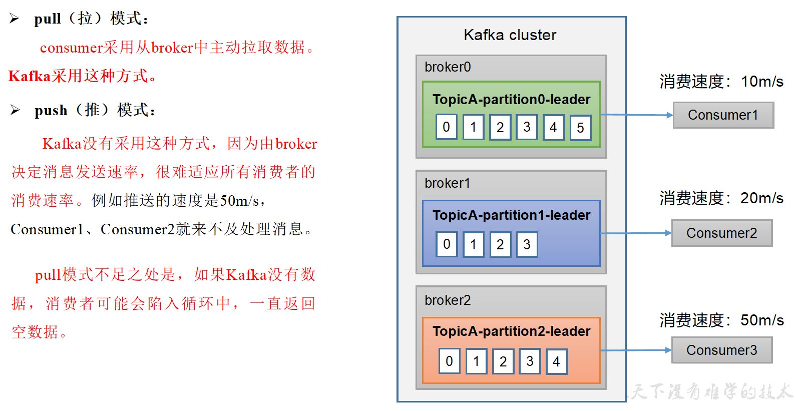

## 5.2 Kafka消费者工作流程

### 5.2.1 消费者总体工作流程


- 单个消费者成组的情况，一个消费者可消费多个topic

### 5.2.2 消费者组原理


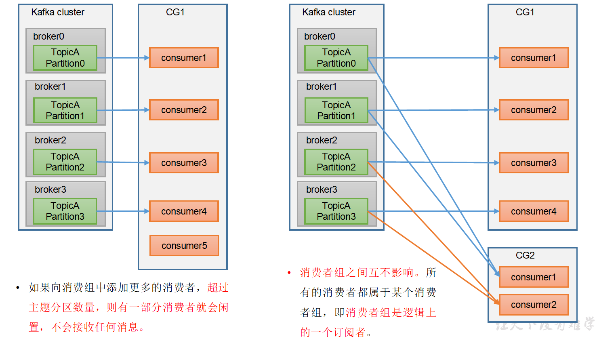


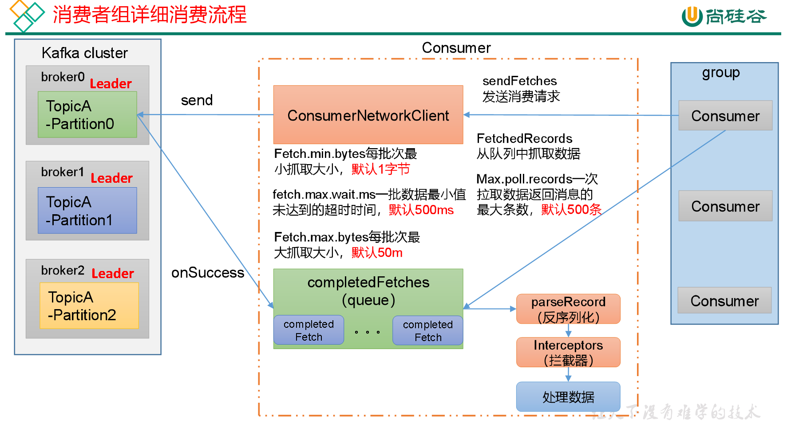

- 消费多个分区的时候，会生成多个compleedFetches队列

### 5.2.3 消费者重要参数

| 参数名称                             | 描述                                                         |
| ------------------------------------ | ------------------------------------------------------------ |
| bootstrap.servers                    | 向Kafka集群建立初始连接用到的host/port列表。                 |
| key.deserializer和value.deserializer | 指定接收消息的key和value的反序列化类型。一定要写全类名。     |
| group.id                             | 标记消费者所属的消费者组。                                   |
| enable.auto.commit                   | 默认值为true，消费者会自动周期性地向服务器提交偏移量。       |
| auto.commit.interval.ms              | 如果设置了 enable.auto.commit 的值为true， 则该值定义了消费者偏移量向Kafka提交的频率，默认5s。 |
| auto.offset.reset                    | 当Kafka中没有初始偏移量或当前偏移量在服务器中不存在（如，数据被删除了），该如何处理？ earliest：自动重置偏移量到最早的偏移量。 latest：默认，自动重置偏移量为最新的偏移量。 none：如果消费组原来的（previous）偏移量不存在，则向消费者抛异常。 anything：向消费者抛异常。 |
| offsets.topic.num.partitions         | __consumer_offsets的分区数，默认是50个分区。                 |
| heartbeat.interval.ms                | Kafka消费者和coordinator之间的心跳时间，默认3s。该条目的值必须小于 session.timeout.ms ，也不应该高于 session.timeout.ms 的1/3。 |
| session.timeout.ms                   | Kafka消费者和coordinator之间连接超时时间，默认45s。超过该值，该消费者被移除，消费者组执行再平衡。 |
| max.poll.interval.ms                 | 消费者处理消息的最大时长，默认是5分钟。超过该值，该消费者被移除，消费者组执行再平衡。 |
| fetch.min.bytes                      | 默认1个字节。消费者获取服务器端一批消息最小的字节数。        |
| fetch.max.wait.ms                    | 默认500ms。如果没有从服务器端获取到一批数据的最小字节数。该时间到，仍然会返回数据。 |
| fetch.max.bytes                      | 默认Default:	52428800（50 m）。消费者获取服务器端一批消息最大的字节数。如果服务器端一批次的数据大于该值（50m）仍然可以拉取回来这批数据，因此，这不是一个绝对最大值。一批次的大小受message.max.bytes （broker config）or max.message.bytes （topic config）影响。 |
| max.poll.records                     | 一次poll拉取数据返回消息的最大条数，默认是500条。            |

## 5.3 消费者API

### 5.3.1 独立消费者案例（订阅主题）

1）需求：
	创建一个独立消费者，消费first主题中数据。

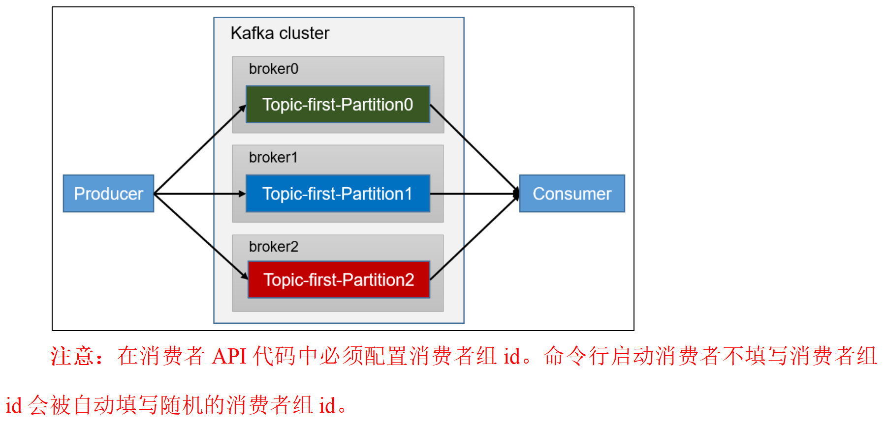

###### consumer代码

```java
package com.atguigu.kafka.consumer;

import org.apache.kafka.clients.consumer.ConsumerConfig;
import org.apache.kafka.clients.consumer.ConsumerRecord;
import org.apache.kafka.clients.consumer.ConsumerRecords;
import org.apache.kafka.clients.consumer.KafkaConsumer;

import java.time.Duration;
import java.util.ArrayList;
import java.util.Properties;

public class CustomConsumer {

    public static void main(String[] args) {

        // 1.创建消费者的配置对象
        Properties properties = new Properties();

        // 2.给消费者配置对象添加参数
        properties.put(ConsumerConfig.BOOTSTRAP_SERVERS_CONFIG, "hadoop102:9092");

        // 配置序列化 必须
properties.put(ConsumerConfig.KEY_DESERIALIZER_CLASS_CONFIG, StringDeserializer.class.getName());
        properties.put(ConsumerConfig.VALUE_DESERIALIZER_CLASS_CONFIG, StringDeserializer.class.getName());

        // 配置消费者组（组名任意起名） 必须
        properties.put(ConsumerConfig.GROUP_ID_CONFIG, "test");

        // 创建消费者对象
        KafkaConsumer<String, String> kafkaConsumer = new KafkaConsumer<String, String>(properties);

        // 注册要消费的主题（可以消费多个主题）subscribe：订阅
        ArrayList<String> topics = new ArrayList<>();
        topics.add("first");
        kafkaConsumer.subscribe(topics);

        // 拉取数据打印
        while (true) {
            // 设置1s中消费一批数据
            ConsumerRecords<String, String> consumerRecords = kafkaConsumer.poll(Duration.ofSeconds(1));

            // 打印消费到的数据
            for (ConsumerRecord<String, String> consumerRecord : consumerRecords) {
                System.out.println(consumerRecord);
            }
        }
    }
}
```

- IDEA中启动山生产者，观察消费者的情况


### 5.3.2 消费者组案例

1）需求：测试同一个主题的分区数据，只能由一个消费者组中的一个消费。

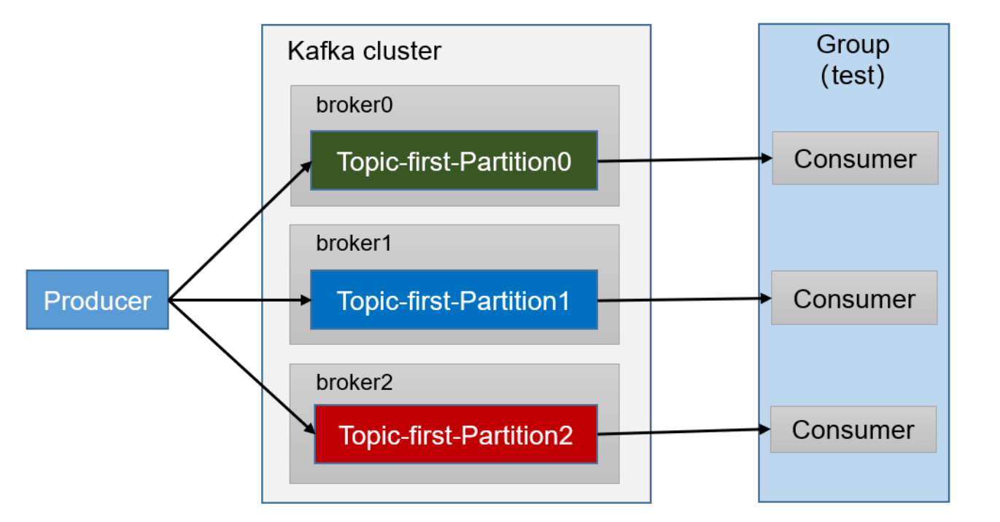

2）案例实操

​	（1）复制一份基础消费者的代码，在IDEA中同时启动，即可启动同一个消费者组中的两个消费者。

```java
package com.atguigu.kafka.consumer;

import org.apache.kafka.clients.consumer.ConsumerConfig;
import org.apache.kafka.clients.consumer.ConsumerRecord;
import org.apache.kafka.clients.consumer.ConsumerRecords;
import org.apache.kafka.clients.consumer.KafkaConsumer;

import java.time.Duration;
import java.util.ArrayList;
import java.util.Properties;

public class CustomConsumer1 {

    public static void main(String[] args) {

        // 1.创建消费者的配置对象
        Properties properties = new Properties();

        // 2.给消费者配置对象添加参数
        properties.put(ConsumerConfig.BOOTSTRAP_SERVERS_CONFIG, "hadoop102:9092");

        // 配置序列化 必须
        properties.put(ConsumerConfig.KEY_DESERIALIZER_CLASS_CONFIG, StringDeserializer.class.getName());
        properties.put(ConsumerConfig.VALUE_DESERIALIZER_CLASS_CONFIG, StringDeserializer.class.getName());

        // 配置消费者组 必须
        properties.put(ConsumerConfig.GROUP_ID_CONFIG, "test");

        // 创建消费者对象
        KafkaConsumer<String, String> kafkaConsumer = new KafkaConsumer<String, String>(properties);

        // 注册主题
        ArrayList<String> topics = new ArrayList<>();
        topics.add("first");
        kafkaConsumer.subscribe(topics);

        // 拉取数据打印
        while (true) {
            // 设置1s中消费一批数据
            ConsumerRecords<String, String> consumerRecords = kafkaConsumer.poll(Duration.ofSeconds(1));

            // 打印消费到的数据
            for (ConsumerRecord<String, String> consumerRecord : consumerRecords) {
                System.out.println(consumerRecord);
            }
        }
    }
}
```

指定消费topic的指定分区


## 5.4 生产经验——分区的分配以及再平衡

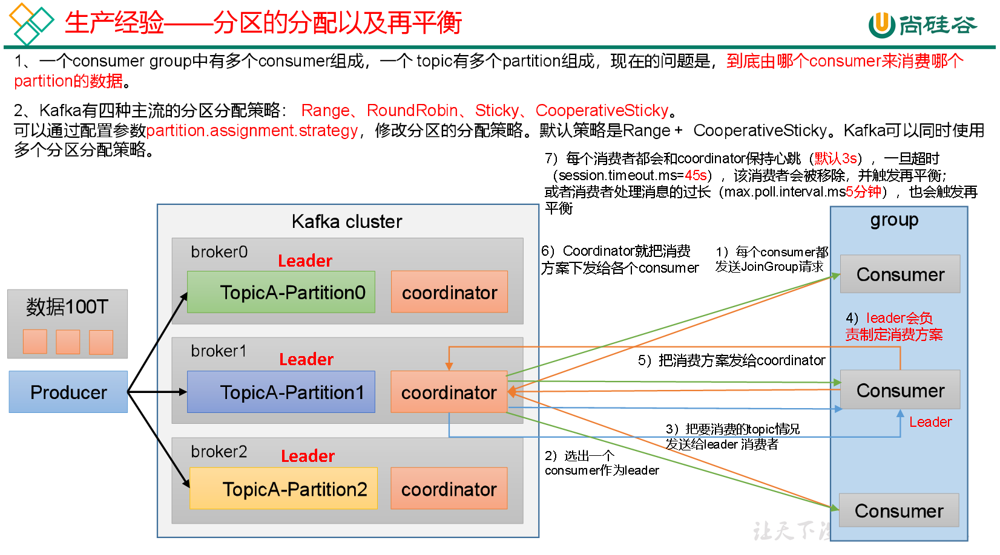

| 参数名称                      | 描述                                                         |
| ----------------------------- | ------------------------------------------------------------ |
| heartbeat.interval.ms         | Kafka消费者和coordinator之间的心跳时间，默认3s。该条目的值必须小于 session.timeout.ms，也不应该高于 session.timeout.ms 的1/3。 |
| session.timeout.ms            | Kafka消费者和coordinator之间连接超时时间，默认45s。超过该值，该消费者被移除，消费者组执行再平衡。 |
| max.poll.interval.ms          | 消费者处理消息的最大时长，默认是5分钟。超过该值，该消费者被移除，消费者组执行再平衡。 |
| partition.assignment.strategy | 消费者分区分配策略，默认策略是Range +  CooperativeSticky。Kafka可以同时使用多个分区分配策略。可以选择的策略包括：Range、RoundRobin、Sticky、CooperativeSticky |

**assignment：分配，转让**

**strategy：策略**

### 5.4.1 Range以及再平衡

1）Range分区策略原理


3）Range分区分配再平衡案例
（1）停止掉0号消费者，快速重新发送消息观看结果（45s以内，越快越好）。
		1号消费者：消费到3、4号分区数据。
		2号消费者：消费到5、6号分区数据。
		0号消费者的任务会整体被分配到1号消费者或者2号消费者。
		说明：0号消费者挂掉后，消费者组需要按照超时时间45s来判断它是否退出，所以需要等待，时间到了45s后，判断它真的退出就会把任务分配给其他broker执行。
（2）再次重新发送消息观看结果（45s以后）。
		1号消费者：消费到0、1、2、3号分区数据。
		2号消费者：消费到4、5、6号分区数据。
		说明：消费者0已经被踢出消费者组，所以重新按照range方式分配。

### 5.4.2 RoundRobin以及再平衡

1）RoundRobin分区策略原理

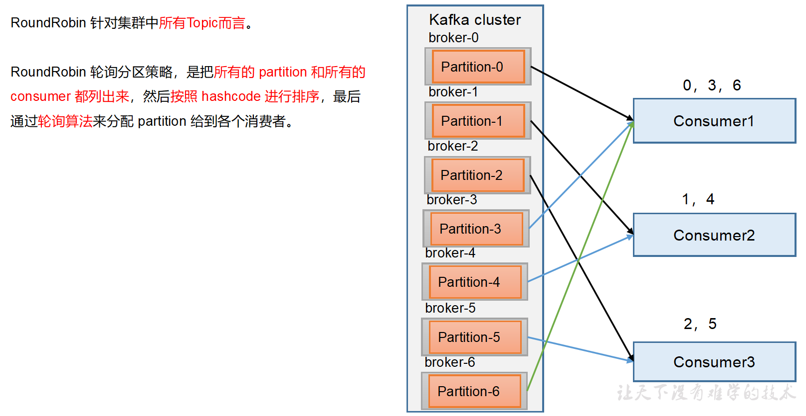

- topic少的时候，使用range策略
- topic多的时候，使用roundrobin策略

2）RoundRobin分区分配策略案例
（1）依次在CustomConsumer、CustomConsumer1、CustomConsumer2三个消费者代码中修改分区分配策略为RoundRobin。

```java
// 修改分区分配策略
properties.put(ConsumerConfig.PARTITION_ASSIGNMENT_STRATEGY_CONFIG, "org.apache.kafka.clients.consumer.RoundRobinAssignor");
```

- 一个组内的消费者，分区策略要相同

3）RoundRobin分区分配再平衡案例
（1）停止掉0号消费者，快速重新发送消息观看结果（45s以内，越快越好）。
		1号消费者：消费到2、5号分区数据
		2号消费者：消费到4、1号分区数据
		0号消费者的任务会按照RoundRobin的方式，把数据轮询分成0 、6和3号分区数据，分别由1号消费者或者2号消费者消费。
		说明：0号消费者挂掉后，消费者组需要按照超时时间45s来判断它是否退出，所以需要等待，时间到了45s后，判断它真的退出就会把任务分配给其他broker执行。
（2）再次重新发送消息观看结果（45s以后）。
	1号消费者：消费到0、2、4、6号分区数据
	2号消费者：消费到1、3、5号分区数据
	说明：消费者0已经被踢出消费者组，所以重新按照RoundRobin方式分配。

### 5.4.3 Sticky以及再平衡

​		粘性分区定义：可以理解为分配的结果带有“粘性的”。即在执行一次新的分配之前，考虑上一次分配的结果，尽量少的调整分配的变动，可以节省大量的开销。
​		粘性分区是Kafka从0.11.x版本开始引入这种分配策略，首先会尽量均衡的放置分区到消费者上面，在出现同一消费者组内消费者出现问题的时候，会尽量保持原有分配的分区不变化。

1）需求
	设置主题为first，7个分区；准备3个消费者，采用粘性分区策略，并进行消费，观察消费分配情况。然后再停止其中一个消费者，再次观察消费分配情况。
2）步骤
（1）修改分区分配策略为粘性。
			注意：3个消费者都应该注释掉，之后重启3个消费者，如果出现报错，全部停止等会再重启，或者修改为全新的消费者组。

```java
// 修改分区分配策略
ArrayList<String> startegys = new ArrayList<>();
startegys.add("org.apache.kafka.clients.consumer.StickyAssignor");

properties.put(ConsumerConfig.PARTITION_ASSIGNMENT_STRATEGY_CONFIG, startegys);
```

3）Sticky分区分配再平衡案例
（1）停止掉0号消费者，快速重新发送消息观看结果（45s以内，越快越好）。
		1号消费者：消费到2、5、3号分区数据。
		2号消费者：消费到4、6号分区数据。
		0号消费者的任务会按照粘性规则，尽可能均衡的随机分成0和1号分区数据，分别由1号消费者或者2号消费者消费。
			说明：0号消费者挂掉后，消费者组需要按照超时时间45s来判断它是否退出，所以需要等待，时间到了45s后，判断它真的退出就会把任务分配给其他broker执行。
（2）再次重新发送消息观看结果（45s以后）。
		1号消费者：消费到2、3、5号分区数据。
		2号消费者：消费到0、1、4、6号分区数据。
			说明：消费者0已经被踢出消费者组，所以重新按照粘性方式分配。

## 5.5 offset位移

### 5.5.1 offset的默认维护位置

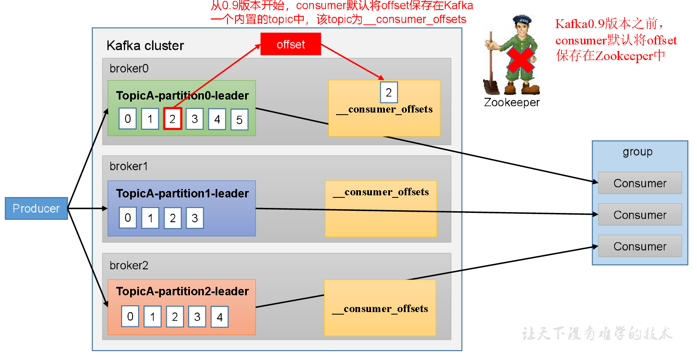

​		__consumer_offsets主题里面采用key和value的方式存储数据。key是group.id+topic+分区号，value就是当前offset的值。每隔一段时间，kafka内部会对这个topic进行compact，也就是每个group.id+topic+分区号就保留最新数据。

**1）消费offset案例**
（0）思想：__consumer_offsets为Kafka中的topic，那就可以通过消费者进行消费。
（1）在配置文件config/consumer.properties中添加配置exclude.internal.topics=false，默认是true，表示不能消费系统主题。为了查看该系统主题数据，所以该参数修改为false。

### 5.5.2 自动提交offset

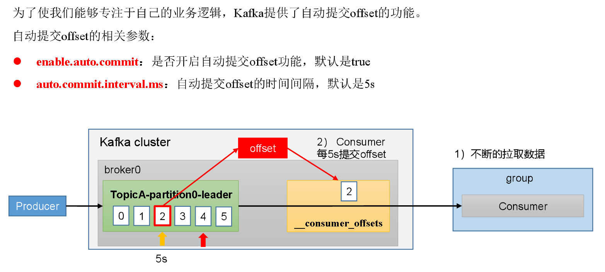

| 参数名称                | 描述                                                         |
| ----------------------- | ------------------------------------------------------------ |
| enable.auto.commit      | 默认值为true，消费者会自动周期性地向服务器提交偏移量。       |
| auto.commit.interval.ms | 如果设置了 enable.auto.commit 的值为true， 则该值定义了消费者偏移量向Kafka提交的频率，默认5s。 |

###### 自动提交代码

```java
package com.atguigu.kafka.consumer;

import org.apache.kafka.clients.consumer.ConsumerConfig;
import org.apache.kafka.clients.consumer.ConsumerRecord;
import org.apache.kafka.clients.consumer.ConsumerRecords;
import org.apache.kafka.clients.consumer.KafkaConsumer;

import java.util.Arrays;
import java.util.Properties;

public class CustomConsumerAutoOffset {

    public static void main(String[] args) {

        // 1. 创建kafka消费者配置类
        Properties properties = new Properties();

        // 2. 添加配置参数
        // 添加连接
        properties.put(ConsumerConfig.BOOTSTRAP_SERVERS_CONFIG, "hadoop102:9092");
       
        // 配置序列化 必须
properties.put(ConsumerConfig.KEY_DESERIALIZER_CLASS_CONFIG, "org.apache.kafka.common.serialization.StringDeserializer");
        properties.put(ConsumerConfig.VALUE_DESERIALIZER_CLASS_CONFIG, "org.apache.kafka.common.serialization.StringDeserializer");

        // 配置消费者组
        properties.put(ConsumerConfig.GROUP_ID_CONFIG, "test");

        // 是否自动提交offset
        properties.put(ConsumerConfig.ENABLE_AUTO_COMMIT_CONFIG, true);
        // 提交offset的时间周期1000ms，默认5s
properties.put(ConsumerConfig.AUTO_COMMIT_INTERVAL_MS_CONFIG, 1000);

        //3. 创建kafka消费者
        KafkaConsumer<String, String> consumer = new KafkaConsumer<>(properties);

        //4. 设置消费主题  形参是列表
        consumer.subscribe(Arrays.asList("first"));

        //5. 消费数据
        while (true){
            // 读取消息
            ConsumerRecords<String, String> consumerRecords = consumer.poll(Duration.ofSeconds(1));

            // 输出消息
            for (ConsumerRecord<String, String> consumerRecord : consumerRecords) {
                System.out.println(consumerRecord.value());
            }
        }
    }
}
```

### 5.5.3 手动提交offset

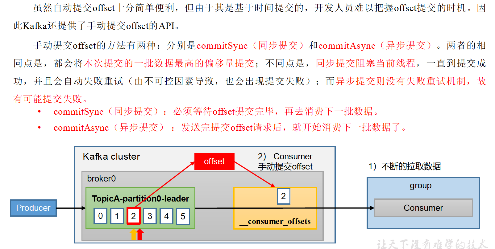

**1）同步提交offset**
由于同步提交offset有失败重试机制，故更加可靠，但是由于一直等待提交结果，提交的效率比较低。以下为同步提交offset的示例。

```java
package com.atguigu.kafka.consumer;

import org.apache.kafka.clients.consumer.ConsumerConfig;
import org.apache.kafka.clients.consumer.ConsumerRecord;
import org.apache.kafka.clients.consumer.ConsumerRecords;
import org.apache.kafka.clients.consumer.KafkaConsumer;

import java.util.Arrays;
import java.util.Properties;

public class CustomConsumerByHandSync {

    public static void main(String[] args) {
        // 1. 创建kafka消费者配置类
        Properties properties = new Properties();
        // 2. 添加配置参数
        // 添加连接
        properties.put(ConsumerConfig.BOOTSTRAP_SERVERS_CONFIG, "hadoop102:9092");

        // 配置序列化 必须
properties.put(ConsumerConfig.KEY_DESERIALIZER_CLASS_CONFIG, "org.apache.kafka.common.serialization.StringDeserializer");
        properties.put(ConsumerConfig.VALUE_DESERIALIZER_CLASS_CONFIG, "org.apache.kafka.common.serialization.StringDeserializer");

        // 配置消费者组
        properties.put(ConsumerConfig.GROUP_ID_CONFIG, "test");

        // 是否自动提交offset
        properties.put(ConsumerConfig.ENABLE_AUTO_COMMIT_CONFIG, false);

        //3. 创建kafka消费者
        KafkaConsumer<String, String> consumer = new KafkaConsumer<>(properties);

        //4. 设置消费主题  形参是列表
        consumer.subscribe(Arrays.asList("first"));

        //5. 消费数据
        while (true){

            // 读取消息
            ConsumerRecords<String, String> consumerRecords = consumer.poll(Duration.ofSeconds(1));

            // 输出消息
            for (ConsumerRecord<String, String> consumerRecord : consumerRecords) {
                System.out.println(consumerRecord.value());
            } 

            // 同步提交offset
            consumer.commitSync();
        }
    }
}
```

**2）异步提交offset**
			虽然同步提交offset更可靠一些，但是由于其会阻塞当前线程，直到提交成功。因此吞吐量会受到很大的影响。因此更多的情况下，会选用异步提交offset的方式。
以下为异步提交offset的示例：

```java
package com.atguigu.kafka.consumer;

import org.apache.kafka.clients.consumer.*;
import org.apache.kafka.common.TopicPartition;

import java.util.Arrays;
import java.util.Map;
import java.util.Properties;

public class CustomConsumerByHandAsync {

    public static void main(String[] args) {

        // 1. 创建kafka消费者配置类
        Properties properties = new Properties();

        // 2. 添加配置参数
        // 添加连接
        properties.put(ConsumerConfig.BOOTSTRAP_SERVERS_CONFIG, "hadoop102:9092");

        // 配置序列化 必须
properties.put(ConsumerConfig.KEY_DESERIALIZER_CLASS_CONFIG, "org.apache.kafka.common.serialization.StringDeserializer");
        properties.put(ConsumerConfig.VALUE_DESERIALIZER_CLASS_CONFIG, "org.apache.kafka.common.serialization.StringDeserializer");

        // 配置消费者组
        properties.put(ConsumerConfig.GROUP_ID_CONFIG, "test");

        // 是否自动提交offset
        properties.put(ConsumerConfig.ENABLE_AUTO_COMMIT_CONFIG, "false");

        //3. 创建Kafka消费者
        KafkaConsumer<String, String> consumer = new KafkaConsumer<>(properties);

        //4. 设置消费主题  形参是列表
        consumer.subscribe(Arrays.asList("first"));

        //5. 消费数据
        while (true){

            // 读取消息
            ConsumerRecords<String, String> consumerRecords = consumer.poll(Duration.ofSeconds(1));

            // 输出消息
            for (ConsumerRecord<String, String> consumerRecord : consumerRecords) {
                System.out.println(consumerRecord.value());
            }

            // 异步提交offset
            consumer.commitAsync();
        }
    }
}
```

### 5.5.4 指定Offset消费

​		auto.offset.reset = earliest | latest | none    默认是latest。
​		当Kafka中没有初始偏移量（消费者组第一次消费）或服务器上不再存在当前偏移量时（例如该数据已被删除），该怎么办？
​	（1）earliest：自动将偏移量重置为最早的偏移量，--from-beginning。
​	（2）latest（默认值）：自动将偏移量重置为最新偏移量。
​	（3）none：如果未找到消费者组的先前偏移量，则向消费者抛出异常。

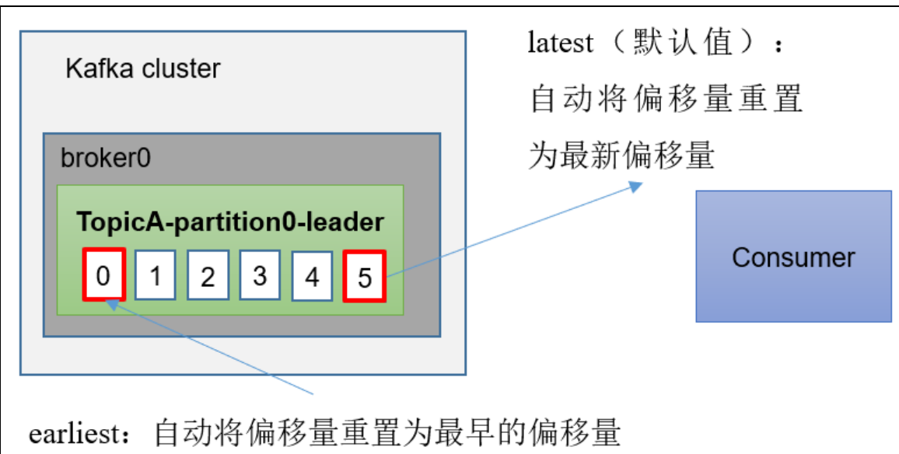


### 5.5.5 漏消费和重复消费

重复消费：已经消费了数据，但是offset没提交。
漏消费：先提交offset后消费，有可能会造成数据的漏消费。

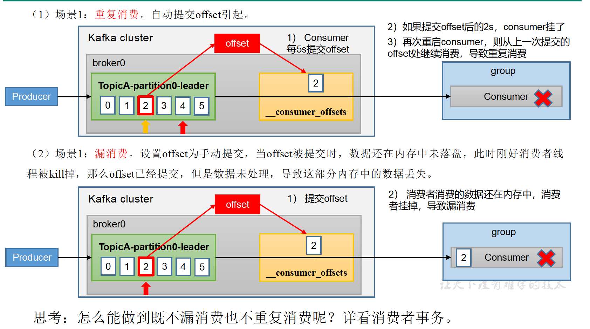

## 5.6 生产经验——消费者事务


- 消费者写出的外部系统不许支持事物
- 打破之前offset的存储位置，与消费者写出的外部系统做原子绑定，（写数据与记录offset通知成功失败）

- 假设消费者向mysql写入数据【消费者流程】
  - 开启事物
  - 向mysql写入读取的数据，
  - 通过sql语句记录offset提交的位置
  - 关闭事物
  - 写入失败，事物回滚，  写入成功，
- 消费者故障后，回复后，从mysql记录的offset位置重启，(assign+ seek)

## 5.7 生产经验——数据积压（消费者如何提高吞吐量）

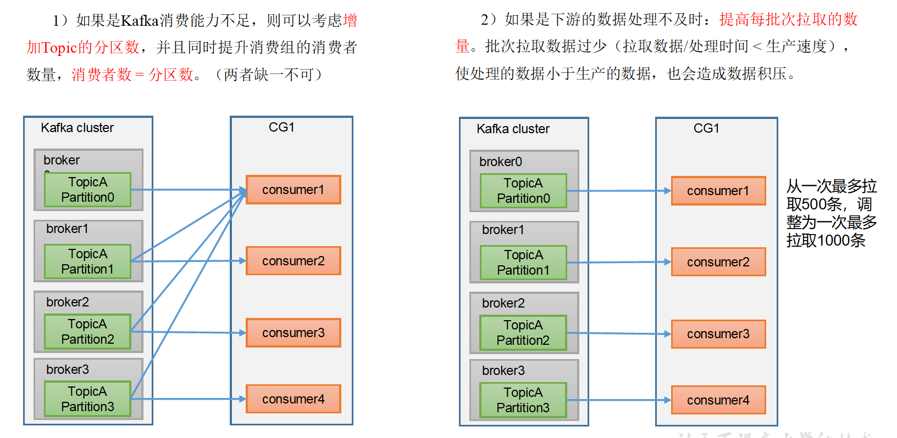

| 参数名称         | 描述                                                         |
| ---------------- | ------------------------------------------------------------ |
| fetch.max.bytes  | 默认Default:	52428800（50 m）。消费者获取服务器端一批消息最大的字节数。如果服务器端一批次的数据大于该值（50m）仍然可以拉取回来这批数据，因此，这不是一个绝对最大值。一批次的大小受message.max.bytes （broker config）or max.message.bytes （topic config）影响。 |
| max.poll.records | 一次poll拉取数据返回消息的最大条数，默认是500条              |


