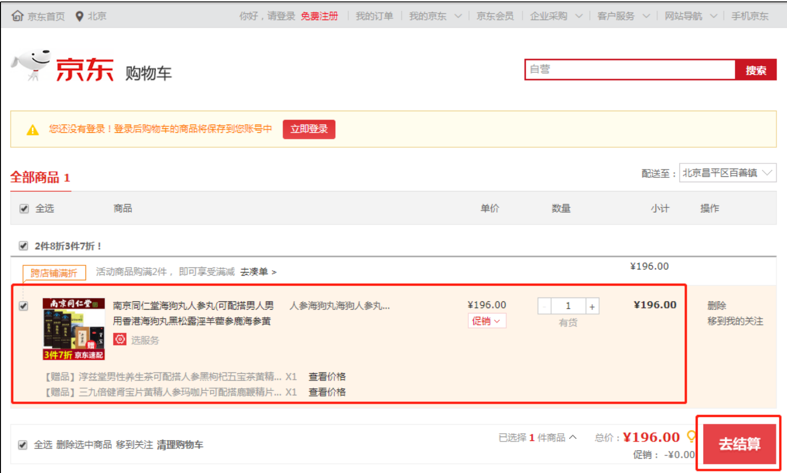
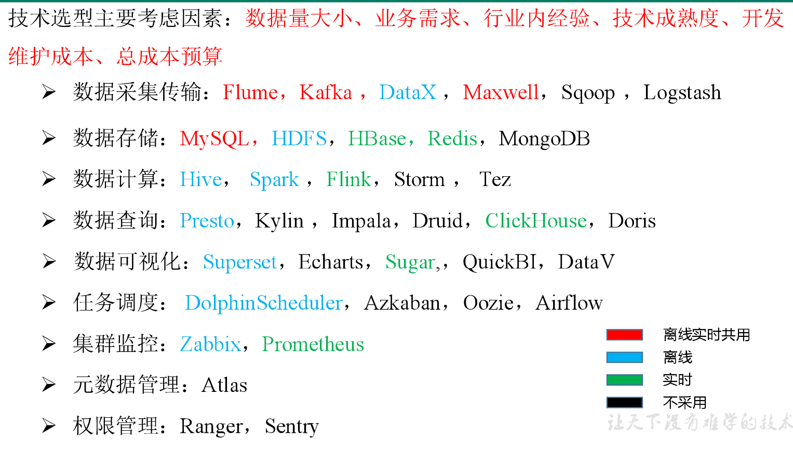
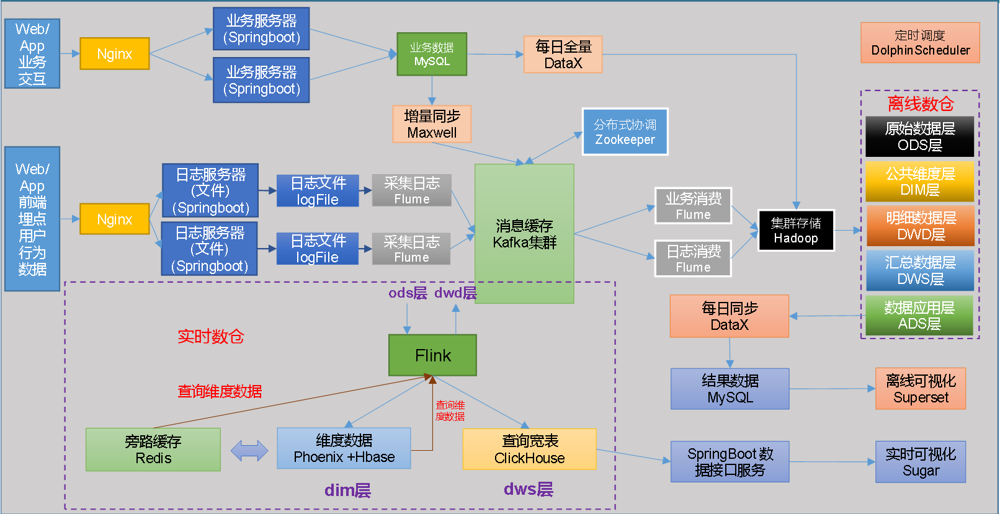
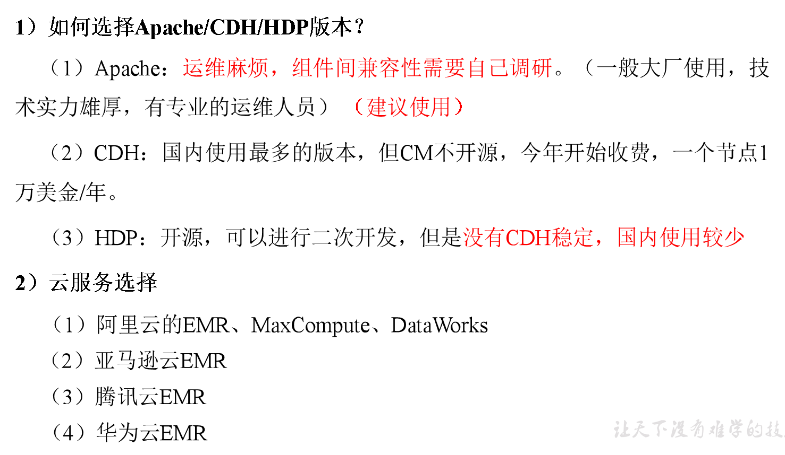
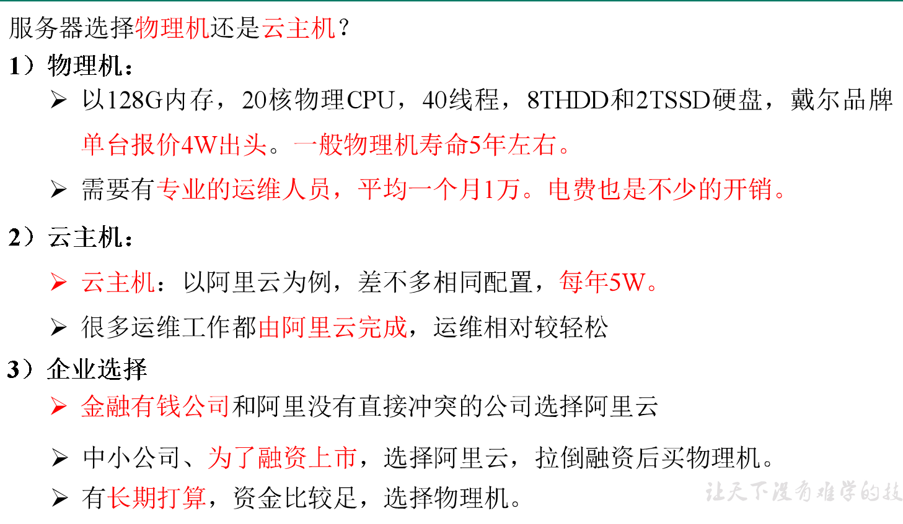
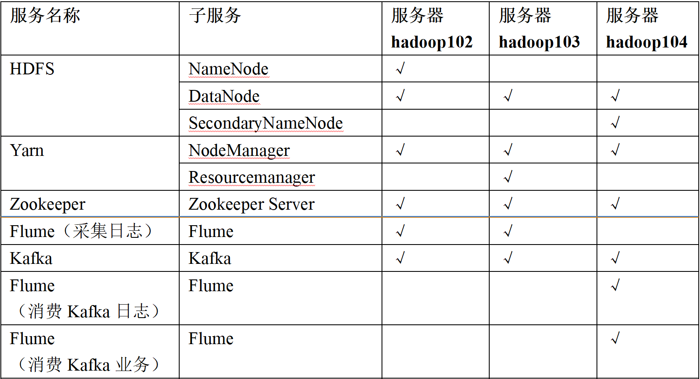
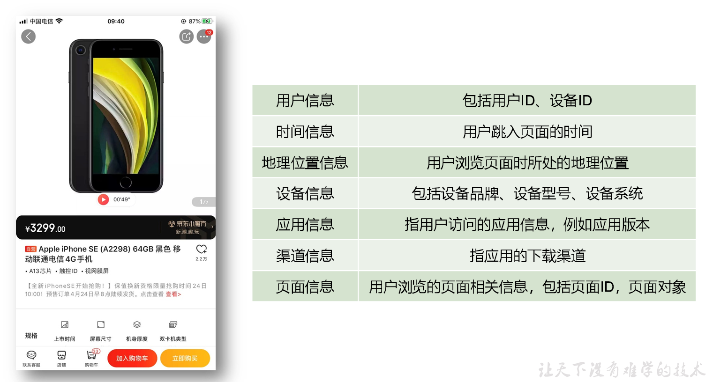
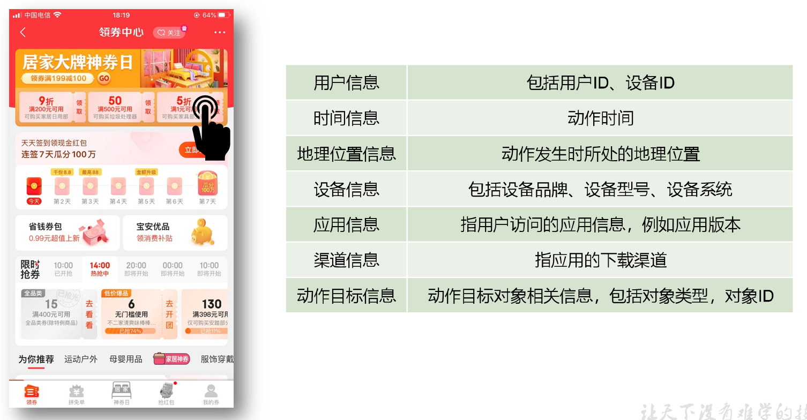

# 第1章 数据仓库概念

​		数据**仓库**（ Data Warehouse ），是**为企业制定决策，提供数据支持**的。可以帮助企业，改进业务流程、提高产品质量等。
​		数据仓库的输入数据通常包括：业务数据、用户行为数据和爬虫数据等
​		**业务数据：**就是各行业在处理事务过程中产生的数据。比如用户在电商网站中登录、下单、支付等过程中，需要和网站后台数据库进行增删改查交互，产生的数据就是业务数据。业务数据通常存储在MySQL、Oracle等数据库中。



- 采集存储

- 计算分析

  ​	**用户行为数据**：用户在使用产品过程中，通过埋点收集与客户端产品交互过程中产生的数据，并发往日志服务器进行保存。比如页面浏览、点击、停留、评论、点赞、收藏等。用户行为数据通常存储在日志文件中。

  ​	**爬虫数据：**通常是通过技术手段获取其他公司网站的数据。不建议同学们这样去做。


- ODS：备份全表，不删除ODS_yonghu_table

- DWD：数据清洗，校验字段，类型，数据脱敏
- DWS：预先聚合
- ADS：计算，业务操作，指标层

# 第2章 项目需求及架构设计

## 2.1 项目需求分析

1）采集平台
	（1）用户行为数据采集平台搭建
	（2）业务数据采集平台搭建
2）离线需求

4）思考题
	1、项目技术如何选型？
	2、框架版本如何选型（Apache、CDH、HDP）
	3、服务器使用物理机还是云主机？
	4、如何确认集群规模？（假设每台服务器8T硬盘）

## 2.2 项目框架

### 2.2.1 技术选型



- HBase， Redis：

### 2.2.2 系统数据流程设计



### 2.2.3 框架版本选型



- EMR：包含大数据框架，性能能较高，
- 选型策略，物理机+apache，   物理机+cdh/hdp， 云主机+cdh/等


### 2.2.4服务器选型



### 2.2.5 集群规模


### 2.2.6 集群资源规划设计

​		在企业中通常会搭建一套生产集群和一套测试集群。生产集群运行生产任务，测试集群用于上线前代码编写和测试。
**1）生产集群**
​	（1）消耗内存的分开
​	（2）数据传输数据比较紧密的放在一起（Kafka 、Zookeeper）
​	（3）客户端尽量放在一到两台服务器上，方便外部访问
​	（4）有依赖关系的尽量放到同一台服务器（例如：Hive和mysql）

| ***\*Master\**** | ***\*Master\**** | ***\*core\**** | ***\*core\**** | ***\*core\**** | ***\*common\**** | ***\*common\**** | ***\*common\**** |
| ---------------- | ---------------- | -------------- | -------------- | -------------- | ---------------- | ---------------- | ---------------- |
| nn               | nn               | dn             | dn             | dn             | JournalNode      | JournalNode      | JournalNode      |
| rm               | rm               | nm             | nm             | nm             |                  |                  |                  |
|                  |                  |                |                |                | zk               | zk               | zk               |
| hive             | hive             | hive           | hive           | hive           |                  |                  |                  |
|                  |                  | kafka          | kafka          | kafka          |                  |                  |                  |
| spark            | spark            | spark          | spark          | spark          |                  |                  |                  |
| datax            | datax            | datax          | datax          | datax          |                  |                  |                  |
| Ds-master        | Ds-master        | Ds-worker      | Ds-worker      | Ds-worker      |                  |                  |                  |
| maxwell          |                  |                |                |                |                  |                  |                  |
| supset           |                  |                |                |                |                  |                  |                  |
| mysql            |                  |                |                |                |                  |                  |                  |
| flume            | flume            |                |                |                |                  |                  |                  |
| flink            | flink            |                |                |                |                  |                  |                  |
|                  |                  | clickhouse     |                |                |                  |                  |                  |
|                  |                  |                | redis          |                |                  |                  |                  |
| hbase            |                  |                |                |                |                  |                  |                  |

**2）测试集群服务器规划**




# 第3章 用户行为日志

## 3.1 用户行为日志概述

​			用户行为日志的内容，主要包括用户的各项**行为信息**以及行为所处的**环境信息**。收集这些信息的主要目的是优化产品和为各项分析统计指标提供数据支撑。收集这些信息的手段通常为**埋点。**
​			目前主流的埋点方式，有**代码埋点（前端/后端）、可视化埋点、全埋点等。**
​			代码埋点是通过调用埋点SDK函数，在需要埋点的业务逻辑功能位置调用接口，上报埋点数据。例如，我们对页面中的某个按钮埋点后，当这个按钮被点击时，可以在这个按钮对应的 OnClick 函数里面调用SDK提供的数据发送接口，来发送数据。
​			可视化埋点只需要研发人员集成采集 **SDK**，不需要写埋点代码，业务人员就可以通过访问分析平台的“圈选”功能，来“圈”出需要对用户行为进行捕捉的控件，并对该事件进行命名。圈选完毕后，这些配置会同步到各个用户的终端上，由采集 SDK 按照圈选的配置自动进行用户行为数据的采集和发送。
​			**全埋点**是通过在产品中嵌入SDK，前端自动采集页面上的全部用户行为事件，上报埋点数据，相当于做了一个统一的埋点。然后再通过界面配置哪些数据需要在系统里面进行分析。

## 3.2 用户行为日志内容

​		本项目收集和分析的用户行为信息主要有**页面浏览记录、动作记录、曝光记录、启动记录和错误记录。**

### 3.2.1 页面浏览记录

​		页面浏览记录，记录的是访客对页面的浏览行为，该行为的环境信息主要有用户信息、时间信息、地理位置信息、设备信息、应用信息、渠道信息及页面信息等。



- oiad：操作系统与设备硬件的一些信息计算得到的id

### 3.2.2 动作记录

​		动作记录，记录的是用户的业务操作行为，该行为的环境信息主要有用户信息、时间信息、地理位置信息、设备信息、应用信息、渠道信息 及动作目标对象信息等。



### 3.2.3 曝光记录

​			曝光记录，记录的是曝光行为，该行为的环境信息主要有用户信息、时间信息、地理位置信息、设备信息、应用信息、渠道信息及曝光对象信息等。


### 3.2.4 启动记录

​			启动记录，记录的是用户启动应用的行为，该行为的环境信息主要有用户信息、时间信息、地理位置信息、设备信息、应用信息、渠道信息、启动类型及开屏广告信息等。


### 3.2.5 错误记录

​			启动记录，记录的是用户在使用应用过程中的报错行为，该行为的环境信息主要有用户信息、时间信息、地理位置信息、设备信息、应用信息、渠道信息、以及可能与报错相关的页面信息、动作信息、曝光信息和动作信息。

## 3.3 用户行为日志格式

​		我们的日志结构大致可分为两类，一是页面日志，二是启动日志。

### 3.3.1 页面日志

​		页面日志，以页面浏览为单位，即一个页面浏览记录，生成一条页面埋点日志。一条完整的页面日志包含，一个页面浏览记录，若干个用户在该页面所做的动作记录，若干个该页面的曝光记录，以及一个在该页面发生的报错记录。除上述行为信息，页面日志还包含了这些行为所处的各种环境信息，包括用户信息、时间信息、地理位置信息、设备信息、应用信息、渠道信息等。

- 数据格式json，页面浏览日志

```json
{
	"common": {                     -- 环境信息
		"ar": "230000",             -- 地区编码
		"ba": "iPhone",             -- 手机品牌
		"ch": "Appstore",           -- 渠道
		"is_new": "1",              -- 是否首日使用，首次使用的当日，该字段值为1，过了24:00，该字段置为0。
		"md": "iPhone 8",           -- 手机型号
		"mid": "YXfhjAYH6As2z9Iq",  -- 设备id
		"os": "iOS 13.2.9",         -- 操作系统
		"uid": "485",               -- 会员id
		"vc": "v2.1.134"            -- app版本号
	},
	"actions": [{                   -- 动作(事件)
		"action_id": "favor_add",   -- 动作id
		"item": "3",                -- 目标id
		"item_type": "sku_id",      -- 目标类型
		"ts": 1585744376605         -- 动作时间戳
	    }
	],
	"displays": [{                  -- 曝光
			"displayType": "query", -- 曝光类型
			"item": "3",            -- 曝光对象id
			"item_type": "sku_id",  -- 曝光对象类型
			"order": 1,             -- 出现顺序
			"pos_id": 2             -- 曝光位置
		},
		{
			"displayType": "promotion",
			"item": "6",
			"item_type": "sku_id",
			"order": 2,
			"pos_id": 1
		},
		{
			"displayType": "promotion",
			"item": "9",
			"item_type": "sku_id",
			"order": 3,
			"pos_id": 3
		},
		{
			"displayType": "recommend",
			"item": "6",
			"item_type": "sku_id",
			"order": 4,
			"pos_id": 2
		},
		{
			"displayType": "query ",
			"item": "6",
			"item_type": "sku_id",
			"order": 5,
			"pos_id": 1
		}
	],
	"page": {                          -- 页面信息
		"during_time": 7648,           -- 持续时间毫秒
		"item": "3", 	               -- 目标id
		"item_type": "sku_id",         -- 目标类型
		"last_page_id": "login",       -- 上页类型
		"page_id": "good_detail",      -- 页面ID
		"sourceType": "promotion"      -- 来源类型
	},                                 
	"err": {                           --错误
		"error_code": "1234",          --错误码
		"msg": "***********"           --错误信息
	},                                 
	"ts": 1585744374423                --跳入时间戳
}
```

### 3.3.2 启动日志

​		启动日志以启动为单位，及一次启动行为，生成一条启动日志。一条完整的启动日志包括一个启动记录，一个本次启动时的报错记录，以及启动时所处的环境信息，包括用户信息、时间信息、地理位置信息、设备信息、应用信息、渠道信息等。

```json
{
  "common": {
    "ar": "370000",
    "ba": "Honor",
    "ch": "wandoujia",
    "is_new": "1",
    "md": "Honor 20s",
    "mid": "eQF5boERMJFOujcp",
    "os": "Android 11.0",
    "uid": "76",
    "vc": "v2.1.134"
  },
  "start": {   
    "entry": "icon",         --icon手机图标  notice 通知   install 安装后启动
    "loading_time": 18803,  --启动加载时间
    "open_ad_id": 7,        --广告页ID
    "open_ad_ms": 3449,    -- 广告总共播放时间
    "open_ad_skip_ms": 1989   --  用户跳过广告时点
  },
"err":{                     --错误
"error_code": "1234",      --错误码
    "msg": "***********"       --错误信息
},
  "ts": 1585744304000
}
```


