###### maven配置文件

```xml
<!--编译插件，改变Maven编译版本-->
<build>
    <!-- plugins插件的意思 ，可以定义多个插件-->
    <plugins>
        <plugin>
            <groupId>org.apache.maven.plugins</groupId>
            <!--Maven的编译插件-->
            <artifactId>maven-compiler-plugin</artifactId>
            <version>3.8.1</version>
            <!--配置插件-->
            <configuration>
                <!--源码 java文件，使用utf-8编码-->
                <encoding>utf-8</encoding>
                <source>1.8</source>
                <target>1.8</target>
            </configuration>
        </plugin>
    </plugins>
</build>
```


### 4.3.2 日志采集Flume配置实操

**1）创建Flume配置文件--创建配置文件**
		在hadoop102节点的Flume的job目录下创建file_to_kafka.conf

```
[atguigu@hadoop104 flume]$ mkdir job
[atguigu@hadoop104 flume]$ vim job/file_to_kafka.conf 
```

2）内容如下

- source为：TAILDIR，监控目标文件夹中的log文件情况
- channel选用kafkfachannel，定义主机端口与yopic，直接将数据写入kafka

```properties
#定义组件
a1.sources = r1
a1.channels = c1

#配置source
a1.sources.r1.type = TAILDIR
a1.sources.r1.filegroups = f1
a1.sources.r1.filegroups.f1 = /opt/module/applog/log/app.*
a1.sources.r1.positionFile = /opt/module/flume/taildir_position.json
a1.sources.r1.interceptors =  i1
a1.sources.r1.interceptors.i1.type = com.atguigu.gmall.flume.interceptor.ETLInterceptor$Builder

#配置channel
a1.channels.c1.type = org.apache.flume.channel.kafka.KafkaChannel
a1.channels.c1.kafka.bootstrap.servers = hadoop102:9092,hadoop103:9092
a1.channels.c1.kafka.topic = topic_log
a1.channels.c1.parseAsFlumeEvent = false

#组装 
a1.sources.r1.channels = c1
```

**3）编写Flume拦截器--对json数据进行预处理**
（1）创建Maven工程flume-interceptor
（2）创建包：com.atguigu.gmall.flume.interceptor
（3）在pom.xml文件中添加如下配置

```xml
<dependencies>
    <dependency>
        <groupId>org.apache.flume</groupId>
        <artifactId>flume-ng-core</artifactId>
        <version>1.9.0</version>
        <scope>provided</scope>
    </dependency>

    <dependency>
        <groupId>com.alibaba</groupId>
        <artifactId>fastjson</artifactId>
        <version>1.2.62</version>
    </dependency>
</dependencies>

<build>
    <plugins>
        <plugin>
            <artifactId>maven-compiler-plugin</artifactId>
            <version>2.3.2</version>
            <configuration>
                <source>1.8</source>
                <target>1.8</target>
            </configuration>
        </plugin>
        <plugin>
            <artifactId>maven-assembly-plugin</artifactId>
            <configuration>
                <descriptorRefs>
                    <descriptorRef>jar-with-dependencies</descriptorRef>
                </descriptorRefs>
            </configuration>
            <executions>
                <execution>
                    <id>make-assembly</id>
                    <phase>package</phase>
                    <goals>
                        <goal>single</goal>
                    </goals>
                </execution>
            </executions>
        </plugin>
    </plugins>
</build>
```

（4）在com.atguigu.gmall.flume.utils包下创建JSONUtil类

- 工具类判断传进来的数据是不是json格式，返回true或者false

```java
package com.atguigu.gmall.flume.utils;

import com.alibaba.fastjson.JSONObject;
import com.alibaba.fastjson.JSONException;

public class JSONUtil {
/*
* 通过异常判断是否是json字符串
* 是：返回true  不是：返回false
* */
    public static boolean isJSONValidate(String log){
        try {
            JSONObject.parseObject(log);
            return true;
        }catch (JSONException e){
            return false;
        }
    }
}
```

（5）在com.atguigu.gmall.flume.interceptor包下创建ETLInterceptor类

- 编写Interceptor的实现类，用来处理处理数据，
- json个数的list要使用iterater来进行遍历，由于需要对list中的数据进行remove操作，直接使用list的remove（）方法会造成数组越界问题
- 将不符合要求的数据直接删除
- 注意要实现Builder（）： 方法

```java
package com.atguigu.gmall.flume.interceptor;

import com.atguigu.gmall.flume.utils.JSONUtil;
import org.apache.flume.Context;
import org.apache.flume.Event;
import org.apache.flume.interceptor.Interceptor;


import java.nio.charset.StandardCharsets;
import java.util.Iterator;
import java.util.List;

public class ETLInterceptor implements Interceptor {

    @Override
    public void initialize() {

    }

    @Override
    public Event intercept(Event event) {
		
		//1、获取body当中的数据并转成字符串
        byte[] body = event.getBody();
        String log = new String(body, StandardCharsets.UTF_8);
		//2、判断字符串是否是一个合法的json，是：返回当前event；不是：返回null
        if (JSONUtil.isJSONValidate(log)) {
            return event;
        } else {
            return null;
        }
    }

    @Override
    public List<Event> intercept(List<Event> list) {

        Iterator<Event> iterator = list.iterator();

        while (iterator.hasNext()){
            Event next = iterator.next();
            if(intercept(next)==null){
                iterator.remove();
            }
        }

        return list;
    }

    public static class Builder implements Interceptor.Builder{

        @Override
        public Interceptor build() {
            return new ETLInterceptor();
        }
        @Override
        public void configure(Context context) {

        }

    }

    @Override
    public void close() {

    }
}
```


- 有依赖，需要将带依赖的包复制到项目文件夹下

### 4.3.3 日志采集Flume测试

- flume监控日志文件夹，并且将数据写入了kafka，底层是实现了一个kafka的生产者
- 直启动kafka的消费者进行监控就行
- 生成模拟数据，改变文件的内容，就会将数据写入kafka

1）启动Zookeeper、Kafka集群
2）启动hadoop102的日志采集Flume

```bash
[atguigu@hadoop102 flume]$ bin/flume-ng agent -n a1 -c conf/ -f job/file_to_kafka.conf -Dflume.root.logger=info,console
```

3）启动一个Kafka的Console-Consumer

```properties
[atguigu@hadoop102 kafka]$ bin/kafka-console-consumer.sh --bootstrap-server hadoop102:9092 --topic topic_log
```

4）生成模拟数据

```properties
[atguigu@hadoop102 ~]$ lg.sh 
```

5）观察Kafka消费者是否能消费到数据

### 4.3.4 日志采集Flume启停脚本

1）分发日志采集Flume配置文件和拦截器
若上述测试通过，需将hadoop102节点的Flume的配置文件和拦截器jar包，向另一台日志服务器发送一份。

```properties
[atguigu@hadoop102 flume]$ scp -r job hadoop103:/opt/module/flume/
[atguigu@hadoop102 flume]$ scp lib/flume-interceptor-1.0-SNAPSHOT-jar-with-dependencies.jar hadoop103:/opt/module/flume/lib/
```

2）方便起见，此处编写一个日志采集Flume进程的启停脚本
在hadoop102节点的/home/atguigu/bin目录下创建脚本f1.sh

```
[atguigu@hadoop102 bin]$ vim f1.sh
```

​	在脚本中填写如下内容

```shell
#!/bin/bash

case $1 in
"start"){
        for i in hadoop102 hadoop103
        do
                echo " --------启动 $i 采集flume-------"
                ssh $i "nohup /opt/module/flume/bin/flume-ng agent -n a1 -c /opt/module/flume/conf/ -f /opt/module/flume/job/file_to_kafka.conf >/dev/null 2>&1 &"
        done
};; 
"stop"){
        for i in hadoop102 hadoop103
        do
                echo " --------停止 $i 采集flume-------"
                ssh $i "ps -ef | grep file_to_kafka | grep -v grep |awk  '{print \$2}' | xargs -n1 kill -9 "
        done

};;
esac
```

- nohup: flume启动与当前的客户端无关系，在当前的session客户端关掉的时候， 后台进程不被kill掉

3）增加脚本执行权限
[atguigu@hadoop102 bin]$ chmod 777 f1.sh
4）f1启动
[atguigu@hadoop102 module]$ f1.sh start
5）f2停止
[atguigu@hadoop102 module]$ f1.sh stop


# 第1章 电商业务简介

## 1.1 电商业务流程

​		电商的业务流程可以以一个普通用户的浏览足迹为例进行说明，用户点开电商首页开始浏览，可能会通过分类查询也可能通过全文搜索寻找自己中意的商品，这些商品无疑都是存储在后台的管理系统中的。
​		当用户寻找到自己中意的商品，可能会想要购买，将商品添加到购物车后发现需要登录，登录后对商品进行结算，这时候购物车的管理和商品订单信息的生成都会对业务数据库产生影响，会生成相应的订单数据和支付数据。
​		订单正式生成之后，还会对订单进行跟踪处理，直到订单全部完成。
​		电商的主要业务流程包括用户前台浏览商品时的商品详情的管理，用户商品加入购物车进行支付时用户个人中心&支付服务的管理，用户支付完成后订单后台服务的管理，这些流程涉及到了十几个甚至几十个业务数据表，甚至更多。

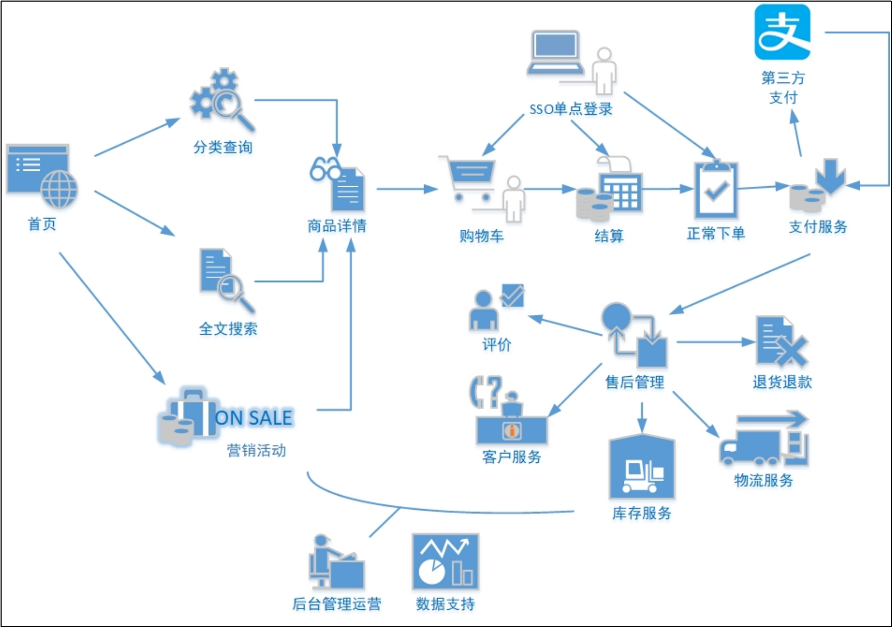

## 1.2 电商常识

### 1.2.1 SKU和SPU

 		SKU = Stock Keeping Unit（库存量基本单位）。现在已经被引申为产品统一编号的简称，每种产品均对应有唯一的SKU号。
		 SPU（Standard Product Unit）：是商品信息聚合的最小单位，是一组可复用、易检索的标准化信息集合。
例如：iPhoneX手机就是SPU。一台银色、128G内存的、支持联通网络的iPhoneX，就是SKU。


### 1.2.2 平台属性和销售属性

1）平台属性


- 属性名称平台提供
- 属性内容，卖家提供

2）销售属性


- 包含商品属性与平台的服务内容

# 第2章 业务数据介绍

## 2.1 电商系统表结构

​		以下为本电商数仓系统涉及到的业务数据表结构关系。这34个表以订单表、用户表、SKU商品表、活动表和优惠券表为中心，延伸出了优惠券领用表、支付流水表、活动订单表、订单详情表、订单状态表、商品评论表、编码字典表退单表、SPU商品表等，用户表提供用户的详细信息，支付流水表提供该订单的支付详情，订单详情表提供订单的商品数量等情况，商品表给订单详情表提供商品的详细信息。本次讲解以此34个表为例，实际项目中，业务数据库中表格远远不止这些。

### 2.1.1 活动信息表（activity_info）

| ***\*字段名\****        | ***\*字段说明\****           |
| ----------------------- | ---------------------------- |
| ***\*id\****            | 活动id                       |
| ***\*activity_name\**** | 活动名称                     |
| ***\*activity_type\**** | 活动类型（1：满减，2：折扣） |
| ***\*activity_desc\**** | 活动描述                     |
| ***\*start_time\****    | 开始时间                     |
| ***\*end_time\****      | 结束时间                     |
| ***\*create_time\****   | 创建时间                     |

### 2.1.2 活动规则表（activity_rule）

| ***\*id\****               | ***\*编号\**** |
| -------------------------- | -------------- |
| ***\*activity_id\****      | 活动ID         |
| ***\*activity_type\****    | 活动类型       |
| ***\*condition_amount\**** | 满减金额       |
| ***\*condition_num\****    | 满减件数       |
| ***\*benefit_amount\****   | 优惠金额       |
| ***\*benefit_discount\**** | 优惠折扣       |
| ***\*benefit_level\****    | 优惠级别       |


### 2.1.6 一级分类表（base_category1）

| ***\*字段名\**** | ***\*字段说明\**** |
| ---------------- | ------------------ |
| ***\*id\****     | 编号               |
| ***\*name\****   | 分类名称           |

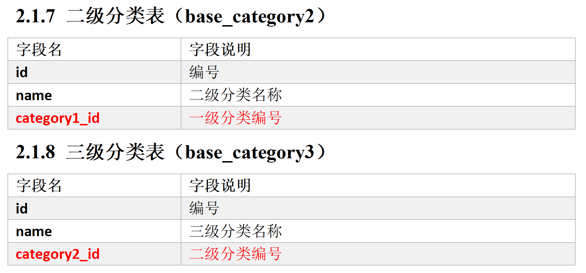


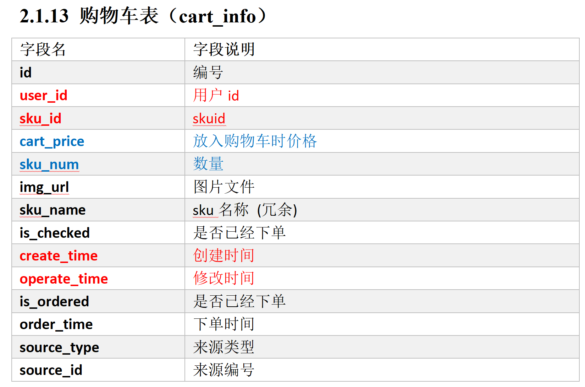

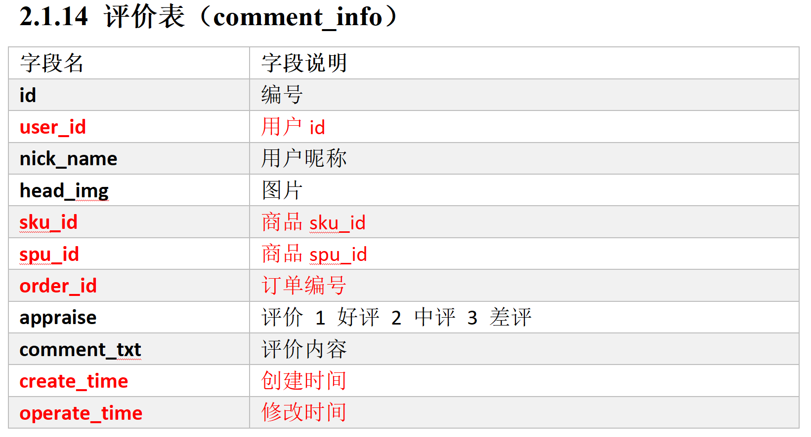

### 2.1.15 优惠券信息表（coupon_info）

| ***\*字段名\****           | ***\*字段说明\****                                  |
| -------------------------- | --------------------------------------------------- |
| ***\*id\****               | 购物券编号                                          |
| ***\*coupon_name\****      | 购物券名称                                          |
| ***\*coupon_type\****      | 购物券类型 1 现金券 2 折扣券 3 满减券 4 满件打折券  |
| ***\*condition_amount\**** | 满额数（3）                                         |
| ***\*condition_num\****    | 满件数（4）                                         |
| ***\*activity_id\****      | 活动编号                                            |
| ***\*benefit_amount\****   | 减金额（1 3）                                       |
| ***\*benefit_discount\**** | 折扣（2 4）                                         |
| ***\*create_time\****      | 创建时间                                            |
| ***\*range_type\****       | 范围类型 1、商品(spuid) 2、品类(三级分类id) 3、品牌 |
| ***\*limit_num\****        | 最多领用次数                                        |
| ***\*taken_count\****      | 已领用次数                                          |
| ***\*start_time\****       | 可以领取的开始日期                                  |
| ***\*end_time\****         | 可以领取的结束日期                                  |
| ***\*operate_time\****     | 修改时间                                            |
| ***\*expire_time\****      | 过期时间                                            |
| ***\*range_desc\****       | 范围描述                                            |

###### 电商业务表

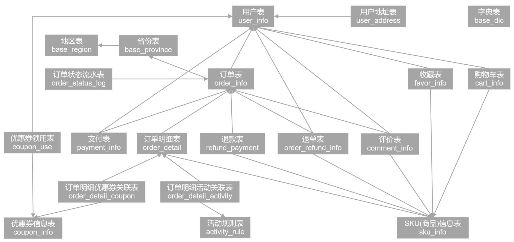

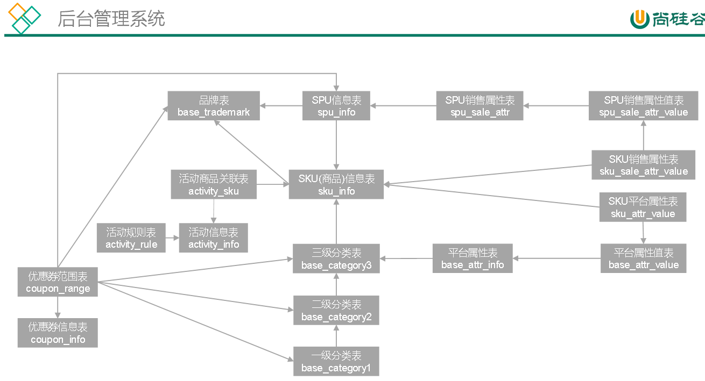

## 2.1 MySQL安装

### 2.1.1 安装包准备

1）将安装包和JDBC驱动上传到/opt/software，共计6个

### 2.1.3 配置MySQL

5）查看MySQL密码

```
[atguigu@hadoop102 software]$ sudo cat /var/log/mysqld.log | grep password
```

配置只要是root用户 + 密码，在任何主机上都能登录MySQL数据库。
1）用刚刚查到的密码进入MySQL（如果报错，给密码加单引号）

```
[atguigu@hadoop102 software]$ mysql -uroot -p'password'
```

2）设置复杂密码（由于MySQL密码策略，此密码必须足够复杂）

```
mysql> set password=password("Qs23=zs32");
```

3）更改MySQL密码策略

```
mysql> set global validate_password_length=4;
mysql> set global validate_password_policy=0;
```

4）设置简单好记的密码

```
mysql> set password=password("000000");
```

5）进入MySQL库

```
mysql> use mysql
```

6）查询user表
mysql> select user, host from user;
7）修改user表，把Host表内容修改为%

```
mysql> update user set host="%" where user="root";
```

8）刷新
mysql> flush privileges;
9）退出
mysql> quit;

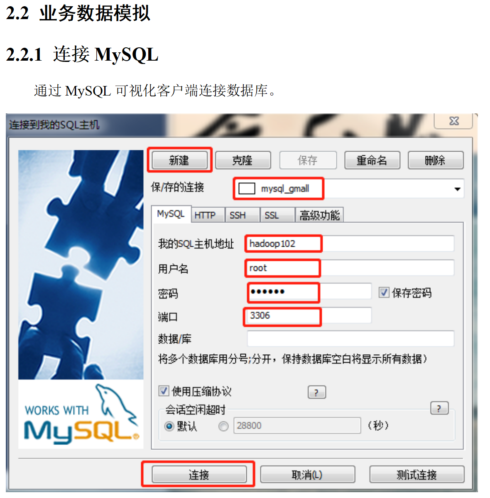

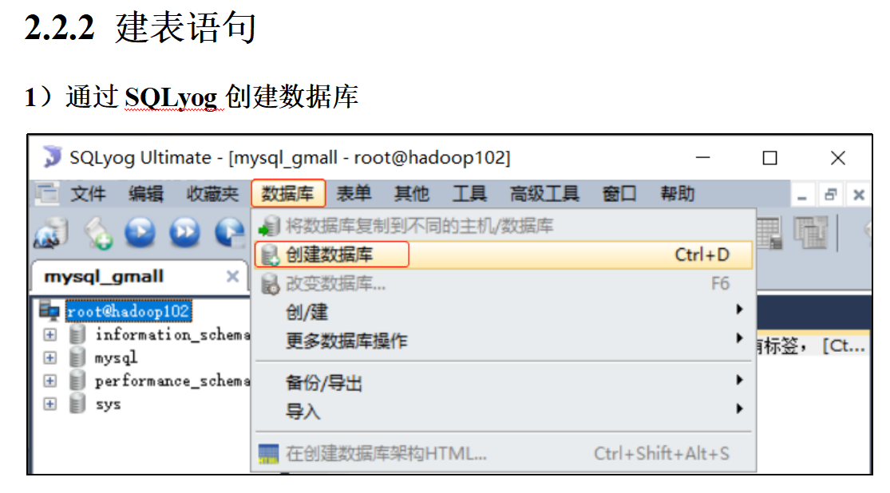

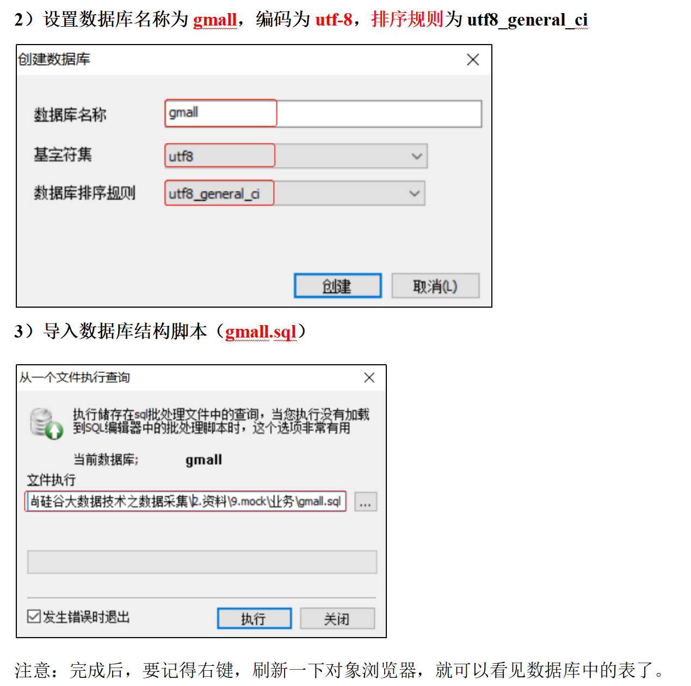

### 2.2.3 生成业务数据

1）在hadoop102的/opt/module/目录下创建db_log文件夹

```
[atguigu@hadoop102 module]$ mkdir db_log/
```

2）把gmall2020-mock-db-2021-11-14.jar和application.properties上传到hadoop102的/opt/module/db_log路径上。
**3）根据需求修改application.properties相关配置**

```properties
logging.level.root=info

spring.datasource.driver-class-name=com.mysql.jdbc.Driver
spring.datasource.url=jdbc:mysql://hadoop102:3306/gmall?useUnicode=true&characterEncoding=utf-8&useSSL=false&serverTimezone=GMT%2B8
spring.datasource.username=root
spring.datasource.password=000000

logging.pattern.console=%m%n


mybatis-plus.global-config.db-config.field-strategy=not_null


#业务日期
mock.date=2020-06-14
#是否重置  注意：第一次执行必须设置为1，后续不需要重置不用设置为1
mock.clear=1
#是否重置用户 注意：第一次执行必须设置为1，后续不需要重置不用设置为1
mock.clear.user=1

#生成新用户数量
mock.user.count=100
#男性比例
mock.user.male-rate=20
#用户数据变化概率
mock.user.update-rate:20

#收藏取消比例
mock.favor.cancel-rate=10
#收藏数量
mock.favor.count=100

#每个用户添加购物车的概率
mock.cart.user-rate=50
#每次每个用户最多添加多少种商品进购物车
mock.cart.max-sku-count=8 
#每个商品最多买几个
mock.cart.max-sku-num=3 

#购物车来源  用户查询，商品推广，智能推荐, 促销活动
mock.cart.source-type-rate=60:20:10:10

#用户下单比例
mock.order.user-rate=50
#用户从购物中购买商品比例
mock.order.sku-rate=50
#是否参加活动
mock.order.join-activity=1
#是否使用购物券
mock.order.use-coupon=1
#购物券领取人数
mock.coupon.user-count=100

#支付比例
mock.payment.rate=70
#支付方式 支付宝：微信 ：银联
mock.payment.payment-type=30:60:10


#评价比例 好：中：差：自动
mock.comment.appraise-rate=30:10:10:50

#退款原因比例：质量问题 商品描述与实际描述不一致 缺货 号码不合适 拍错 不想买了 其他
mock.refund.reason-rate=30:10:20:5:15:5:5
```

4）并在该目录下执行，如下命令，生成2020-06-14日期数据：

```properties
[atguigu@hadoop102 db_log]$ java -jar gmall2020-mock-db-2021-11-14.jar
```

5）查看gmall数据库，观察是否有2020-06-14的数据出现

### 2.2.4 业务数据建模

- 非重点， 了解

可借助EZDML这款数据库设计工具，来辅助我们梳理复杂的业务表关系。
1）下载地址
http://www.ezdml.com/download_cn.html
2）使用说明
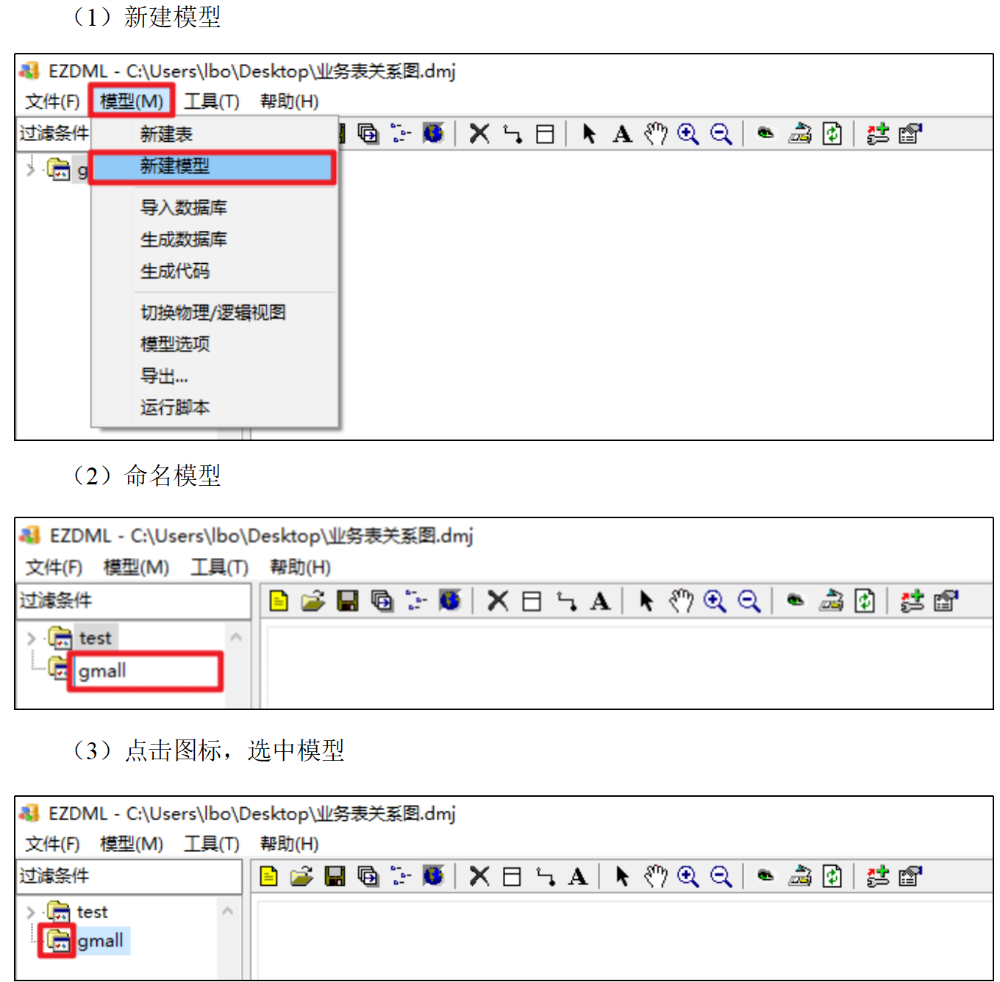

4）导入数据

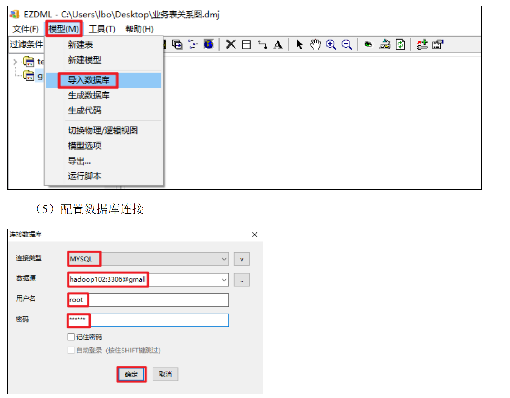

# 第3章 业务数据采集模块

## 3.1 采集通道

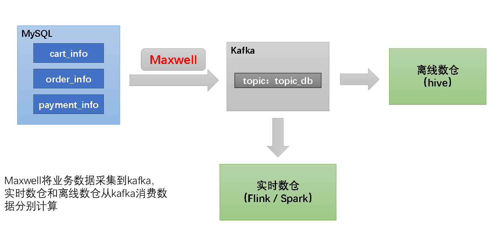

## 3.2 采集工具：Maxwell

# 第1章 Maxwell简介

## 1.1 Maxwell概述

​		Maxwell 是由美国Zendesk公司开源，用Java编写的MySQL变更数据抓取软件。它会实时监控Mysql数据库的数据变更操作（包括insert、update、delete），并将变更数据以 JSON 格式发送给 Kafka、Kinesi等流数据处理平台。官网地址：http://maxwells-daemon.io/

## 1.2 Maxwell输出数据格式

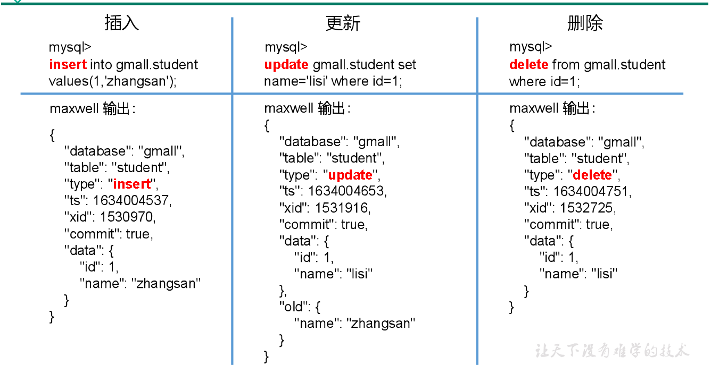

| 字段     | 解释                                                         |
| -------- | ------------------------------------------------------------ |
| database | 变更数据所属的数据库                                         |
| table    | 表更数据所属的表                                             |
| type     | 数据变更类型                                                 |
| ts       | 数据变更发生的时间                                           |
| xid      | 事务id                                                       |
| commit   | 事务提交标志，可用于重新组装事务                             |
| data     | 对于insert类型，表示插入的数据；对于update类型，标识修改之后的数据；对于delete类型，表示删除的数据 |
| old      | 对于update类型，表示修改之前的数据，只包含变更字段           |

# 第2章 Maxwell原理

​		Maxwell的工作原理是实时读取MySQL数据库的二进制日志（Binlog），从中获取变更数据，再将变更数据以JSON格式发送至Kafka等流处理平台。

## 2.1 MySQL二进制日志

​		二进制日志（Binlog）是MySQL服务端非常重要的一种日志，它会保存MySQL数据库的所有数据变更记录。Binlog的主要作用包括主从复制和数据恢复。Maxwell的工作原理和主从复制密切相关。

## 2.2 MySQL主从复制

​		MySQL的主从复制，就是用来建立一个和主数据库完全一样的数据库环境，这个数据库称为从数据库。
1）主从复制的应用场景如下：
（1）做数据库的热备：主数据库服务器故障后，可切换到从数据库继续工作。
（2）读写分离：主数据库只负责业务数据的写入操作，而多个从数据库只负责业务数据的查询工作，在读多写少场景下，可以提高数据库工作效率。
2）主从复制的工作原理如下：
（1）Master主库将数据变更记录，写到二进制日志(binary log)中
（2）Slave从库向mysql master发送dump协议，将master主库的binary log events拷贝到它的中继日志(relay log)
（3）Slave从库读取并回放中继日志中的事件，将改变的数据同步到自己的数据库。

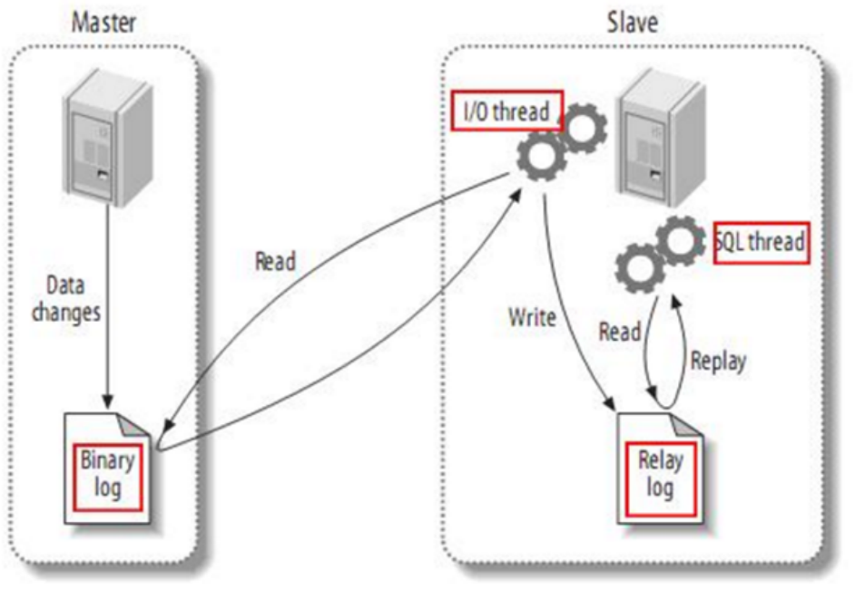

## 2.3 Maxwell原理

​		很简单，就是将自己伪装成slave，并遵循MySQL主从复制的协议，从master同步数据。

# 第3章 Maxwell部署

## 3.1 安装Maxwell

- 下载
- 安装解压
- 修改名称

## 3.2 配置MySQL

### 3.2.1 启用MySQL Binlog

​		MySQL服务器的Binlog默认是未开启的，如需进行同步，需要先进行开启。
1）修改MySQL配置文件/etc/my.cnf

```
[atguigu@hadoop102 ~]$ sudo vim /etc/my.cnf
```

2）增加如下配置

```properties
[mysqld]

#数据库id
server-id = 1
#启动binlog，该参数的值会作为binlog的文件名
log-bin=mysql-bin
#binlog类型，maxwell要求为row类型
binlog_format=row
#启用binlog的数据库，需根据实际情况作出修改
binlog-do-db=gmall
```

**注：MySQL Binlog模式**
		Statement-based：基于语句，Binlog会记录所有写操作的SQL语句，包括insert、update、delete等。
		优点： 节省空间
		缺点： 有可能造成数据不一致，例如insert语句中包含now()函数。
Row-based：基于行，Binlog会记录每次写操作后被操作行记录的变化。
			优点：保持数据的绝对一致性。
		缺点：占用较大空间。
mixed：混合模式，默认是Statement-based，如果SQL语句可能导致数据不一致，就自动切换到Row-based。
		**Maxwell要求Binlog采用Row-based模式。**

3）重启MySQL服务

```shell
[atguigu@hadoop102 ~]$ sudo systemctl restart mysqld
```

### 3.2.2 创建Maxwell所需数据库和用户

​		Maxwell需要在MySQL中存储其运行过程中的所需的一些数据，包括binlog同步的断点位置（Maxwell支持断点续传）等等，故需要在MySQL为Maxwell创建数据库及用户。
1）创建数据库

```
msyql> CREATE DATABASE maxwell;
```

2）调整MySQL数据库密码级别

```
mysql> set global validate_password_policy=0;
mysql> set global validate_password_length=4;
```

3）创建Maxwell用户并赋予其必要权限

```
mysql> CREATE USER 'maxwell'@'%' IDENTIFIED BY 'maxwell';
mysql> GRANT ALL ON maxwell.* TO 'maxwell'@'%';
mysql> GRANT SELECT, REPLICATION CLIENT, REPLICATION SLAVE ON *.* TO 'maxwell'@'%';
```

3.3 配置Maxwell
1）修改Maxwell配置文件名称

```
[atguigu@hadoop102 maxwell]$ cd /opt/module/maxwell
[atguigu@hadoop102 maxwell]$ cp config.properties.example config.properties
```

2）修改Maxwell配置文件

```properties
[atguigu@hadoop102 maxwell]$ vim config.properties

#Maxwell数据发送目的地，可选配置有stdout|file|kafka|kinesis|pubsub|sqs|rabbitmq|redis
producer=kafka
#目标Kafka集群地址
kafka.bootstrap.servers=hadoop102:9092,hadoop103:9092
#目标Kafka topic，可静态配置，例如:maxwell，也可动态配置，例如：%{database}_%{table}
kafka_topic=maxwell

#MySQL相关配置
host=hadoop102
user=maxwell
password=maxwell
jdbc_options=useSSL=false&serverTimezone=Asia/Shanghai
```

- Maxwel相当于是一个mysql的slave， 会自动监控mysql的binerylog文件完成同步
- 还相当于实现了一个kafka的生产者， 指定了集群的位置端口号， topic
- 指定了监控的数据库的位置，

# 第4章 Maxwell使用

## 4.1 启动Kafka集群

​		若Maxwell发送数据的目的地为Kafka集群，则需要先确保Kafka集群为启动状态。
4.2 Maxwell启停 
1）启动Maxwell

```
[atguigu@hadoop102 ~]$ /opt/module/maxwell/bin/maxwell --config /opt/module/maxwell/config.properties --daemon
```

2）停止Maxwell

```
[atguigu@hadoop102 ~]$ ps -ef | grep maxwell | grep -v grep | grep maxwell | awk '{print $2}' | xargs kill -9
```

3）Maxwell启停脚本
（1）创建并编辑Maxwell启停脚本

```
[atguigu@hadoop102 bin]$ vim mxw.sh
```

（2）脚本内容如下

```shell
#!/bin/bash

MAXWELL_HOME=/opt/module/maxwell

status_maxwell(){
    result=`ps -ef | grep com.zendesk.maxwell.Maxwell | grep -v grep | wc -l`
    return $result
}


start_maxwell(){
    status_maxwell
    if [[ $? -lt 1 ]]; then
        echo "启动Maxwell"
        $MAXWELL_HOME/bin/maxwell --config $MAXWELL_HOME/config.properties --daemon
    else
        echo "Maxwell正在运行"
    fi
}


stop_maxwell(){
    status_maxwell
    if [[ $? -gt 0 ]]; then
        echo "停止Maxwell"
        ps -ef | grep com.zendesk.maxwell.Maxwell | grep -v grep | awk '{print $2}' | xargs kill -9
    else
        echo "Maxwell未在运行"
    fi
}


case $1 in
    start )
        start_maxwell
    ;;
    stop )
        stop_maxwell
    ;;
    restart )
       stop_maxwell
       start_maxwell
    ;;
esac
```

`ps -ef | grep com.zendesk.maxwell.Maxwell | grep -v grep | awk '{print $2}' | xargs kill -9`

-  grep -v grep: 删除结果中的grep条数
- awk '{print $2}'： 取第二个参数，进程号
-  xargs kill -9：  将参数传递给命令， kill进程

## 4.3 增量数据同步

- Maxwell实现了kafka的生产者， 指定了topic， 
- 启动Maxwell后只需要启动消费者监控行了

1）启动Kafka消费者

```
[atguigu@hadoop102 kafka]$ bin/kafka-console-consumer.sh --bootstrap-server hadoop102:9092 --topic maxwell
```

2）模拟生成数据

```
[atguigu@hadoop102 db_log]$ java -jar gmall2020-mock-db-2021-01-22.jar
```

3）观察Kafka消费者

```
{"database":"gmall","table":"comment_info","type":"insert","ts":1634023510,"xid":1653373,"xoffset":11998,"data":{"id":1447825655672463369,"user_id":289,"nick_name":null,"head_img":null,"sku_id":11,"spu_id":3,"order_id":18440,"appraise":"1204","comment_txt":"评论内容：12897688728191593794966121429786132276125164551411","create_time":"2020-06-16 15:25:09","operate_time":null}}
{"database":"gmall","table":"comment_info","type":"insert","ts":1634023510,"xid":1653373,"xoffset":11999,"data":{"id":1447825655672463370,"user_id":774,"nick_name":null,"head_img":null,"sku_id":25,"spu_id":8,"order_id":18441,"appraise":"1204","comment_txt":"评论内容：67552221621263422568447438734865327666683661982185","create_time":"2020-06-16 15:25:09","operate_time":null}}
```

## 4.4 历史数据全量同步

​		上一节，我们已经实现了使用Maxwell实时增量同步MySQL变更数据的功能。但有时只有增量数据是不够的，我们可能需要使用到MySQL数据库中从历史至今的一个完整的数据集。这就需要我们在进行增量同步之前，先进行一次历史数据的全量同步。这样就能保证得到一个完整的数据集。

### 4.4.1 Maxwell-bootstrap

​		Maxwell提供了bootstrap功能来进行历史数据的全量同步，命令如下：

```properties
[atguigu@hadoop102 maxwell]$ /opt/module/maxwell/bin/maxwell-bootstrap --database gmall --table user_info --config /opt/module/maxwell/config.properties
```

4.4.2 boostrap数据格式
采用bootstrap方式同步的输出数据格式如下：

```json
{
    "database": "fooDB",
    "table": "barTable",
    "type": "bootstrap-start",
    "ts": 1450557744,
    "data": {}
}
{
    "database": "fooDB",
    "table": "barTable",
    "type": "bootstrap-insert",
    "ts": 1450557744,
    "data": {
        "txt": "hello"
    }
}
{
    "database": "fooDB",
    "table": "barTable",
    "type": "bootstrap-insert",
    "ts": 1450557744,
    "data": {
        "txt": "bootstrap!"
    }
}
{
    "database": "fooDB",
    "table": "barTable",
    "type": "bootstrap-complete",
    "ts": 1450557744,
    "data": {}
}
```

注意事项：
1）第一条type为bootstrap-start和最后一条type为bootstrap-complete的数据，是bootstrap开始和结束的标志，不包含数据，中间的type为bootstrap-insert的数据才包含数据。
2）一次bootstrap输出的所有记录的ts都相同，为bootstrap开始的时间。

## 3.3 采集通道Maxwell配置

- Maxwell中配置了监控那个节点机器上的mysql的binlog文件的变化
- 配置了将数据写到那个节点的的kafka'的那个topic中
- 只需要启动kafka的消费者监控，之后启动jar包， 生成测试数据就可以观察结果  了

1）修改Maxwell配置文件config.properties

```
[atguigu@hadoop102 maxwell]$ vim /opt/module/maxwell/config.properties
```

2）配置参数如下

```properties
log_level=info

producer=kafka
kafka.bootstrap.servers=hadoop102:9092,hadoop103:9092

#kafka topic配置
kafka_topic=topic_db

# mysql login info
host=hadoop102
user=maxwell
password=maxwell
jdbc_options=useSSL=false&serverTimezone=Asia/Shanghai
```

3）重新启动Maxwell

```
[atguigu@hadoop102 bin]$ mxw.sh restart
```

4）通道测试
（1）启动Zookeeper以及Kafka集群
（2）启动一个Kafka Console Consumer，消费topic_db数据

```
[atguigu@hadoop103 kafka]$ bin/kafka-console-consumer.sh --bootstrap-server hadoop102:9092 --topic topic_db
```

（3）生成模拟数据

```
[atguigu@hadoop102 bin]$ cd /opt/module/db_log/
[atguigu@hadoop102 db_log]$ java -jar gmall2020-mock-db-2021-11-14.jar 
```

（4）观察Kafka消费者是否能消费到数据

```
{"database":"gmall","table":"cart_info","type":"update","ts":1592270938,"xid":13090,"xoffset":1573,"data":{"id":100924,"user_id":"93","sku_id":16,"cart_price":4488.00,"sku_num":1,"img_url":"http://47.93.148.192:8080/group1/M00/00/02/rBHu8l-sklaALrngAAHGDqdpFtU741.jpg","sku_name":"华为 HUAWEI P40 麒麟990 5G SoC芯片 5000万超感知徕卡三摄 30倍数字变焦 8GB+128GB亮黑色全网通5G手机","is_checked":null,"create_time":"2020-06-14 09:28:57","operate_time":null,"is_ordered":1,"order_time":"2021-10-17 09:28:58","source_type":"2401","source_id":null},"old":{"is_ordered":0,"order_time":null}}
```


