## 4.3 同步HDFS数据到MySQL案例


​		案例要求：同步HDFS上的/base_province目录下的数据到MySQL gmall 数据库下的test_province表。
​		需求分析：要实现该功能，需选用HDFSReader和MySQLWriter。
1）编写配置文件
（1）创建配置文件test_province.json

```
[atguigu@hadoop102 ~]$ vim /opt/module/datax/job/test_province.json
```

（2）配置文件内容如下

（2）配置文件内容如下

```json
{
    "job": {
        "content": [
            {
                "reader": {
                    "name": "hdfsreader",
                    "parameter": {
                        "defaultFS": "hdfs://hadoop102:8020",
                        "path": "/base_province",
                        "column": [
                            "*"
                        ],
                        "fileType": "text",
                        "compress": "gzip",
                        "encoding": "UTF-8",
                        "nullFormat": "\\N",
                        "fieldDelimiter": "\t",
                    }
                },
                "writer": {
                    "name": "mysqlwriter",
                    "parameter": {
                        "username": "root",
                        "password": "000000",
                        "connection": [
                            {
                                "table": [
                                    "test_province"
                                ],
                                "jdbcUrl": "jdbc:mysql://hadoop102:3306/gmall?useUnicode=true&characterEncoding=utf-8"
                            }
                        ],
                        "column": [
                            "id",
                            "name",
                            "region_id",
                            "area_code",
                            "iso_code",
                            "iso_3166_2"
                        ],
                        "writeMode": "replace"
                    }
                }
            }
        ],
        "setting": {
            "speed": {
                "channel": 1
            }
        }
    }
}
```

2）配置文件说明
（1）Reader参数说明

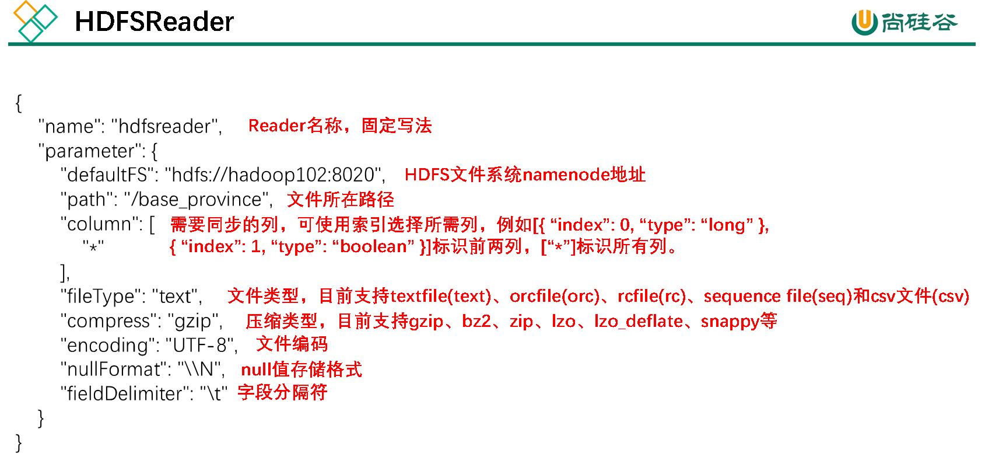

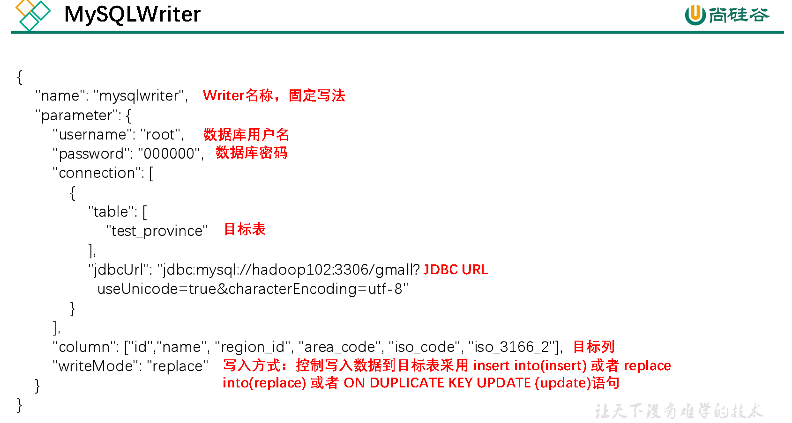

**注意事项：**
		HFDS Writer并未提供nullFormat参数：也就是用户并不能自定义null值写到HFDS文件中的存储格式。默认情况下，HFDS Writer会将null值存储为空字符串（''），而Hive默认的null值存储格式为\N。所以后期将DataX同步的文件导入Hive表就会出现问题。
		解决该问题的方案有两个：
		一是修改DataX HDFS Writer的源码，增加自定义null值存储格式的逻辑，可参考https://blog.csdn.net/u010834071/article/details/105506580。
		二是在Hive中建表时指定null值存储格式为空字符串（''），例如：

```bash
DROP TABLE IF EXISTS base_province;
CREATE EXTERNAL TABLE base_province
(
    `id`         STRING COMMENT '编号',
    `name`       STRING COMMENT '省份名称',
    `region_id`  STRING COMMENT '地区ID',
    `area_code`  STRING COMMENT '地区编码',
    `iso_code`   STRING COMMENT '旧版ISO-3166-2编码，供可视化使用',
    `iso_3166_2` STRING COMMENT '新版IOS-3166-2编码，供可视化使用'
) COMMENT '省份表'
    ROW FORMAT DELIMITED FIELDS TERMINATED BY '\t'
    NULL DEFINED AS ''
    LOCATION '/base_province/';
```

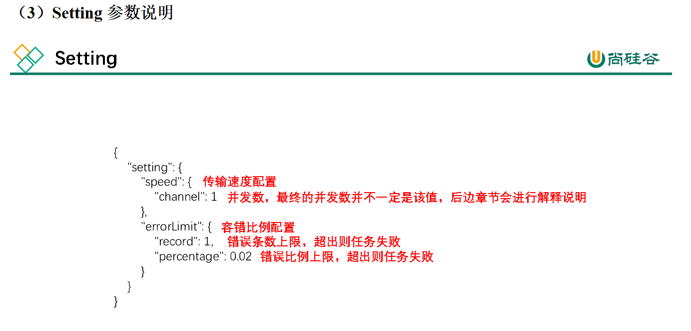


```shell
DROP TABLE IF EXISTS `test_province`;
CREATE TABLE `test_province`  (
  `id` bigint(20) NOT NULL,
  `name` varchar(20) CHARACTER SET utf8 COLLATE utf8_general_ci NULL DEFAULT NULL,
  `region_id` varchar(20) CHARACTER SET utf8 COLLATE utf8_general_ci NULL DEFAULT NULL,
  `area_code` varchar(20) CHARACTER SET utf8 COLLATE utf8_general_ci NULL DEFAULT NULL,
  `iso_code` varchar(20) CHARACTER SET utf8 COLLATE utf8_general_ci NULL DEFAULT NULL,
  `iso_3166_2` varchar(20) CHARACTER SET utf8 COLLATE utf8_general_ci NULL DEFAULT NULL,
  PRIMARY KEY (`id`)
) ENGINE = InnoDB CHARACTER SET = utf8 COLLATE = utf8_general_ci ROW_FORMAT = Dynamic;
```

**3）提交任务**
（1）在MySQL中创建gmall.test_province表

（2）进入DataX根目录
`[atguigu@hadoop102 datax]$ cd /opt/module/datax` 
（3）执行如下命令
`[atguigu@hadoop102 datax]$ python bin/datax.py job/test_province.json` 
4）查看结果
（1）DataX打印日志

```bash
2021-10-13 15:21:35.006 [job-0] INFO  JobContainer - 
任务启动时刻                    : 2021-10-13 15:21:23
任务结束时刻                    : 2021-10-13 15:21:35
任务总计耗时                    :                 11s
任务平均流量                    :               70B/s
记录写入速度                    :              3rec/s
读出记录总数                    :                  34
读写失败总数                    :                   0
```

（2）查看MySQL目标表数据

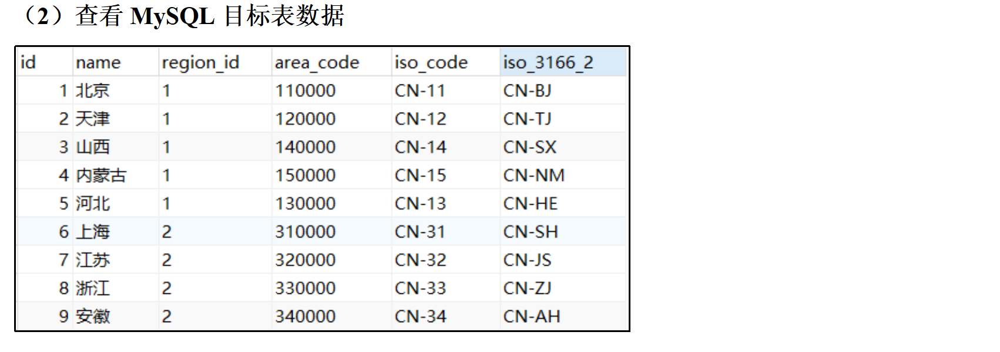

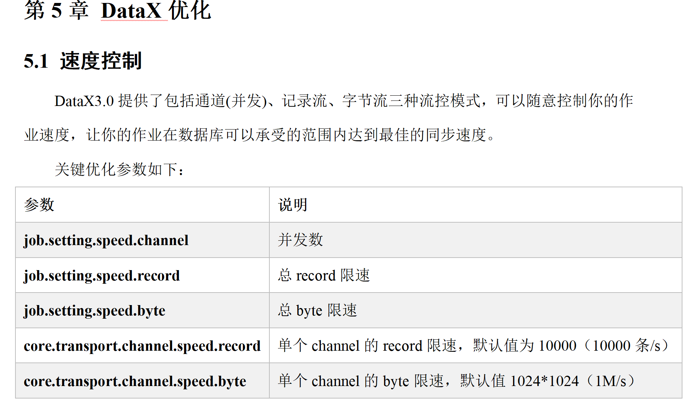

注意事项：
1.若配置了总record限速，则必须配置单个channel的record限速
2.若配置了总byte限速，则必须配置单个channe的byte限速
3.若配置了总record限速和总byte限速，channel并发数参数就会失效。因为配置了总record限速和总byte限速之后，实际channel并发数是通过计算得到的：
计算公式为:
min(总byte限速/单个channel的byte限速，总record限速/单个channel的record限速)

```json
{
    "core": {		// d单个并发
        "transport": {
            "channel": {
                "speed": {
                    "byte": 1048576 //单个channel byte限速1M/s
                }
            }
        }
    },
    "job": {		// job
        "setting": {
            "speed": {
                "byte" : 5242880 //总byte限速5M/s
            }
        },
        ...
    }
}
```

## 5.2 内存调整

​		当提升DataX Job内Channel并发数时，内存的占用会显著增加，因为DataX作为数据交换通道，在内存中会缓存较多的数据。例如Channel中会有一个Buffer，作为临时的数据交换的缓冲区，而在部分Reader和Writer的中，也会存在一些Buffer，为了防止OOM等错误，需调大JVM的堆内存。
​		建议将内存设置为4G或者8G，这个也可以根据实际情况来调整。
​		调整JVM xms xmx参数的两种方式：一种是直接更改datax.py脚本；另一种是在启动的时候，加上对应的参数，如下：

```bash
python datax/bin/datax.py --jvm="-Xms8G -Xmx8G" /path/to/your/job.json
```

#### 2.2.5.2 数据通道

全量表数据由DataX从MySQL业务数据库直接同步到HDFS，具体数据流向如下图所示。

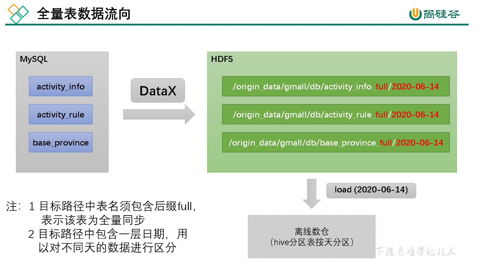

#### 2.2.5.4 DataX配置文件生成脚本

方便起见，此处提供了DataX配置文件批量生成脚本，脚本内容及使用方式如下。

`[atguigu@hadoop102 bin]$ vim ~/bin/gen_import_config.py` 
	脚本内容如下

```python
# ecoding=utf-8
import json
import getopt
import os
import sys
import MySQLdb

#MySQL相关配置，需根据实际情况作出修改
mysql_host = "hadoop102"
mysql_port = "3306"
mysql_user = "root"
mysql_passwd = "000000"

#HDFS NameNode相关配置，需根据实际情况作出修改
hdfs_nn_host = "hadoop102"
hdfs_nn_port = "8020"

#生成配置文件的目标路径，可根据实际情况作出修改
output_path = "/opt/module/datax/job/import"


def get_connection():
    return MySQLdb.connect(host=mysql_host, port=int(mysql_port), user=mysql_user, passwd=mysql_passwd)


def get_mysql_meta(database, table):
    connection = get_connection()
    cursor = connection.cursor()
    sql = "SELECT COLUMN_NAME,DATA_TYPE from information_schema.COLUMNS WHERE TABLE_SCHEMA=%s AND TABLE_NAME=%s ORDER BY ORDINAL_POSITION"
    cursor.execute(sql, [database, table])
    fetchall = cursor.fetchall()
    cursor.close()
    connection.close()
    return fetchall


def get_mysql_columns(database, table):
    return map(lambda x: x[0], get_mysql_meta(database, table))


def get_hive_columns(database, table):
    def type_mapping(mysql_type):
        mappings = {
            "bigint": "bigint",
            "int": "bigint",
            "smallint": "bigint",
            "tinyint": "bigint",
            "decimal": "string",
            "double": "double",
            "float": "float",
            "binary": "string",
            "char": "string",
            "varchar": "string",
            "datetime": "string",
            "time": "string",
            "timestamp": "string",
            "date": "string",
            "text": "string"
        }
        return mappings[mysql_type]

    meta = get_mysql_meta(database, table)
    return map(lambda x: {"name": x[0], "type": type_mapping(x[1].lower())}, meta)


def generate_json(source_database, source_table):
    job = {
        "job": {
            "setting": {
                "speed": {
                    "channel": 3
                },
                "errorLimit": {
                    "record": 0,
                    "percentage": 0.02
                }
            },
            "content": [{
                "reader": {
                    "name": "mysqlreader",
                    "parameter": {
                        "username": mysql_user,
                        "password": mysql_passwd,
                        "column": get_mysql_columns(source_database, source_table),
                        "splitPk": "",
                        "connection": [{
                            "table": [source_table],
                            "jdbcUrl": ["jdbc:mysql://" + mysql_host + ":" + mysql_port + "/" + source_database]
                        }]
                    }
                },
                "writer": {
                    "name": "hdfswriter",
                    "parameter": {
                        "defaultFS": "hdfs://" + hdfs_nn_host + ":" + hdfs_nn_port,
                        "fileType": "text",
                        "path": "${targetdir}",
                        "fileName": source_table,
                        "column": get_hive_columns(source_database, source_table),
                        "writeMode": "append",
                        "fieldDelimiter": "\t",
                        "compress": "gzip"
                    }
                }
            }]
        }
    }
    if not os.path.exists(output_path):
        os.makedirs(output_path)
    with open(os.path.join(output_path, ".".join([source_database, source_table, "json"])), "w") as f:
        json.dump(job, f)


def main(args):
    source_database = ""
    source_table = ""

    options, arguments = getopt.getopt(args, '-d:-t:', ['sourcedb=', 'sourcetbl='])
    for opt_name, opt_value in options:
        if opt_name in ('-d', '--sourcedb'):
            source_database = opt_value
        if opt_name in ('-t', '--sourcetbl'):
            source_table = opt_value

    generate_json(source_database, source_table)


if __name__ == '__main__':
    main(sys.argv[1:])
```

​		注：
​		（1）安装Python Mysql驱动
​		由于需要使用Python访问Mysql数据库，故需安装驱动，命令如下：
`[atguigu@hadoop102 bin]$ sudo yum install -y MySQL-python`
​		（2）脚本使用说明
`python gen_import_config.py -d database -t table`
​		通过-d传入数据库名，-t传入表名，执行上述命令即可生成该表的DataX同步配置文件。
​		2）在~/bin目录下创建gen_import_config.sh脚本
`[atguigu@hadoop102 bin]$ vim ~/bin/gen_import_config.sh`
​		脚本内容如下

```shell
#!/bin/bash

python ~/bin/gen_import_config.py -d gmall -t activity_info
python ~/bin/gen_import_config.py -d gmall -t activity_rule
python ~/bin/gen_import_config.py -d gmall -t base_category1
python ~/bin/gen_import_config.py -d gmall -t base_category2
python ~/bin/gen_import_config.py -d gmall -t base_category3
python ~/bin/gen_import_config.py -d gmall -t base_dic
python ~/bin/gen_import_config.py -d gmall -t base_province
python ~/bin/gen_import_config.py -d gmall -t base_region
python ~/bin/gen_import_config.py -d gmall -t base_trademark
python ~/bin/gen_import_config.py -d gmall -t cart_info
python ~/bin/gen_import_config.py -d gmall -t coupon_info
python ~/bin/gen_import_config.py -d gmall -t sku_attr_value
python ~/bin/gen_import_config.py -d gmall -t sku_info
python ~/bin/gen_import_config.py -d gmall -t sku_sale_attr_value
python ~/bin/gen_import_config.py -d gmall -t spu_info
```

- gen_import_config.sh会调用gen_import_config.py生成python中定义好的由sql到hdfs的Datax的配置文件，将配置文件放到job/目录下

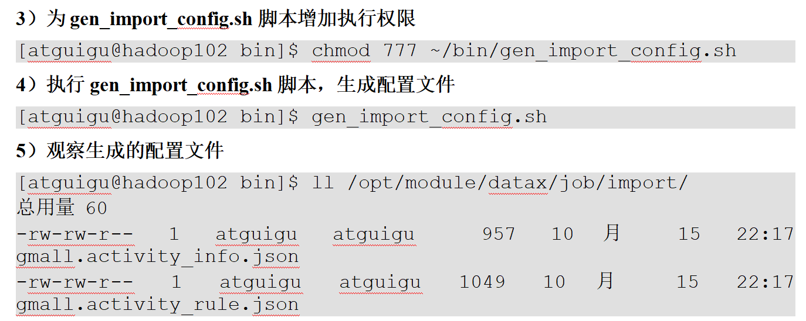

### 2.2.5.5 测试生成的DataX配置文件

以activity_info为例，测试用脚本生成的配置文件是否可用。
1）创建目标路径
由于DataX同步任务要求目标路径提前存在，故需手动创建路径，当前activity_info表的目标路径应为/origin_data/gmall/db/activity_info_full/2020-06-14。
`[atguigu@hadoop102 bin]$ hadoop fs -mkdir /origin_data/gmall/db/activity_info_full/2020-06-14`
2）执行DataX同步命令

```bash
[atguigu@hadoop102 bin]$ python /opt/module/datax/bin/datax.py -p"-Dtargetdir=/origin_data/gmall/db/activity_info_full/2020-06-14" /opt/module/datax/job/import/gmall.activity_info.json
```

3）观察同步结果
观察HFDS目标路径是否出现数据。

### 2.2.5.6 全量表数据同步脚本

为方便使用以及后续的任务调度，此处编写一个全量表数据同步脚本。
1）在~/bin目录创建mysql_to_hdfs_full.sh
`[atguigu@hadoop102 bin]$ vim ~/bin/mysql_to_hdfs_full.sh` 
脚本内容如下

- 创建脚本，根据之前生成的配置文件，运行Datax，将数据由SQL全量同步到HDFS中的指定文件夹

```shell
#!/bin/bash

DATAX_HOME=/opt/module/datax

# 如果传入日期则do_date等于传入的日期，否则等于前一天日期
if [ -n "$2" ] ;then
    do_date=$2
else
    do_date=`date -d "-1 day" +%F`
fi

#处理目标路径，此处的处理逻辑是，如果目标路径不存在，则创建；若存在，则清空，目的是保证同步任务可重复执行
handle_targetdir() {
  hadoop fs -test -e $1
  if [[ $? -eq 1 ]]; then
    echo "路径$1不存在，正在创建......"
    hadoop fs -mkdir -p $1
  else
    echo "路径$1已经存在"
    fs_count=$(hadoop fs -count $1)
    content_size=$(echo $fs_count | awk '{print $3}')
    if [[ $content_size -eq 0 ]]; then
      echo "路径$1为空"
    else
      echo "路径$1不为空，正在清空......"
      hadoop fs -rm -r -f $1/*
    fi
  fi
}

#数据同步
import_data() {
  datax_config=$1
  target_dir=$2

  handle_targetdir $target_dir
  python $DATAX_HOME/bin/datax.py -p"-Dtargetdir=$target_dir" $datax_config
}

case $1 in
"activity_info")
  import_data /opt/module/datax/job/import/gmall.activity_info.json /origin_data/gmall/db/activity_info_full/$do_date
  ;;
"activity_rule")
  import_data /opt/module/datax/job/import/gmall.activity_rule.json /origin_data/gmall/db/activity_rule_full/$do_date
  ;;
"base_category1")
  import_data /opt/module/datax/job/import/gmall.base_category1.json /origin_data/gmall/db/base_category1_full/$do_date
  ;;
"base_category2")
  import_data /opt/module/datax/job/import/gmall.base_category2.json /origin_data/gmall/db/base_category2_full/$do_date
  ;;
"base_category3")
  import_data /opt/module/datax/job/import/gmall.base_category3.json /origin_data/gmall/db/base_category3_full/$do_date
  ;;
"base_dic")
  import_data /opt/module/datax/job/import/gmall.base_dic.json /origin_data/gmall/db/base_dic_full/$do_date
  ;;
"base_province")
  import_data /opt/module/datax/job/import/gmall.base_province.json /origin_data/gmall/db/base_province_full/$do_date
  ;;
"base_region")
  import_data /opt/module/datax/job/import/gmall.base_region.json /origin_data/gmall/db/base_region_full/$do_date
  ;;
"base_trademark")
  import_data /opt/module/datax/job/import/gmall.base_trademark.json /origin_data/gmall/db/base_trademark_full/$do_date
  ;;
"cart_info")
  import_data /opt/module/datax/job/import/gmall.cart_info.json /origin_data/gmall/db/cart_info_full/$do_date
  ;;
"coupon_info")
  import_data /opt/module/datax/job/import/gmall.coupon_info.json /origin_data/gmall/db/coupon_info_full/$do_date
  ;;
"sku_attr_value")
  import_data /opt/module/datax/job/import/gmall.sku_attr_value.json /origin_data/gmall/db/sku_attr_value_full/$do_date
  ;;
"sku_info")
  import_data /opt/module/datax/job/import/gmall.sku_info.json /origin_data/gmall/db/sku_info_full/$do_date
  ;;
"sku_sale_attr_value")
  import_data /opt/module/datax/job/import/gmall.sku_sale_attr_value.json /origin_data/gmall/db/sku_sale_attr_value_full/$do_date
  ;;
"spu_info")
  import_data /opt/module/datax/job/import/gmall.spu_info.json /origin_data/gmall/db/spu_info_full/$do_date
  ;;
"all")
  import_data /opt/module/datax/job/import/gmall.activity_info.json /origin_data/gmall/db/activity_info_full/$do_date
  import_data /opt/module/datax/job/import/gmall.activity_rule.json /origin_data/gmall/db/activity_rule_full/$do_date
  import_data /opt/module/datax/job/import/gmall.base_category1.json /origin_data/gmall/db/base_category1_full/$do_date
  import_data /opt/module/datax/job/import/gmall.base_category2.json /origin_data/gmall/db/base_category2_full/$do_date
  import_data /opt/module/datax/job/import/gmall.base_category3.json /origin_data/gmall/db/base_category3_full/$do_date
  import_data /opt/module/datax/job/import/gmall.base_dic.json /origin_data/gmall/db/base_dic_full/$do_date
  import_data /opt/module/datax/job/import/gmall.base_province.json /origin_data/gmall/db/base_province_full/$do_date
  import_data /opt/module/datax/job/import/gmall.base_region.json /origin_data/gmall/db/base_region_full/$do_date
  import_data /opt/module/datax/job/import/gmall.base_trademark.json /origin_data/gmall/db/base_trademark_full/$do_date
  import_data /opt/module/datax/job/import/gmall.cart_info.json /origin_data/gmall/db/cart_info_full/$do_date
  import_data /opt/module/datax/job/import/gmall.coupon_info.json /origin_data/gmall/db/coupon_info_full/$do_date
  import_data /opt/module/datax/job/import/gmall.sku_attr_value.json /origin_data/gmall/db/sku_attr_value_full/$do_date
  import_data /opt/module/datax/job/import/gmall.sku_info.json /origin_data/gmall/db/sku_info_full/$do_date
  import_data /opt/module/datax/job/import/gmall.sku_sale_attr_value.json /origin_data/gmall/db/sku_sale_attr_value_full/$do_date
  import_data /opt/module/datax/job/import/gmall.spu_info.json /origin_data/gmall/db/spu_info_full/$do_date
  ;;
esac
```


### 2.2.6 增量表数据同步

#### 2.2.6.1 数据通道

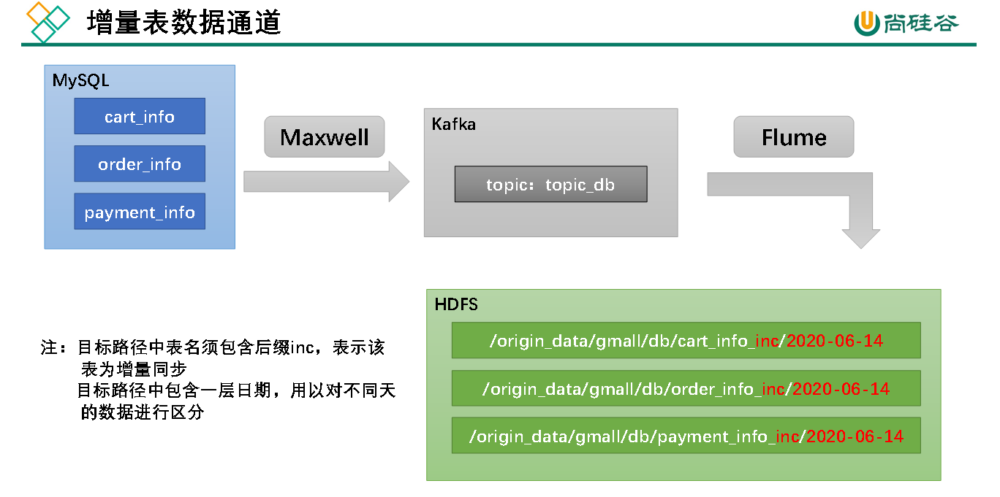

#### 2.2.6.2 Flume配置

1）Flume配置概述
		Flume需要将Kafka中topic_db主题的数据传输到HDFS，故其需选用KafkaSource以及HDFSSink，Channel选用FileChannel。
		需要注意的是， HDFSSink需要将不同mysql业务表的数据写到不同的路径，并且路径中应当包含一层日期，用于区分每天的数据。关键配置如下：


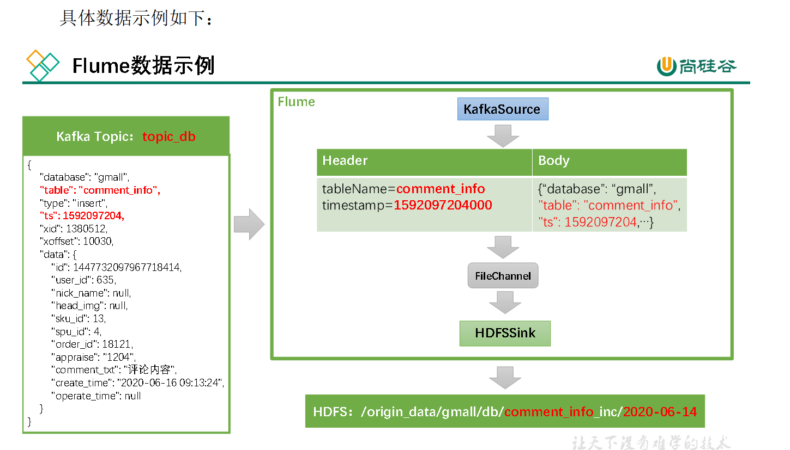

2）Flume配置实操
（1）创建Flume配置文件
在hadoop104节点的Flume的job目录下创建kafka_to_hdfs_db.conf

```bash
[atguigu@hadoop104 flume]$ mkdir job
[atguigu@hadoop104 flume]$ vim job/kafka_to_hdfs_db.conf 
```

（2）配置文件内容如下

```properties
a1.sources = r1
a1.channels = c1
a1.sinks = k1

a1.sources.r1.type = org.apache.flume.source.kafka.KafkaSource
a1.sources.r1.batchSize = 5000
a1.sources.r1.batchDurationMillis = 2000
a1.sources.r1.kafka.bootstrap.servers = hadoop102:9092,hadoop103:9092
a1.sources.r1.kafka.topics = topic_db
a1.sources.r1.kafka.consumer.group.id = kafka_to_hdfs_db
a1.sources.r1.setTopicHeader = true
a1.sources.r1.topicHeader = topic
a1.sources.r1.interceptors = i1
a1.sources.r1.interceptors.i1.type = com.atguigu.gmall.flume.interceptor.TimestampAndTableNameInterceptor$Builder

a1.channels.c1.type = file
a1.channels.c1.checkpointDir = /opt/module/flume/checkpoint/behavior2
a1.channels.c1.dataDirs = /opt/module/flume/data/behavior2/
a1.channels.c1.maxFileSize = 2146435071
a1.channels.c1.capacity = 1000000
a1.channels.c1.keep-alive = 6

## sink1
a1.sinks.k1.type = hdfs
a1.sinks.k1.hdfs.path = /origin_data/gmall/db/%{tableName}_inc/%Y-%m-%d
a1.sinks.k1.hdfs.filePrefix = db
a1.sinks.k1.hdfs.round = false


a1.sinks.k1.hdfs.rollInterval = 10
a1.sinks.k1.hdfs.rollSize = 134217728
a1.sinks.k1.hdfs.rollCount = 0


a1.sinks.k1.hdfs.fileType = CompressedStream
a1.sinks.k1.hdfs.codeC = gzip

## 拼装
a1.sources.r1.channels = c1
a1.sinks.k1.channel= c1
```

编写拦截器

- 拦截器将header中的table与time修改为正确的了

```java
package com.atguigu.gmall.flume.interceptor;

import com.alibaba.fastjson.JSONObject;
import org.apache.flume.Context;
import org.apache.flume.Event;
import org.apache.flume.interceptor.Interceptor;

import java.nio.charset.StandardCharsets;
import java.util.List;
import java.util.Map;

public class TimestampAndTableNameInterceptor implements Interceptor {
    @Override
    public void initialize() {

    }

    @Override
    public Event intercept(Event event) {

        Map<String, String> headers = event.getHeaders();
String log = new String(event.getBody(), StandardCharsets.UTF_8);

 		JSONObject jsonObject = JSONObject.parseObject(log);

 		Long ts = jsonObject.getLong("ts");
 		//Maxwell输出的数据中的ts字段时间戳单位为秒，Flume HDFSSink要求单位为毫秒
 		String timeMills = String.valueOf(ts * 1000);

 		String tableName = jsonObject.getString("table");

 		headers.put("timestamp", timeMills);
 		headers.put("tableName", tableName);
		return event;

    }

    @Override
    public List<Event> intercept(List<Event> events) {

        for (Event event : events) {
            intercept(event);
        }

        return events;
    }

    @Override
    public void close() {

    }

    public static class Builder implements Interceptor.Builder {


        @Override
        public Interceptor build() {
            return new TimestampAndTableNameInterceptor ();
        }

        @Override
        public void configure(Context context) {

        }
    }
}
```

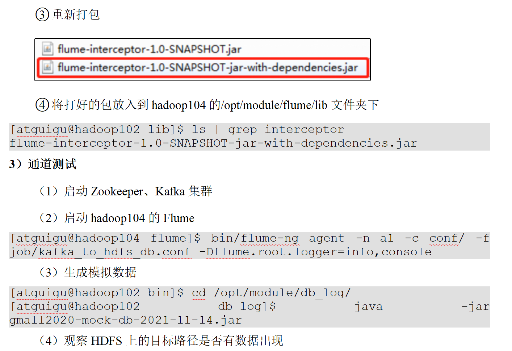

- 记得启动Datax

	​		若HDFS上的目标路径已有增量表的数据出现了，就证明数据通道已经打通。
（5）数据目标路径的日期说明
	​		仔细观察，会发现目标路径中的日期，并非模拟数据的业务日期，而是当前日期。这是由于Maxwell输出的JSON字符串中的ts字段的值，是数据的变动日期。而真实场景下，数据的业务日期与变动日期应当是一致的。

**4）编写Flume启停脚本**
		为方便使用，此处编写一个Flume的启停脚本
（1）在hadoop102节点的/home/atguigu/bin目录下创建脚本f3.sh

```
[atguigu@hadoop102 bin]$ vim f3.sh
```

​	在脚本中填写如下内容

```bash
#!/bin/bash

case $1 in
"start")
        echo " --------启动 hadoop104 业务数据flume-------"
        ssh hadoop104 "nohup /opt/module/flume/bin/flume-ng agent -n a1 -c /opt/module/flume/conf -f /opt/module/flume/job/kafka_to_hdfs_db.conf >/dev/null 2>&1 &"
;;
"stop")

        echo " --------停止 hadoop104 业务数据flume-------"
        ssh hadoop104 "ps -ef | grep kafka_to_hdfs_db | grep -v grep |awk '{print \$2}' | xargs -n1 kill"
;;
esac
```

- f3.sh是业务数据的增量同步flume， 将数据从SQL同步到HDFS


#### 2.2.6.3 Maxwell配置

1）Maxwell时间戳问题

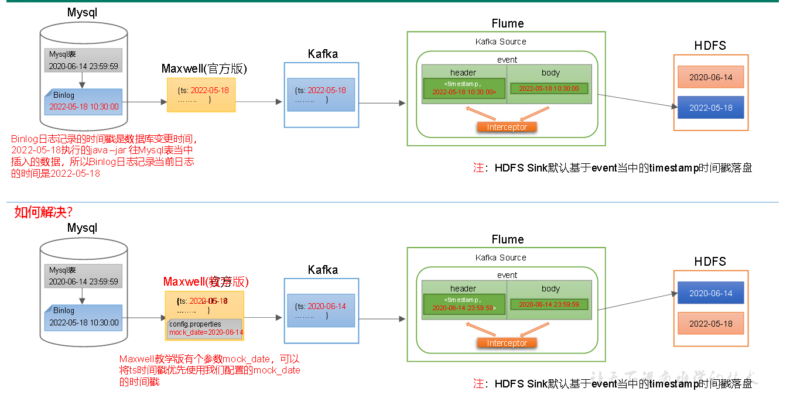

​		此处为了模拟真实环境，对Maxwell源码进行了改动，增加了一个参数mock_date，该参数的作用就是指定Maxwell输出JSON字符串的ts时间戳的日期，接下来进行测试。
​		修改Maxwell配置文件config.properties，增加mock_date参数，如下

```bash
log_level=info

producer=kafka
kafka.bootstrap.servers=hadoop102:9092,hadoop103:9092

#kafka topic配置
kafka_topic=topic_db

#注：该参数仅在maxwell教学版中存在，修改该参数后重启Maxwell才可生效
mock_date=2020-06-14

# mysql login info
host=hadoop102
user=maxwell
password=maxwell
jdbc_options=useSSL=false&serverTimezone=Asia/Shanghai
```

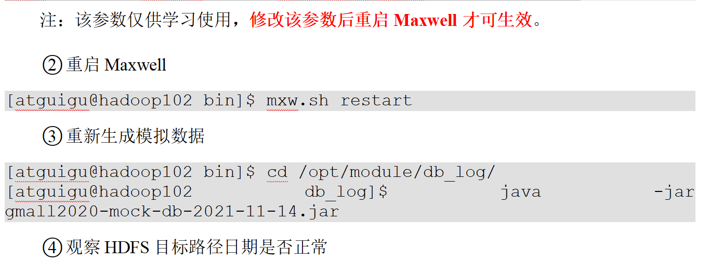

#### 2.2.6.4 增量表首日全量同步

​		通常情况下，增量表需要在首日进行一次全量同步，后续每日再进行增量同步，首日全量同步可以使用Maxwell的bootstrap功能，方便起见，下面编写一个增量表首日全量同步脚本。
​		1）在~/bin目录创建mysql_to_kafka_inc_init.sh
​		`[atguigu@hadoop102 bin]$ vim mysql_to_kafka_inc_init.sh`
​		脚本内容如下

```shell
#!/bin/bash

# 该脚本的作用是初始化所有的增量表，只需执行一次

MAXWELL_HOME=/opt/module/maxwell

import_data() {
    $MAXWELL_HOME/bin/maxwell-bootstrap --database gmall --table $1 --config $MAXWELL_HOME/config.properties
}

case $1 in
"cart_info")
  import_data cart_info
  ;;
"comment_info")
  import_data comment_info
  ;;
"coupon_use")
  import_data coupon_use
  ;;
"favor_info")
  import_data favor_info
  ;;
"order_detail")
  import_data order_detail
  ;;
"order_detail_activity")
  import_data order_detail_activity
  ;;
"order_detail_coupon")
  import_data order_detail_coupon
  ;;
"order_info")
  import_data order_info
  ;;
"order_refund_info")
  import_data order_refund_info
  ;;
"order_status_log")
  import_data order_status_log
  ;;
"payment_info")
  import_data payment_info
  ;;
"refund_payment")
  import_data refund_payment
  ;;
"user_info")
  import_data user_info
  ;;
"all")
  import_data cart_info
  import_data comment_info
  import_data coupon_use
  import_data favor_info
  import_data order_detail
  import_data order_detail_activity
  import_data order_detail_coupon
  import_data order_info
  import_data order_refund_info
  import_data order_status_log
  import_data payment_info
  import_data refund_payment
  import_data user_info
  ;;
esac
```

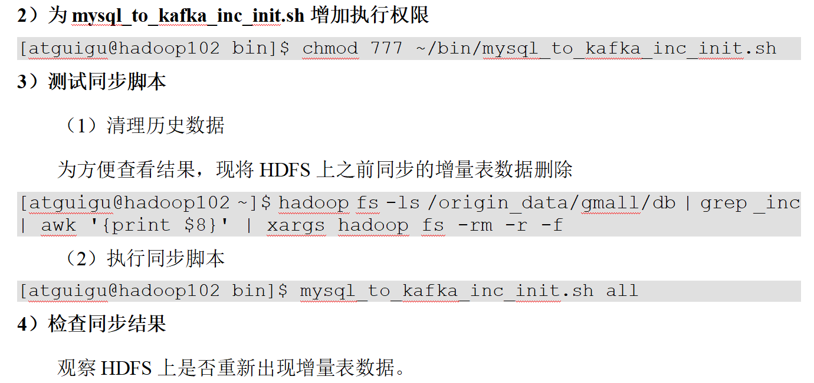

## 2.3 采集通道启动/停止脚本

1）在/home/atguigu/bin目录下创建脚本cluster.sh
`[atguigu@hadoop102 bin]$ vim cluster.sh`
	在脚本中填写如下内容

```shell
#!/bin/bash

case $1 in
"start"){
        echo ================== 启动 集群 ==================

        #启动 Zookeeper集群
        zk.sh start

        #启动 Hadoop集群
        hdp.sh start

        #启动 Kafka采集集群
        kf.sh start

        #启动采集 Flume
        f1.sh start

#启动日志消费 Flume
        f2.sh start

#启动业务消费 Flume
        f3.sh start

#启动 maxwell
        mxw.sh start

        };;
"stop"){
        echo ================== 停止 集群 ==================

#停止 Maxwell
        mxw.sh stop

#停止 业务消费Flume
        f3.sh stop

#停止 日志消费Flume
        f2.sh stop

#停止 日志采集Flume
        f1.sh stop

        #停止 Kafka采集集群
        kf.sh stop

        #停止 Hadoop集群
        hdp.sh stop

        #停止 Zookeeper集群
        zk.sh stop

};;
esac
```


# 第3章 数仓环境准备

## 4.1 Hive安装部署

1）把apache-hive-3.1.2-bin.tar.gz上传到linux的/opt/software目录下
2）解压apache-hive-3.1.2-bin.tar.gz到/opt/module/目录下面
`[atguigu@hadoop102 software]$ tar -zxvf /opt/software/apache-hive-3.1.2-bin.tar.gz -C /opt/module/`
3）修改apache-hive-3.1.2-bin.tar.gz的名称为hive
`[atguigu@hadoop102 software]$ mv /opt/module/apache-hive-3.1.2-bin/ /opt/module/hive`
4）修改/etc/profile.d/my_env.sh，添加环境变量
`[atguigu@hadoop102 software]$ sudo vim /etc/profile.d/my_env.sh`
添加内容

```bash
#HIVE_HOME
export HIVE_HOME=/opt/module/hive
export PATH=$PATH:$HIVE_HOME/bin
```

重启Xshell对话框或者source一下 /etc/profile.d/my_env.sh文件，使环境变量生效
		`[atguigu@hadoop102 software]$ source /etc/profile.d/my_env.sh`
5）解决日志Jar包冲突，进入/opt/module/hive/lib目录
		`[atguigu@hadoop102 lib]$ mv log4j-slf4j-impl-2.10.0.jar log4j-slf4j-impl-2.10.0.jar.bak`
4.2 Hive元数据配置到MySQL
4.2.1 拷贝驱动
将MySQL的JDBC驱动拷贝到Hive的lib目录下
		`[atguigu@hadoop102 lib]$ cp /opt/software/mysql-connector-java-5.1.27-bin.jar /opt/module/hive/lib/`
4.2.2 配置Metastore到MySQL
在$HIVE_HOME/conf目录下新建hive-site.xml文件
		`[atguigu@hadoop102 conf]$ vim hive-site.xml`
添加如下内容

```xml
<?xml version="1.0"?>
<?xml-stylesheet type="text/xsl" href="configuration.xsl"?>

<configuration>
  <!-- jdbc连接的URL -->
  <property>
    <name>javax.jdo.option.ConnectionURL</name>
    <value>jdbc:mysql://hadoop102:3306/metastore?useSSL=false</value>
  </property>

  <!-- jdbc连接的Driver-->
  <property>
    <name>javax.jdo.option.ConnectionDriverName</name>
    <value>com.mysql.jdbc.Driver</value>
  </property>

  <!-- jdbc连接的username-->
  <property>
    <name>javax.jdo.option.ConnectionUserName</name>
    <value>root</value>
  </property>

  <!-- jdbc连接的password -->
  <property>
    <name>javax.jdo.option.ConnectionPassword</name>
    <value>000000</value>
  </property>

  <!-- Hive默认在HDFS的工作目录 -->
  <property>
    <name>hive.metastore.warehouse.dir</name>
    <value>/user/hive/warehouse</value>
  </property>
  <!-- 指定hiveserver2连接的host -->
  <property>
    <name>hive.server2.thrift.bind.host</name>
    <value>hadoop102</value>
  </property>

  <!-- 指定hiveserver2连接的端口号 -->
  <property>
    <name>hive.server2.thrift.port</name>
    <value>10000</value>
  </property>

  <!-- hiveserver2的高可用参数，开启此参数可以提高hiveserver2的启动速度 -->
  <property>
    <name>hive.server2.active.passive.ha.enable</name>
    <value>true</value>
  </property>

</configuration>
```

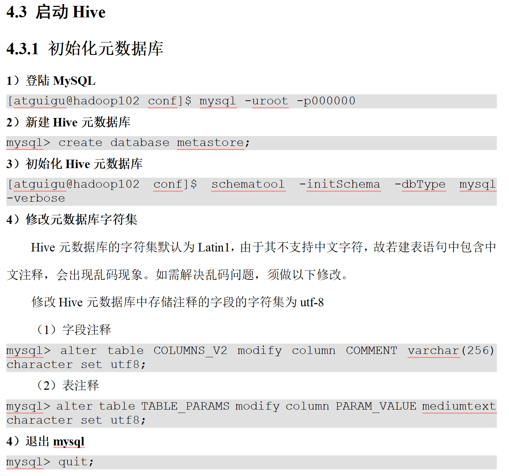


