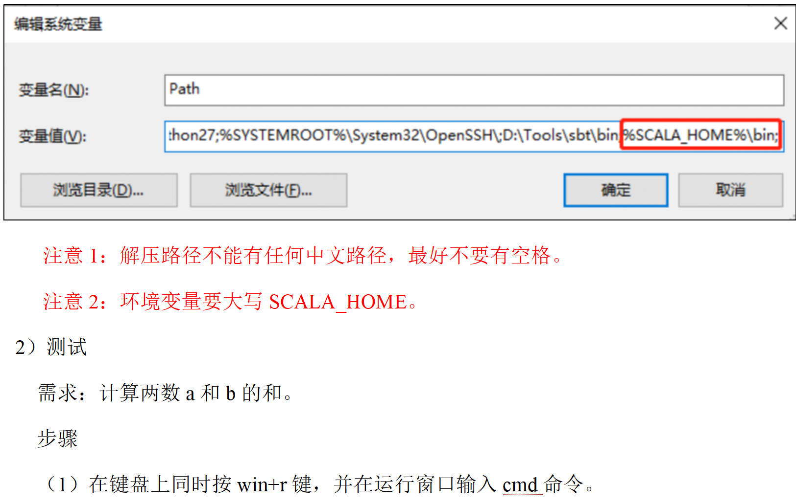
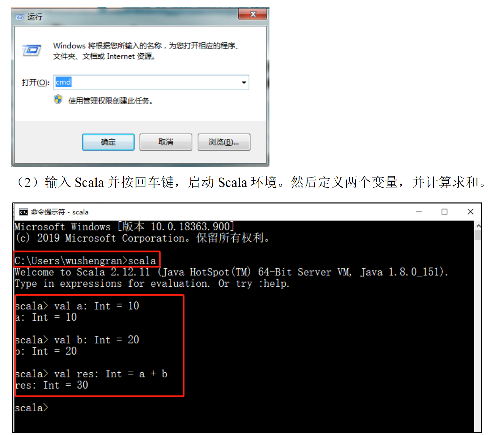
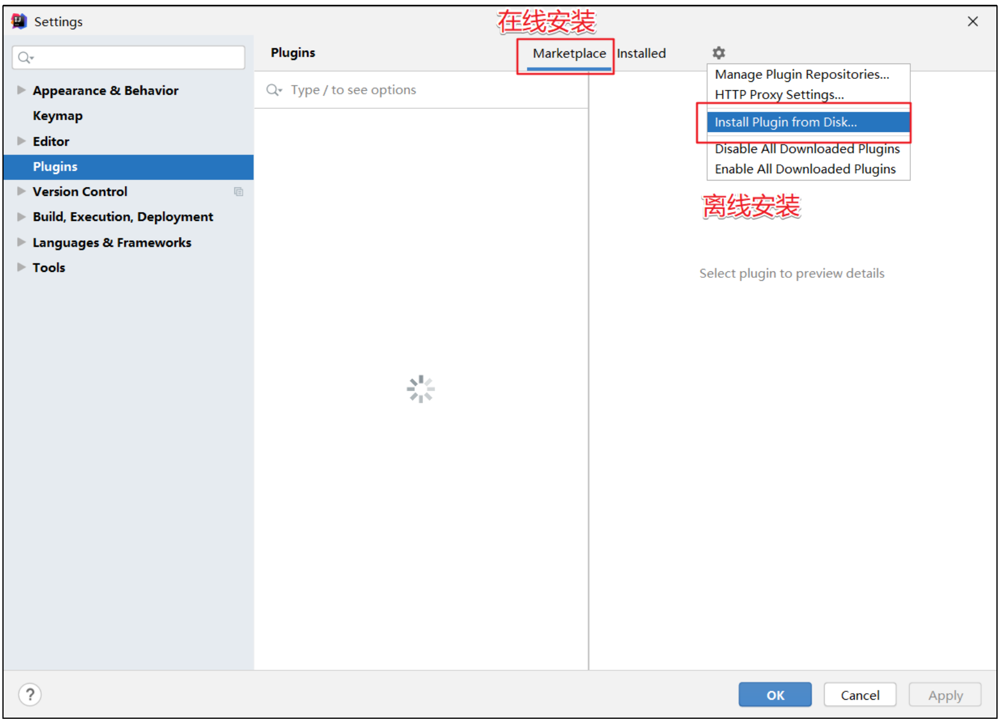
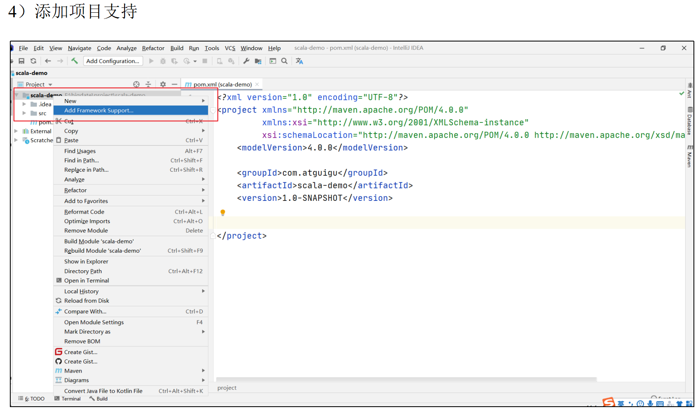
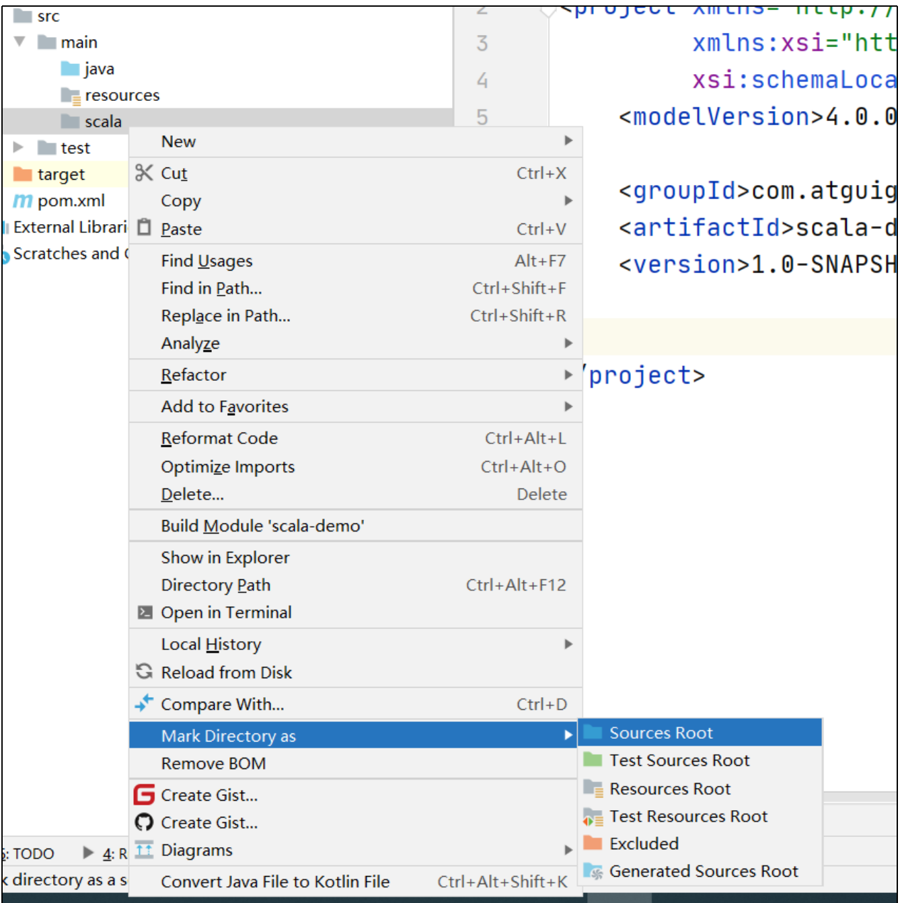
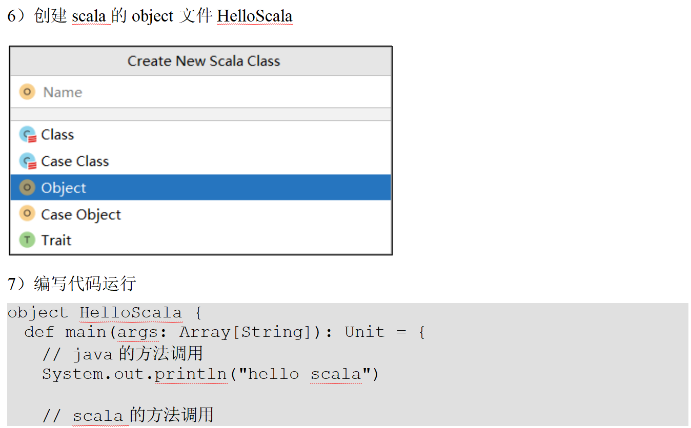
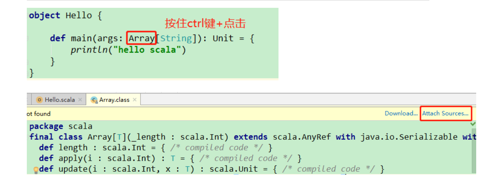
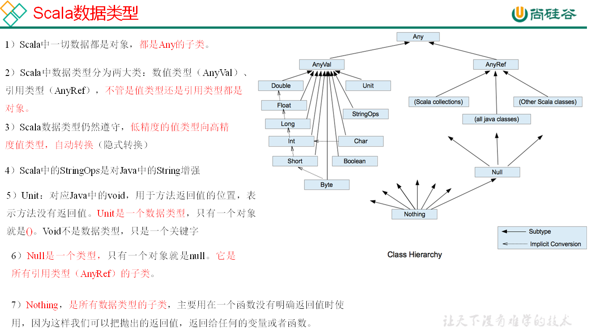
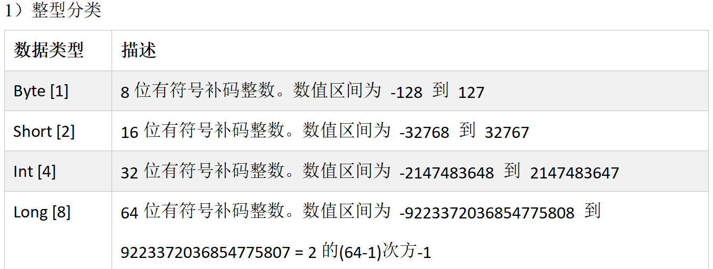

##### 课前回顾

**一、 Hadoop基础架构阶段**

- 1， 前置内容
  - Maven： 管理jar和项目模块相关， 工具
  - Linux：操作系统， 熟悉常用命令
  - Shell： 高级脚本（linux， 编写脚本，让集群服务器更加智能化， 自动化）
- Hadoop
  - HDFS：海量数据存储管理
  - MapReduce： 海量数据分布式计算
  - Yarn： 资源调度框架
- Zookeeper
  - 分布式应用场景， 中间协调者的角色
- Hive（重要）
  - 数据仓库的统计分析工具
- Flume：（流式的数据采集框架）
- Kafka（重要）
  - 高吞吐的消息队列
- 采集项目：
  - Datax
  - Maxwell

**二、Spark生态阶段（做离线数仓**）

- Scala
  - 编程语言， 为了方便研究基于Scala编写的一些技术框架，

**三、Flink生态**

# 第1章 Scala入门

## 1.1 概述

​		Scala将面向对象和函数式编程结合成一种简洁的高级语言。
​		语言特点如下：
​		（1）Scala和Java一样属于JVM语言，使用时都需要先编译为class字节码文件，并且Scala能够直接调用Java的类库。
​		（2）Scala支持两种编程范式面向对象和函数式编程。
​		（3）Scala语言更加简洁高效；语法能够化简，函数式编程的思想使代码结构简洁。
​		（4）作者马丁·奥德斯基设计Scala借鉴了Java的设计思想，同时优秀的设计也推动了Java语言的发展。

## 1.2 Scala环境搭建

1）安装步骤
（1）首先确保JDK1.8安装成功
（2）下载对应的Scala安装文件scala-2.12.11.zip
（3）解压scala-2.12.11.zip，解压到任意没有中文的路径,例如D:\Tools
（4）配置Scala的环境变量






## 1.3 HelloWorld案例

### 1.3.1 idea中的hello world案例

1）创建新的maven工程







5）创建文件夹scala并标记为source-root






### 1.3.2 Scala程序反编译

​		1）在项目的target目录Hello文件上点击右键->Show in Explorer->看到object底层生成Hello$.class和Hello.class两个文件。
​		2）采用Java反编译工具jd-gui.exe反编译代码，将Hello.class拖到jd-gui.exe页面。


## 1.5 关联Scala源码

​		在使用Scala过程中，为了搞清楚Scala底层的机制，需要查看源码，下面看看如何关联和查看Scala的源码包。
​		1）查看源码
​		例如查看Array源码。按住ctrl键->点击Array->右上角出现Attach Soures…



2）关联源码
（1）将我们的源码包scala-sources-2.12.11.tar.gz拷贝到D:\Tools\scala-2.12.11\lib文件夹下，并解压为scala-sources-2.12.11文件夹。
（2）点击Attach Sources…->选择D:\Tools\scala-2.12.11\lib\scala-sources-2.12.11，这个文件夹，就可以看到源码了。


# 第2章 变量和数据类型

## 2.1 注释

​		Scala注释使用和Java完全一样。
​		注释是一个程序员必须要具有的良好编程习惯。将自己的思想通过注释先整理出来，再用代码去体现。
1）基本语法
（1）单行注释：//
（2）多行注释：/* */
（3）文档注释：/**
​	*
​    */
2）代码规范
（1）使用一次tab操作，实现缩进，默认整体向右边移动，用shift+tab整体向左移。
（2）或者使用ctrl + alt + L来进行格式化。
（3）运算符两边习惯性各加一个空格。比如：2 + 4 * 5。
（4）一行最长不超过80个字符，超过的请使用换行展示，尽量保持格式优雅。
2.2 变量和常量（重点）
常量：在程序执行的过程中，其值不会被改变的变量。
0）回顾：Java变量和常量语法
​	变量类型 变量名称 = 初始值			int a = 10
​	final常量类型 常量名称 = 初始值		final int b = 20
​	注意：java中的final如果加static才会被存放在常量池中，否则作为不可修改的变量存在堆栈中。
1）基本语法
​	var 变量名 [: 变量类型] = 初始值		var i:Int = 10
val 常量名 [: 常量类型] = 初始值		val j:Int = 20
注意：能用常量的地方不用变量。
2）案例实操
（1）声明一个值的时候，类型可以省略，编译器自动推导，即类型推导。
（2）类型确定后，就不能修改，说明Scala是强数据类型语言。
（3）变量声明时，必须要有初始值。
（4）在声明/定义一个变量时，可以使用var或者val来修饰，var修饰的变量可改变，val修饰的变量不可改。
（5）var修饰的对象引用可以改变，val修饰的对象则不可改变，但对象的状态（值）却是可以改变的。（比如：自定义对象、数组、集合等等）。

```scala
package com.atguigu.chapter02

object Test01_Var {
  def main(args: Array[String]): Unit = {

    // 声明变量和常量
    val a: Int = 10
    var b: Int = 20


    // 常量值无法修改
    //    a = 20
    b = 30
    //    （1）声明变量时，类型可以省略，编译器自动推导，即类型推导
    val c = 30


    //    （2）类型确定后，就不能修改，说明Scala是强数据类型语言。

    //    b = "30"

    //    （3）变量声明时，必须要有初始值
    val d: Int = 0

//    var d1:Int = _
	
    val test02_Var = new Test02_Var()
    println(test02_Var.i)
    
    //    （4）var修饰的对象引用可以改变，val修饰的对象则不可改变，
    //    但对象的状态（值）却是可以改变的。（比如：自定义对象、数组、集合等等）
    val person0 = new Person02()
    var person1 = new Person02()

    // 引用数据类型的常量和变量能否替换成别的对象
    // var 可以修改引用数据类型的地址值  val不行
    person1 = new Person02()

    // 引用数据类型中的属性值能否发生变化  取决于内部的属性在定义的时候是var还是val
    //    person0.name = "lisi"
    person0.age = 11

  }
}

class Test01_Var {

  // scala中类的属性 如果是var变量也能使用默认值  但是必须要有等号
  var i: Int = _
}

class Person01 {
  val name: String = "zhangsan"
  var age: Int = 10
}
```

## 2.3 标识符的命名规范

​		Scala对各种变量、方法、函数等命名时使用的字符序列称为标识符。即：凡是自己可以起名字的地方都叫标识符。
1）命名规则
Scala中的标识符声明，基本和Java是一致的，但是细节上会有所变化，有以下三种规则：
（1）以字母或者下划线开头，后接字母、数字、下划线
（2）以操作符开头，且只包含操作符（+ - * / # !等）
（3）用反引号`....`包括的任意字符串，即使是Scala关键字（39个）也可以
​		•package, import, class, object, trait, extends, with, type, for
​		•private, protected, abstract, sealed, final, implicit, lazy, override
​		•try, catch, finally, throw 
​		•if, else, match, case, do, while, for, return, yield
​		•def, val, var 
​		•this, super
​		•new
​		•true, false, null
**注意：正常使用不能只遵守规则，必须按照规范来写，即使用大小驼峰命名法。**

## 2.4 字符串输出

1）基本语法
（1）字符串，通过+号连接。
（2）重复字符串拼接。
（3）printf用法：字符串，通过%传值。
（4）字符串模板（插值字符串）：通过$获取变量值。
    （5）长字符串  原始字符串

```scala
package com.atguigu.chapter02

object Test02_Str {
  def main(args: Array[String]): Unit = {

    //    （1）字符串，通过+号连接
    System.out.println()
    println("hello" + "world")

    //    （2）重复字符串拼接
    println("linhailinhai" * 200)

    //    （3）printf用法：字符串，通过%传值。
    printf("name: %s age: %d\n", "linhai", 8)

    //    （4）字符串模板（插值字符串）：通过$获取变量值
    val name = "linhai"
    val age = 8

    val s1 = s"name: $name,age:${age}"
    println(s1)

    val s2 = s"name: ${name + 1},age:${age + 2}"
    println(s2)


    //    （5）长字符串  原始字符串
    println("我" +
      "是" +
      "一首" +
      "诗")

    //多行字符串，在Scala中，利用三个双引号包围多行字符串就可以实现。
    // 输入的内容，带有空格、\t之类，导致每一行的开始位置不能整洁对齐。
    //应用scala的stripMargin方法，在scala中stripMargin默认是“|”作为连接符，
    // 在多行换行的行头前面加一个“|”符号即可。
    println(
      """我
        |是
        |一首
        |诗
        |""".stripMargin)

    """
      |select id,
      |       age
      |from  user_info
      |""".stripMargin


    s"""
       |${name}
       |${age}
       |""".stripMargin
  }
}
```

## 2.5 数据类型（重点）




```scala
object Test03_Type {
  def main(args: Array[String]): Unit = {	
	// 所有的代码都是代码块
    // 表示运行一段代码  同时将最后一行的结果作为返回值
    // 千万不要写return
    val i: Int = {
      println("我是代码块")
      10 + 10
    }

    // 代码块为1行的时候  大括号可以省略
    val i1: Int = 10 + 10

    // 如果代码块没有计算结果  返回类型是unit
    val unit: Unit = {
      println("hello")
      println("我是代码块")
    }


    // 当代码块没办法完成计算的时候  返回值类型为nothing
    //    val value: Nothing = {
    //      println("hello")
    //      throw new RuntimeException
//    }
}
}
```

## 2.7 整数类型（Byte、Short、Int、Long）

Scala的整数类型就是用于存放整数值的，比如12，30，3456等等。



2）案例实操
（1）Scala各整数类型有固定的表示范围和字段长度，不受具体操作的影响，以保证Scala程序的可移植性。

```scala
object Test03_Type {
  def main(args: Array[String]): Unit = {

    // 整数类型
    val i1 = 1

    val l = 1L

    // （1）Scala各整数类型有固定的表示范围和字段长度，不受具体操作的影响，以保证Scala程序的可移植性。
    val b1: Byte = 2
//    val b0: Byte = 128
    
    val b2: Byte = 1 + 1
    println(b2)

    val i2 = 1

    //（2）编译器对于常量值的计算 能够直接使用结果进行编译
    // 但是如果是变量值 编译器是不知道变量的值的 所以判断不能将大类型的值赋值给小的类型
    //    val b3: Byte = i2 + 1
    //    println(b3)

    // （3）Scala程序中变量常声明为Int型，除非不足以表示大数，才使用Long
    val l1 = 2200000000L
  }
}
```

## 2.8 浮点类型（Float、Double）

Scala的浮点类型可以表示一个小数，比如123.4f，7.8，0.12等等。


2）案例实操
Scala的浮点型常量默认为Double型，声明Float型常量，须后加‘f’或‘F’。

```scala
object Test03_Type{

    def main(args: Array[String]): Unit = {

    // 浮点数介绍
    // 默认使用double
    val d: Double = 3.14

    // 如果使用float 在末尾添加f
    val fl = 3.14f

    // 浮点数计算有误差
    println(0.1 / 3.3)
    }
}
```

## 2.9 字符类型（Char）

1）基本说明
字符类型可以表示单个字符，字符类型是Char。
2）案例实操
（1）字符常量是用单引号 ' ' 括起来的单个字符。
（2）\t ：一个制表位，实现对齐的功能
（3）\n ：换行符
（4）\\ ：表示\
（5）\" ：表示"

```scala
object Test03_Type{

    def main(args: Array[String]): Unit = {

    //    （1）字符常量是用单引号 ' ' 括起来的单个字符。
    val c1: Char = 'a'
    val c2: Char = 65535

    //    （2）\t ：一个制表位，实现对齐的功能
    val c3: Char = '\t'

    //    （3）\n ：换行符
    val c4: Char = '\n'
    println(c3 + 0)
    println(c4 + 0)

    //    （4）\\ ：表示\
    val c5: Char = '\\'
    println(c5 + 0)

    //    （5）\" ：表示"
    val c6: Char = '\"'
    println(c6 + 0)
  }
}
```

## 2.10 布尔类型：Boolean

1）基本说明
（1）布尔类型也叫Boolean类型，Booolean类型数据只允许取值true和false
（2）boolean类型占1个字节。
2）案例实操

```scala
object Test03_Type{

    def main(args: Array[String]): Unit = {
        
        val bo1: Boolean = true
        val bo2: Boolean = false
    }
}
```


