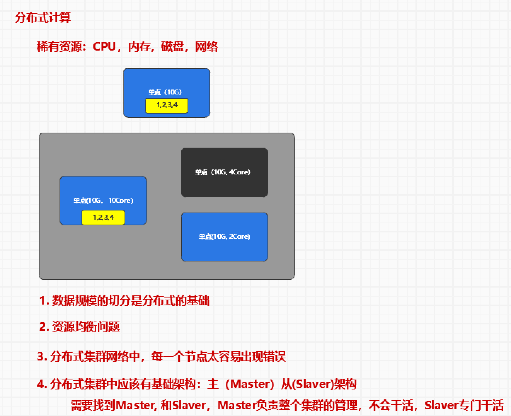
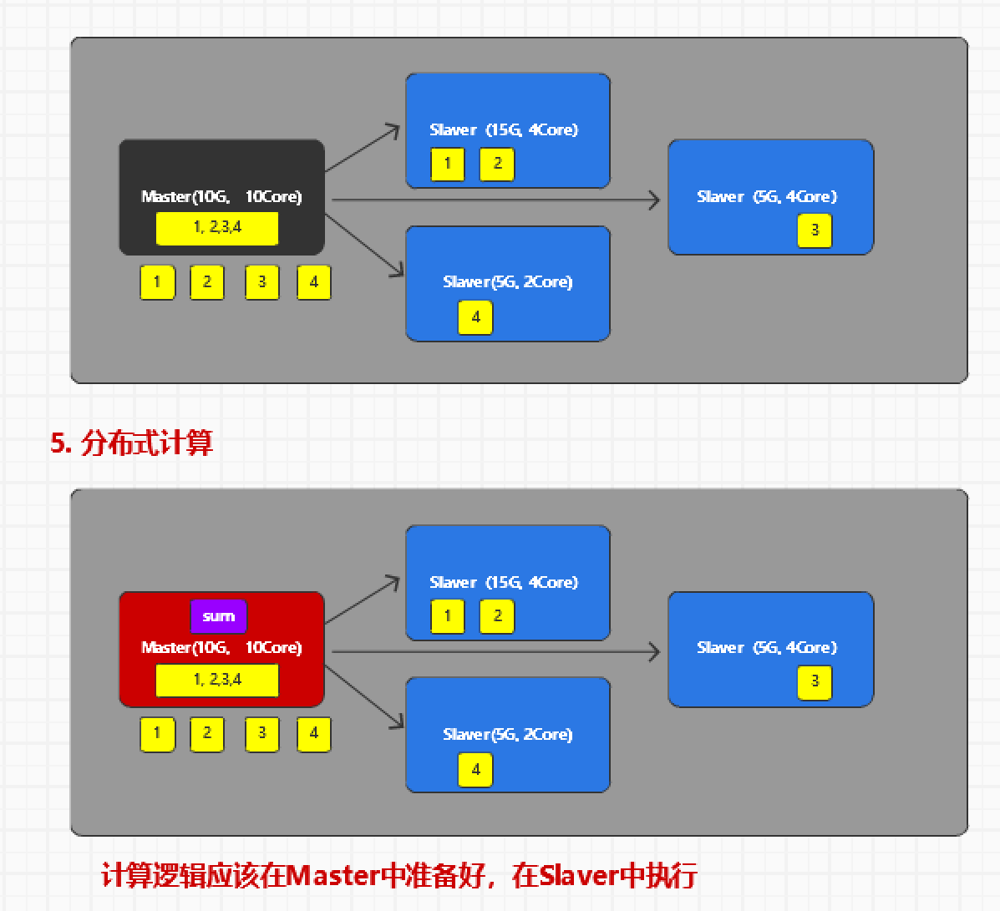
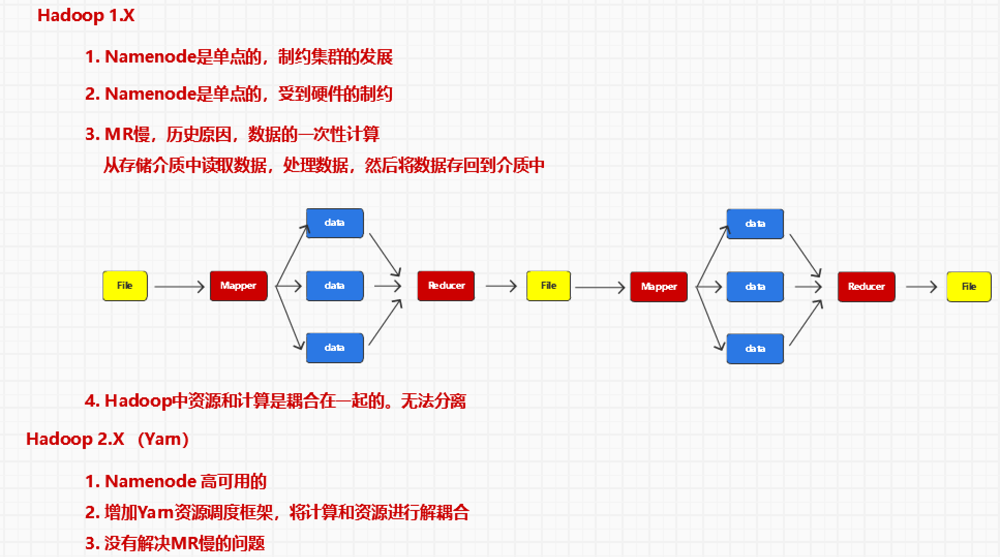
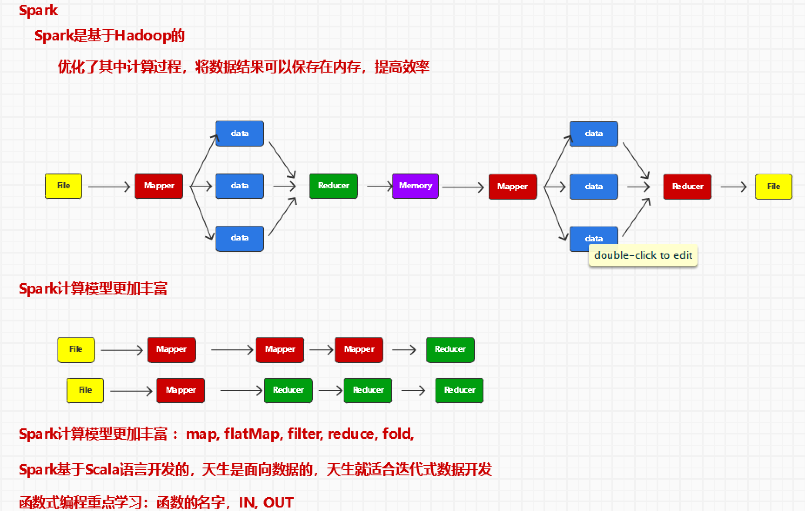
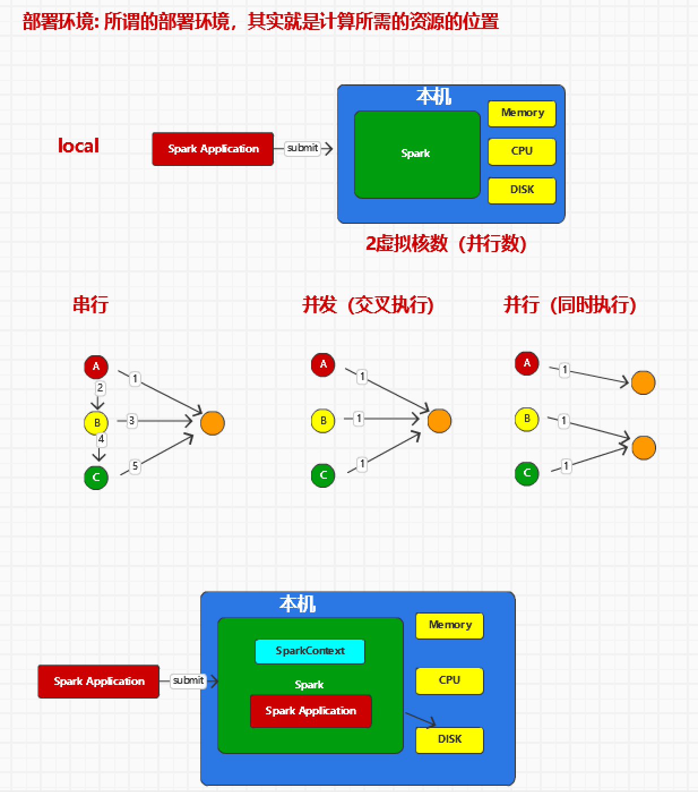

- 函数式编程不好理解
- Scala面向函数， 
- 大数据看重的是功能， 注重数据拿过来要干什么， 看中功能
- 一个团队中， 控制成本， 大佬加码农

##### 分布式计算 简析

- 1. 关键： 数据规模： 稀有资源有限， 数据规模的切分是分布式的基础
- 2. 数据是如何分配的： 节点时间的资源部均衡， 【分布式资源均衡问题】，
- 3. 分布式集群网络中， 每一个节点容易出现错误
- 4. 分布式集群在中 ， 需要专门的  集群架构： 【Master】 【Slaver】，Master负责管理， Slaver负责干活
- 5. 分布式计算， 计算的逻辑， 应该在Master中准备好， 在Slaver中执行
  6. 计算框架 ： 
     1. 框架是半成品系统， 将通用性的内容封装好了，

##### Hadoop与Spark关系

1. （1.x 版本的NameNode）是单点的，受到资源的限制， 制约集群的发展
2. 单点形态 ， 受到硬件的制约
3.  历史原因， 从存储介质中读取数据， 处理数据，  然后将结果存储回去：  复杂逻辑需要将整个过程 重新执行一遍， 磁盘IO 消耗过大
4. Hadoop中资源与计算是耦合在一起的，无法分离

##### Hadoop 2.x（Yarn）

1. NameNode 高可用
2. 增加Yarn资源调度器， 将资源与计算进行解耦合
3. 没有解决MR慢的问题

##### Spark

1. Spark是基于Hadoop的， 优化了计算过程， 将数据保存在内存， 提高效率
2. Spark计算模型更加丰富，：包含map， flatmap， filter， reduce， fold
3. Spark是 基于Scala语言开发的， 天生是面向数据的， 天生就适合迭代式数据开发
4. 函数式编程重点学： 函数的名字（ 函数多），IN， OUT

**Scala中函数的参数的个数可以超过22个**

对象的类型不能超过22个

**实时：数据的延迟**： 点击到反馈以毫秒为单位: 实时

**离线： 以小时与天为单位的计算结果**

##### Spark -部署环境

1. 其实就是计算所需资源的位置
   1. local： 
   2. 虚拟核数：（并行 ）
   3. 串行：多线程串在一块
   4. 并发： 多个线程同时抢占CPU， 抢到的执行， 没抢到的阻塞（交叉执行）
   5. 并行： 多个CPU的核心（多核同时执行）

##### 分布式简介






##### Hadoop特点特性



##### Spark特点




##### Spark部署



##### 简单WordCount案例

1. Maven创建项目流程
   1. groupid与artifacted是配置文件中的内容
   2. 之后的项目名，包名等， 记得选择正确的文件夹

1）创建一个Maven项目WordCount
2）**在项目WordCount上点击右键，Add Framework Support=》勾选scala**
3）在main下创建scala文件夹，并右键Mark Directory as Sources Root=>在scala下创建包名为com.atguigu.spark
4）输入文件夹准备：在新建的WordCount项目名称上右键=》新建input文件夹=》在input文件夹上右键=》分别新建1.txt和2.txt。每个文件里面准备一些word单词。

###### 实例代码

```scala
package com.atguigu.bigdata.spark.core.word.wordcount

import org.apache.spark.rdd.RDD
import org.apache.spark.{SparkConf, SparkContext}

object WordCount {
  def main(args: Array[String]): Unit = {
    // 1. 创建配置文件
    val conf: SparkConf = new SparkConf().setMaster("local[2]").setAppName("SparkEnv")
    val sc = new SparkContext(conf)

    // 2. 读取文件
    val fileDatas: RDD[String] = sc.textFile("data/word.txt")

    // 3. 对读取到的信息 进行处理
    val wordDatas: RDD[String] = fileDatas.flatMap(_.split(" "))

    // 对处理后的元组进行处理
    val wordGroup: RDD[(String, Iterable[String])] = wordDatas.groupBy(word => word)
    //        fileDatas.flatMap(
    //            (line:String) => {
    //                line.split(" ")
    //            }
    //        )
    //
    //        fileDatas.flatMap(
    //            (line:String) => line.split(" ")
    //        )
    //        fileDatas.flatMap(
    //            (line) => line.split(" ")
    //        )
    //        fileDatas.flatMap(
    //            line => line.split(" ")
    //        )
    //        fileDatas.flatMap(_.split(" "))

    // TODO 将相同的单词分在一个组内
    // 分组后的数据是：
    // (word, list(word, word, word, word))


    // TODO 获取单词数量
    // (word, list(word, word, word, word))
    // (word, size)
    //        wordGroup.map{
    //            case ( word, list ) => {
    //
    //            }
    //        }
    val wordCount: RDD[(String, Int)] = wordGroup.map(
      {
        t => {
          (t._1, t._2.size)
        }
      }
    )
    wordCount.collect().foreach(println)

    sc.stop()


  }
}

```

###### 配置文件

- 用到的插件要编写齐全

```xml
    <!--编译插件，改变Maven编译版本-->
    <build>
        <!-- plugins插件的意思 ，可以定义多个插件-->
        <plugins>
            <plugin>
                <groupId>org.apache.maven.plugins</groupId>
                <!--Maven的编译插件-->
                <artifactId>maven-compiler-plugin</artifactId>
                <version>3.8.1</version>
                <!--配置插件-->
                <configuration>
                    <!--源码 java文件，使用utf-8编码-->
                    <encoding>utf-8</encoding>
                    <source>1.8</source>
                    <target>1.8</target>
                </configuration>
            </plugin>

            <plugin>
                <groupId>net.alchim31.maven</groupId>
                <artifactId>scala-maven-plugin</artifactId>
                <version>3.4.6</version>
                <executions>
                    <execution>
                        <goals>
                            <goal>compile</goal>
                            <goal>testCompile</goal>
                        </goals>
                    </execution>
                </executions>
            </plugin>

            <plugin>
                <groupId>org.apache.maven.plugins</groupId>
                <artifactId>maven-assembly-plugin</artifactId>
                <version>3.0.0</version>
                <configuration>
                    <descriptorRefs>
                        <descriptorRef>jar-with-dependencies</descriptorRef>
                    </descriptorRefs>
                </configuration>
                <executions>
                    <execution>
                        <id>make-assembly</id>
                        <phase>package</phase>
                        <goals>
                            <goal>single</goal>
                        </goals>
                    </execution>
                </executions>
            </plugin>

        </plugins>
    </build>

    <dependencies>
        <dependency>
            <groupId>org.apache.spark</groupId>
            <artifactId>spark-core_2.12</artifactId>
            <version>3.0.0</version>
        </dependency>
    </dependencies>
```

