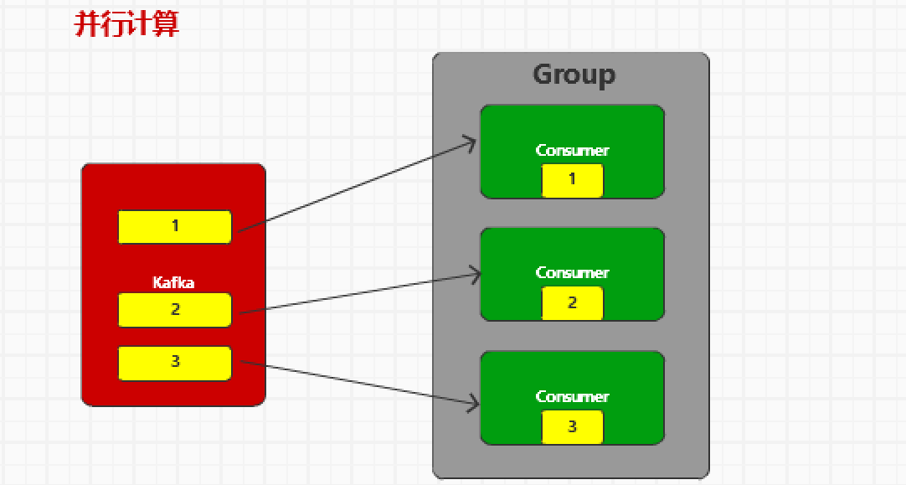
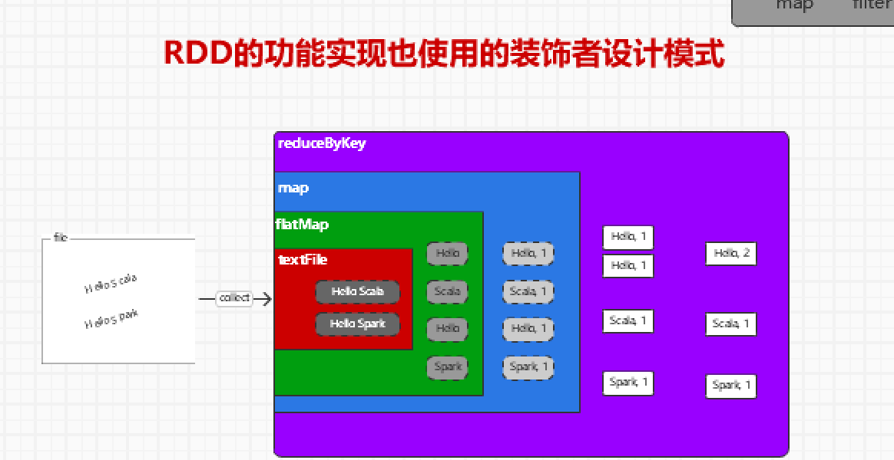
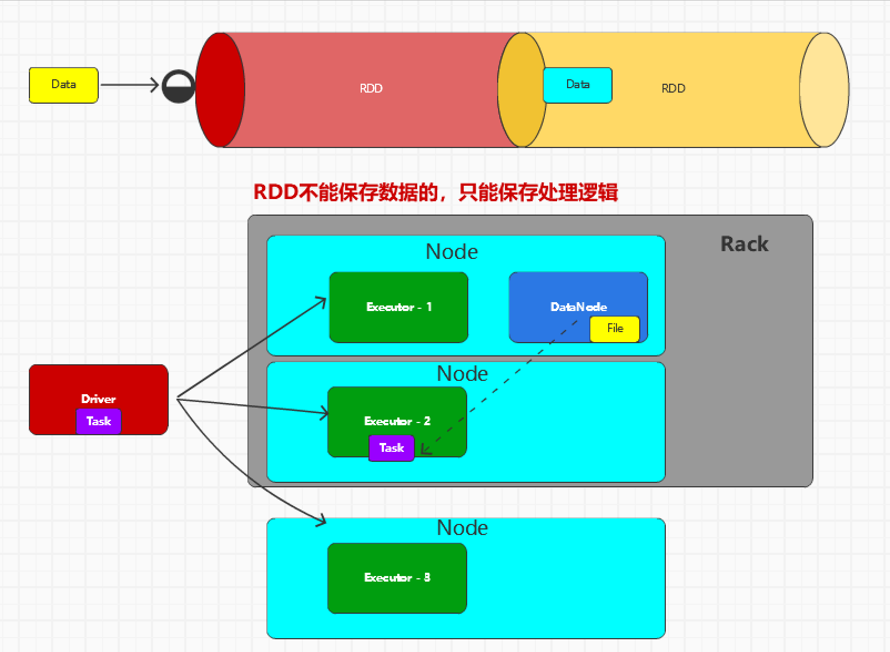
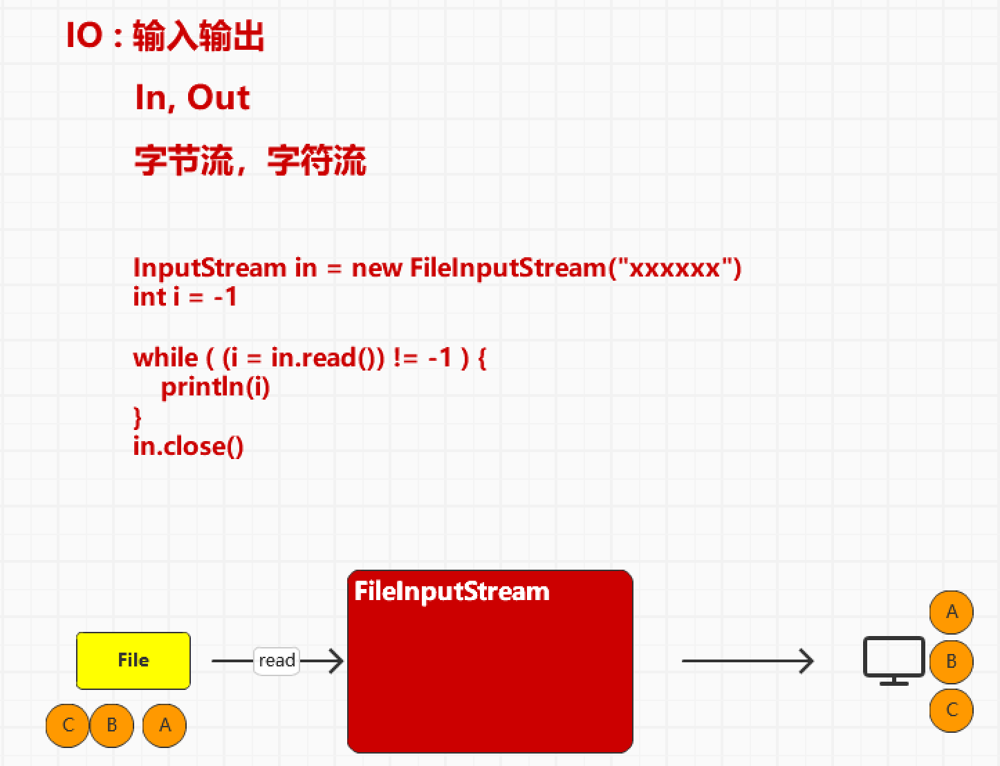
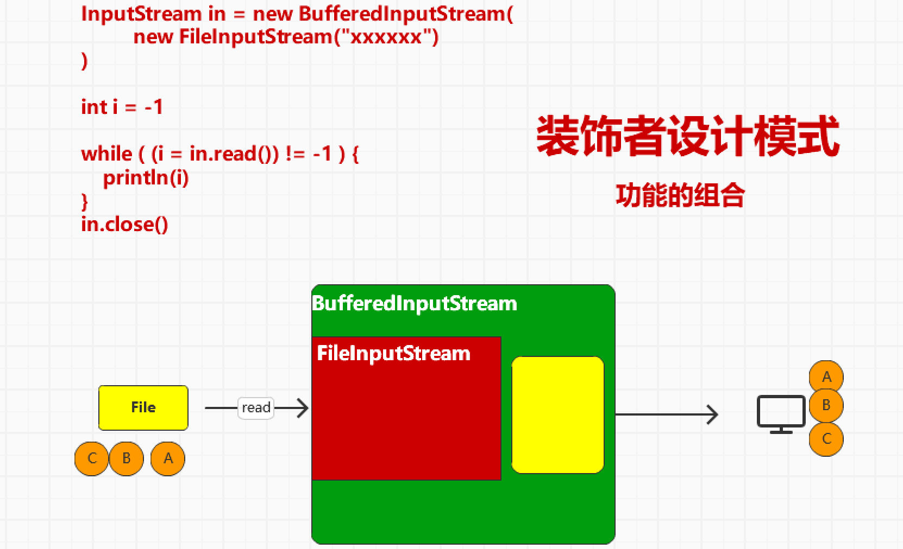
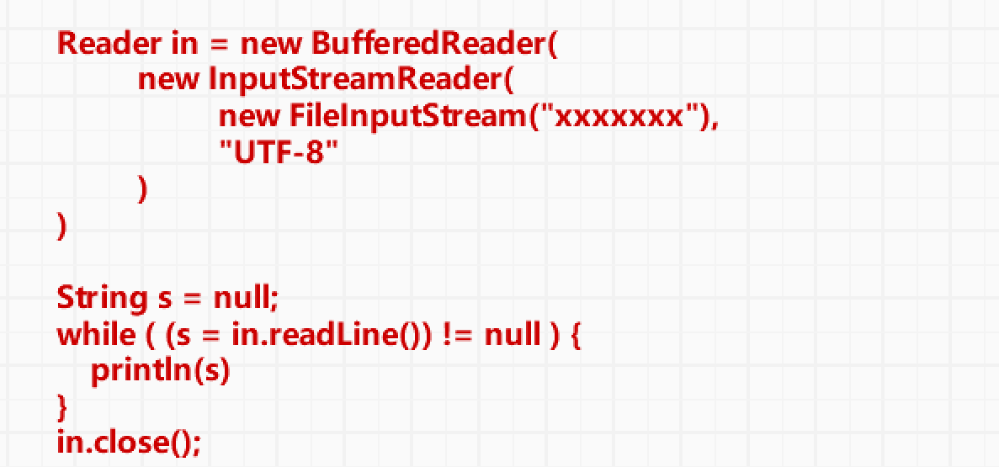

##### 笔记

1. 从Mysql中取==> 200条数据==>User类 ==>ArrayList ===> foreach

2. **ArrayList: 底层是数组： 默认容量为10， 扩容系数 1.5** 
3. 直接使用数组 `new User[200]`: 不需要扩容，
4. 能序列化（seralizeble）的对象可以在主从中传输， 才能做分布式： `transient`关键字修饰的属性不会被序列化

##### Hash定位

1. HashMap：底层数数组， hash用来定位，
2. shuffle： 洗牌，解决数据倾斜的一种方案

##### 快捷键

Ctrl + H   ： 查看谁实现了抽象函数

##### RDD：Spark中重要的数据模型

1. RDD的功能实现使用了装饰者的模式。
2. 数据{水流} --- 源源不断的流经 ----- RDD{管道}
3. collect：水管的阀门，阀门开启之后 水流{Data}才会流动
4. 计算位置可变，能在内存，也能在文件； 不可变：功能不可变，模型不可变，要变会会生成新模型； 可分区：数据分区； 集合： DataSet，数据集，










##### Spark：IO：输入输出

1. 零拷贝：Java虚拟机不接受数据， 将指令交给操作系统， 让操作系统将数据传输到指定位置， 操作系统使用的是页缓存， 页缓存只需要一个缓存就可以， 【零拷贝指的是 无效拷贝次数为0】
2. 用户状态， 系统状态， 两种切换会切换环境， 浪费时间， 频繁切换装填会极大的占用时间
3. 单个打印切换次数太多，切换消耗时间， ---使用缓存， 一批操作一批数据， 减少环境操作次数，减少占用时间，使用 Buffer， 内部有缓冲区， 将数据暂时缓存
4. 装饰者设计模式：【功能的组合】








##### 算子：认知心理学角度理解

1. opration（算子）
2. 转换算子
3. 行动算子

**匿名函数：将函数当做参数传递的时候常用匿名函数**

**至简原则： 普通函数， 匿名函数**


#### 代码

##### RDD创建

1. `wordCount.collect()`： 的作用， 相当于RDD的阀门开关

```scala
package com.atguigu.bigdata.spark.core.wordcount

import org.apache.spark.rdd.RDD
import org.apache.spark.{SparkConf, SparkContext}

object Spark05_RDD {

    def main(args: Array[String]): Unit = {

        val conf = new SparkConf().setMaster("local[2]").setAppName("SparkEnv")
        val sc = new SparkContext(conf);

        val fileDatas: RDD[String] = sc.textFile("data/word.txt")

        val wordDatas: RDD[String] = fileDatas.flatMap(_.split(" "))


        val mapDatas: RDD[(String, Int)] = wordDatas.map(
            word => {
                println("xxxxxx")
                (word, 1)
            }
        )

        val wordCount: RDD[(String, Int)] = mapDatas.reduceByKey(_ + _)


        // TODO 采集数据打印在控制台上
        wordCount.collect()//.foreach(println)
        sc.stop()
    }
}

```

##### RDD两种声明方式

1. 不直接new
2. 集合创建RDD
3. 磁盘文件创建RDD

```scala
package com.atguigu.bigdata.spark.core.rdd.instance

import org.apache.spark.{SparkConf, SparkContext}

object Spark01_RDD_Instance {

    def main(args: Array[String]): Unit = {

        val conf = new SparkConf().setMaster("local[2]").setAppName("RDDInstance")
        val sc = new SparkContext(conf);

        // TODO 如果想要构建数据模型RDD，不能直接new
        //      需要通过环境对象帮助我们构建数据模型
        //      1. 从内存集合中构建
        // parallelize:并行，分区
        //sc.parallelize()
        //      2. 从磁盘文件中构建
        //sc.textFile()
        sc.stop()

    }
}

```

##### 内存集合创建RDD

1. parallelize:并行，分区

```scala
package com.atguigu.bigdata.spark.core.rdd.instance

import org.apache.spark.rdd.RDD
import org.apache.spark.{SparkConf, SparkContext}

object Spark02_RDD_Instance_Memory {

    def main(args: Array[String]): Unit = {

        val conf = new SparkConf().setMaster("local[2]").setAppName("RDDInstance")
        val sc = new SparkContext(conf);

        // TODO 1. 从内存集合中构建RDD
        // parallelize:并行，分区
        // Scala的集合一般都是采用伴生对象的apply方法构建
        val seq = Seq(1,2,3,4)
        val rdd: RDD[Int] = sc.parallelize(seq)
        // makeRDD方法的底层调用的就是parallelize方法。
        val rdd1: RDD[Int] = sc.makeRDD(seq)

        rdd.collect.foreach(println)

        sc.stop()

    }
}

```

##### 内存创建并分区

1. conf.set("spark.default.parallelism", "4")：conf指定
2. 默认全部核心
3. 声明创建的时候显示指定

```scala
package com.atguigu.bigdata.spark.core.rdd.instance

import org.apache.spark.rdd.RDD
import org.apache.spark.{SparkConf, SparkContext}

object Spark02_RDD_Instance_Memory_Partition {

    def main(args: Array[String]): Unit = {

        val conf = new SparkConf().setMaster("local[*]").setAppName("RDDInstance")
        //conf.set("spark.default.parallelism", "4")
        val sc = new SparkContext(conf);

        // TODO 1. 从内存集合中构建RDD
        val seq = Seq(1,2,3,4)
        val list = List(1,2,3,4)
        val set = Set(1,2,3,4)
        val map = Map("a"->1)

        // TODO makeRDD方法需要传递2个参数
        //   第一个参数表示数据源（集合Seq）
        //   第二个参数表示分区数量，但是存在默认值，如果不传递参数，会自动采用默认值
        //       默认值：scheduler.conf.getInt("spark.default.parallelism", totalCores)
        //val rdd: RDD[Int] = sc.makeRDD(seq)
        val rdd: RDD[Int] = sc.makeRDD(seq)

        // 将数据模型保存为分区文件
        rdd.saveAsTextFile("output")
        sc.stop()
    }
}
```

##### 内存数据分区默认规则

1. 默认平均分区， 余数放在后边的分区

```scala
package com.atguigu.bigdata.spark.core.rdd.instance

import org.apache.spark.rdd.RDD
import org.apache.spark.{SparkConf, SparkContext}

object Spark02_RDD_Instance_Memory_Partition_Data {

    def main(args: Array[String]): Unit = {

        val conf = new SparkConf().setMaster("local[*]").setAppName("RDDInstance")
        val sc = new SparkContext(conf);

        // TODO 分区数据最开始时，都应该是平均
        // 【1，2】【3，4】

        // 【1，2】【3，4，5】

        // 【1】【2，3】【4,5】
        val rdd: RDD[Int] = sc.makeRDD(
            List(1,2,3,4,5), 2
        )
        rdd.saveAsTextFile("output")
        sc.stop()

    }
}

```

##### 磁盘文件RDD

1. 可一次读取多个文件
2. 可以使用正则匹配

```scala
package com.atguigu.bigdata.spark.core.rdd.instance

import org.apache.spark.rdd.RDD
import org.apache.spark.{SparkConf, SparkContext}

object Spark03_RDD_Instance_Disk {

    def main(args: Array[String]): Unit = {

        val conf = new SparkConf().setMaster("local[2]").setAppName("RDDInstance")
        val sc = new SparkContext(conf);

        // TODO 从磁盘文件中读取数据，构建数据模型RDD
        // 这里的String表示文件中一行一行的数据
        // TODO Spark是基于MR开发，所以Spark没有读取文件的能力，Spark中读文件是使用Hadoop完成的
        //val rdd: RDD[String] = sc.textFile("data/word.txt")
        //val rdd: RDD[String] = sc.textFile("data/word.txt,data/word1.txt,data/word2.txt")
        //val rdd: RDD[String] = sc.textFile("data")
        val rdd: RDD[String] = sc.textFile("data/word*.txt")

        rdd.collect.foreach(println)
        sc.stop()

    }
}

```

##### 磁盘文件RDD分区

1. 读文件操作由Hadoop完成
2. 一次读取一行
3. totalsize， goalsize， 分区计算规则
4. hadoop 百分之十的限制
5. 大文件会首先应用hadoop的你128M的分区限制， 先分区存储到hadoop， 再根据规则进行RDD分区

```scala
package com.atguigu.bigdata.spark.core.rdd.instance

import org.apache.spark.rdd.RDD
import org.apache.spark.{SparkConf, SparkContext}

object Spark03_RDD_Instance_Disk_Partition {

    def main(args: Array[String]): Unit = {

        val conf = new SparkConf().setMaster("local[*]").setAppName("RDDInstance")
        val sc = new SparkContext(conf);

        // TODO 读取文件数据时，RDD模型也存在分区操作
        //      textFile方法可以传递2个参数
        //      第一个参数表示数据文件路径
        //      第二个参数表示最小分区数，参数存在默认值，可以不用传递，那么会自动使用默认值
        //           默认值是：math.min(defaultParallelism, 2)
        // 实际分区的数量要比第二个参数可能要大。
        // 因为Spark读取文件的分区数量的计算不是Spark完成的，是Hadoop完成的
        /*
          // 总共字节数
          totalSize = 7

          // 每个分区放的字节数, 10%
          goalSize = 7 / 3 = 2...1;

          // 总共分区数
          7 / 2 = 3 + 1 = 4


         */
        val rdd: RDD[String] = sc.textFile("data/word.txt", 3)

        rdd.saveAsTextFile("output")
        sc.stop()

    }
}
```

##### 文件RDD分区实例


```scala
package com.atguigu.bigdata.spark.core.rdd.instance

import org.apache.spark.rdd.RDD
import org.apache.spark.{SparkConf, SparkContext}

object Spark03_RDD_Instance_Disk_Partition_Data {

    def main(args: Array[String]): Unit = {

        val conf = new SparkConf().setMaster("local[*]").setAppName("RDDInstance")
        val sc = new SparkContext(conf);


        // TODO 划分分区时，偏移量规则
        // [0, 0+3]   => [1,2]
        // [3, 3+3]   => [3]
        // [6, 6+1]   => []

        // [0, 0+2]   => [1]
        // [2, 2+2]   => [2]
        // [4, 4+2]   => [3]
        // [6, 6+1]   => []

        // TODO Spark读取文件采用的是Hadoop来读取，Hadoop读取文件有规则的
        //   1. 按行读取，一行数据应该是一个完整的业务数据，不能被切分。
        //   2. 不是按字节读取，是按照偏移量读取
        //   3. 相同的偏移量不能被重复读取
        /*

        1@@ => 012
        2@@ => 345
        3   => 6


         */

        val rdd: RDD[String] = sc.textFile("data/word.txt", 3)
        rdd.saveAsTextFile("output")
        sc.stop()

    }
}

```

#### 算子

##### 算子简介

```scala
package com.atguigu.bigdata.spark.core.rdd.operate.transform

import org.apache.spark.{SparkConf, SparkContext}

object Spark01_RDD_Oper_Transform {

    def main(args: Array[String]): Unit = {

        val conf = new SparkConf().setMaster("local[2]").setAppName("RDDInstance")
        val sc = new SparkContext(conf);

        // TODO RDD提供了很多的方法，但是方法主要分为两大类：

        // 1. 第一大类用于将旧的RDD转换为新的RDD，实现功能的组合和扩展
        //    称之为转换算子
        //    在使用时，会根据数据的类型分为3大类
        //    1.1 单值类型 ： List(1,2,3,4)
        //    1.2 双值类型 : List(1,2,3,4), List(3,4,5,6)
        //    1.3 键值类型 : List( (a,1), (b, 1) )
        // 2  第二大类用于执行RDD的操作
        //    称之为行动算子s

        sc.stop()

    }
}
```

##### 转换算子map

1. 一个RDD的元素依次进行map， map中一个函数对元素进行操作，返回一个新的RDD
2. 参数是一个函数

```scala
package com.atguigu.bigdata.spark.core.rdd.operate.transform

import org.apache.spark.rdd.RDD
import org.apache.spark.{SparkConf, SparkContext}

object Spark02_RDD_Oper_Transform {

    def main(args: Array[String]): Unit = {

        val conf = new SparkConf().setMaster("local[2]").setAppName("RDDInstance")
        val sc = new SparkContext(conf);

        // TODO RDD - 转换算子 - map
        val rdd = sc.makeRDD(
            List(1,2,3,4)
        )

        // 函数式编程中，重要的是函数的名称，函数的参数，函数的返回值
        // map算子需要传递一个参数，参数的类型为函数类型： Int => U
        def mapFunction(num : Int): Int = {
            num * 2
        }

        // map算子会将数据集中的每一条数据执行函数逻辑，将执行后的结果返回。默认类型不变
        val newRDD: RDD[Int] = rdd.map(mapFunction)

        newRDD.collect().foreach(println)

        sc.stop()

    }
}
```

##### 函数至简原则

1. 匿名函数： 当一个函数当做函数来传递的时候， 函数的名字不重要， 传入的函数，和执行的函数名字才重要，匿名函数可省略。

```scala
package com.atguigu.bigdata.spark.core.rdd.operate.transform

import org.apache.spark.rdd.RDD
import org.apache.spark.{SparkConf, SparkContext}

object Spark02_RDD_Oper_Transform_1 {

    def main(args: Array[String]): Unit = {

        val conf = new SparkConf().setMaster("local[2]").setAppName("RDDInstance")
        val sc = new SparkContext(conf);

        // TODO RDD - 转换算子 - map
        val rdd = sc.makeRDD(
            List(1,2,3,4)
        )

//        def mapFunction(num : Int): Int = {
//            num * 2
//        }

        // 至简原则
//        val newRDD: RDD[Int] = rdd.map(
//            (num : Int) => {
//                num * 2
//            }
//        )
//
//        val newRDD: RDD[Int] = rdd.map(
//            (num : Int) => num * 2
//        )
//
//        val newRDD: RDD[Int] = rdd.map(
//            (num) => num * 2
//        )
//
//        val newRDD: RDD[Int] = rdd.map(
//            num => num * 2
//        )

        val newRDD: RDD[Int] = rdd.map(_ * 2)

        newRDD.collect().foreach(println)

        sc.stop()

    }
}
```

