##### map算子

- map（）函数不会分区处理数据

- 多分区并行处理， 
- 最终合成一个rdd， 相当于数据的一次性操作，分区内前边的数据处理完成后，后边=的数据才会被处理
- 算子摸默认不会更改分区的数量

```scala
package rdd.opration.transform

import org.apache.spark.rdd.RDD
import org.apache.spark.{SparkConf, SparkContext}

object Scala02_Transform_2 {
  def main(args: Array[String]): Unit = {
    val conf: SparkConf = new SparkConf().setMaster("local[*]").setAppName("RDDInstance")

    val sc = new SparkContext(conf)

    val rdd1: RDD[Int] = sc.makeRDD(
      List(1, 2, 3, 4), 2
    )

    // 默认情况，RDD不会改变分区数量
    // 默认数据处理后所在分区不变
    // 计算过程中， 分区内有序， 分区之间无序
    // RDD不能保存数据，多个转换算子， 所以一条数据应该完全处理完毕之后再处理下一条数据
    // RDD是组合成的一个完整的功能， 一次执行玩一条数据;

    val newRDD: RDD[Int] = rdd1.map(
      num => {
        println(s"num ===> $num")
        num
      }
    )

    val newRdd1: RDD[Int] = newRDD.map(
      num => {
        println(s"num ------> $num")
        num
      }
    )
    newRdd1.collect()

        // newRDD.collect()// .foreach(println)
//    newRDD.saveAsTextFile("output")

    sc.stop()

  }
}
```

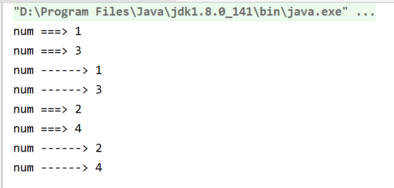

##### mapPartitions： 分区map

1. 分区并行，效率高
2. 依赖内存， 大数据环境数据量大， 综合考虑

```scala
package rdd.opration.transform

import org.apache.spark.rdd.RDD
import org.apache.spark.{SparkConf, SparkContext}

object Scala03_Transform {
  def main(args: Array[String]): Unit = {
    val conf: SparkConf = new SparkConf().setMaster("local[*]").setAppName("RDDInstance")

    val sc = new SparkContext(conf)

    val rdd1: RDD[Int] = sc.makeRDD(
      List(1, 2, 3, 4), 2
    )


    // mapPartitions: 用于将一个分区的数据统一进行转换映射，
    // 分区数据可能会很多 - 数据倾斜， 内存不一定放的下，mapPartitions 有可能内存溢出
    // mapPartitions ： 效率较高， 依赖内存大小
    // 内存足够的情况下， 可以使用 ；

    rdd1.mapPartitions(
      iter => {
        println(s"************")
        iter.map(_ * 2)
      }
    ).collect().foreach(println)


    sc.stop()
  }
}
```


##### mapPartitions： 分区相关

1. map为一对一关系， 数据不可能减少，
2. mapPartitions ： 是一个迭代器对应一个迭代器， 可以返回nvl.iterrater，可以减少迭代器的个数

```scala
package rdd.opration.transform

import org.apache.spark.rdd.RDD
import org.apache.spark.{SparkConf, SparkContext}

object Scala03_Transform_1 {
  def main(args: Array[String]): Unit = {
    val conf: SparkConf = new SparkConf().setMaster("local[*]").setAppName("RDDInstance")

    val sc = new SparkContext(conf)

    val rdd1: RDD[Int] = sc.makeRDD(
      List(1, 2, 3, 4), 2
    )

    // map的处理逻辑 是 一对一
    // rdd1.map()

    // mapPartitions l逻辑是一个迭代器对应一个迭代器
    // 可以改变数据个数，;
        rdd1.mapPartitions(
          iter => Nil.iterator
        )

    //    rdd1.mapPartitions(
    //      iter => {
    //        println(s"************")
    //        iter.map(_ * 2)
    //      }
    //    ).collect().foreach(println)


    sc.stop()
  }
}
```


##### mapPartitionsWithIndex： 按照分区操作数据

1.对特定分区的数据进行操作

- 待分区号的批处理map


```scala
package com.atguigu.bigdata.spark.core.rdd.operate.transform

import org.apache.spark.{SparkConf, SparkContext}

object Spark04_RDD_Oper_Transform {

    def main(args: Array[String]): Unit = {

        val conf = new SparkConf().setMaster("local[2]").setAppName("RDDInstance")
        val sc = new SparkContext(conf);

        // TODO RDD - 转换算子 - map
        val rdd = sc.makeRDD(
            List(1,2,3,4,5,6), 3
        )

        // TODO 获取第二个分区的数据，其他分区数据不要
        //      Spark的分区索引标号从0开始
        //      3,4
        rdd.mapPartitionsWithIndex(
            (ind, iter) => {
                if ( ind == 1 ) {
                    iter
                } else {
                    Nil.iterator
                }
            }
        ).collect().foreach(println)
//        var cnt = 0
//        rdd.mapPartitions(
//            iter => {
//                if ( cnt != 1 ) {
//                    cnt += 1
//                    Nil.iterator
//                } else {
//                    cnt += 1
//                    iter
//                }
//            }
//        ).collect().foreach(println)

        sc.stop()

    }
}
```


##### flatMap：（扁平化）数据转换

​		与map操作类似，将RDD中的每一个元素通过应用f函数依次转换为新的元素，并封装到RDD中。
​		区别：在flatMap操作中**，f函数的返回值是一个集合**，并且会将每一个该集合中的元素拆分出来放到新的RDD中

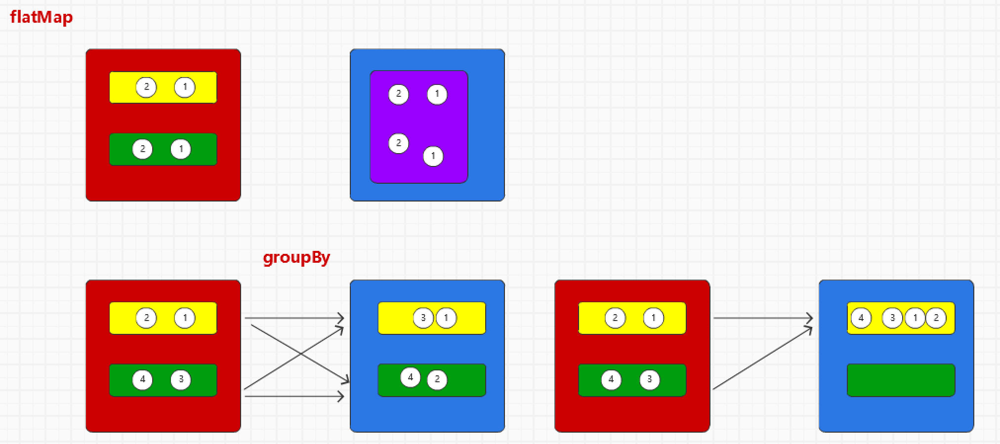

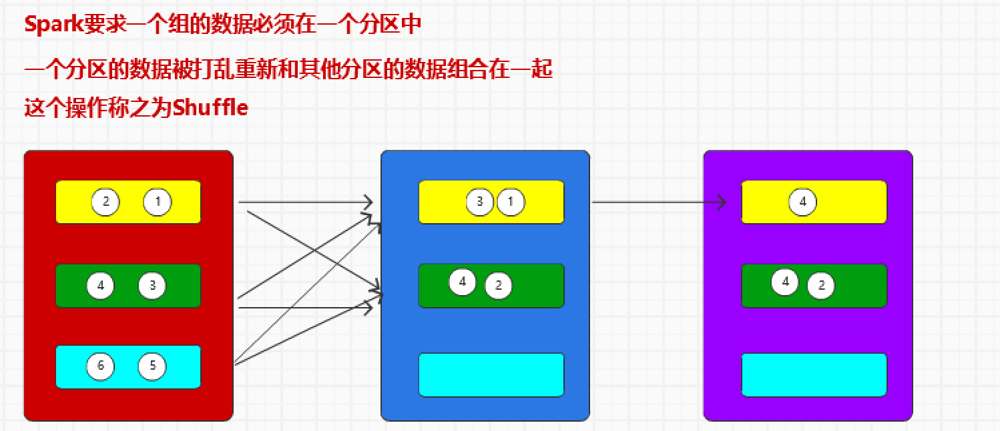

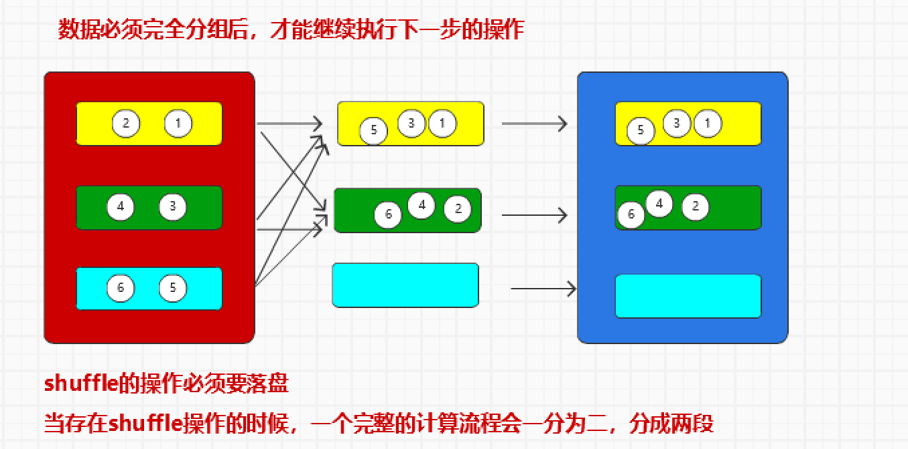

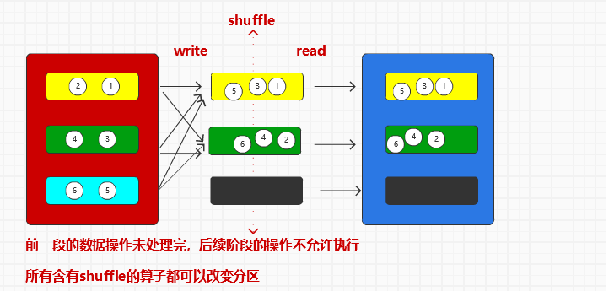


1. 可以将数据中的元素进行flat操作， 返回的为容器类型

```scala
package com.atguigu.bigdata.spark.core.rdd.operate.transform

import org.apache.spark.{SparkConf, SparkContext}

import scala.collection.mutable.ListBuffer

object Spark05_RDD_Oper_Transform {

    def main(args: Array[String]): Unit = {

        val conf = new SparkConf().setMaster("local[2]").setAppName("RDDInstance")
        val sc = new SparkContext(conf);

        // TODO RDD - 转换算子 - flatMap
        val rdd = sc.makeRDD(
            List(
                List(1,2), List(3,4)
            )
        )
        // flatMap算子可以将数据集中的数据拆分成个体来使用
        rdd.flatMap(
            list => {
                list
//                val buffer = ListBuffer[Int]()
//                list.foreach(
//                    num => {
//                        buffer.append(num)
//                    }
//                )
//                buffer.toList
            }
        ).collect().foreach(println)


        sc.stop()

    }
}
```

##### flatmap中的隐式转换

1. 对于传入的str字符串， 会默认进行隐式转换， 为字符数组
2. 返回的容器类型就是字符串数组
3. 隐式转换：当调用数据类型中没有的方法的时候，会进行二次编译，检查有无进行隐式转换

```scala
package rdd.opration.transform

import org.apache.spark.rdd.RDD
import org.apache.spark.{SparkConf, SparkContext}

object Scala05_Transform_1 {
  def main(args: Array[String]): Unit = {
    val conf: SparkConf = new SparkConf().setMaster("local[*]").setAppName("RDDInstance")

    val sc = new SparkContext(conf)

    val rdd: RDD[String] = sc.makeRDD(
      List(
        "Hello Scala", "Hello Spark"
      )
    )
    rdd.flatMap(
      str => {
        //        str.split(" ")
        str
      }
    ).collect().foreach(println)

    sc.stop()


  }
}
```

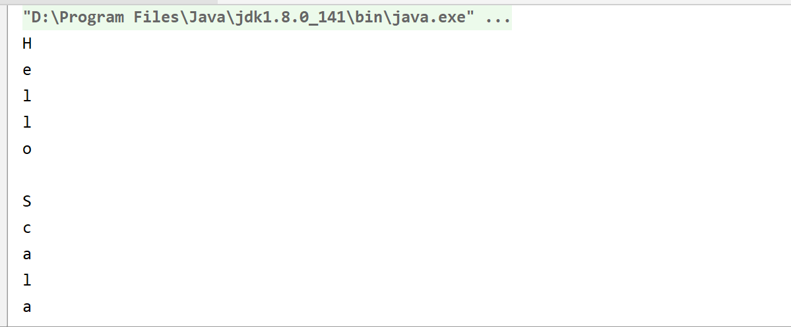

##### flatmap中的模式匹配

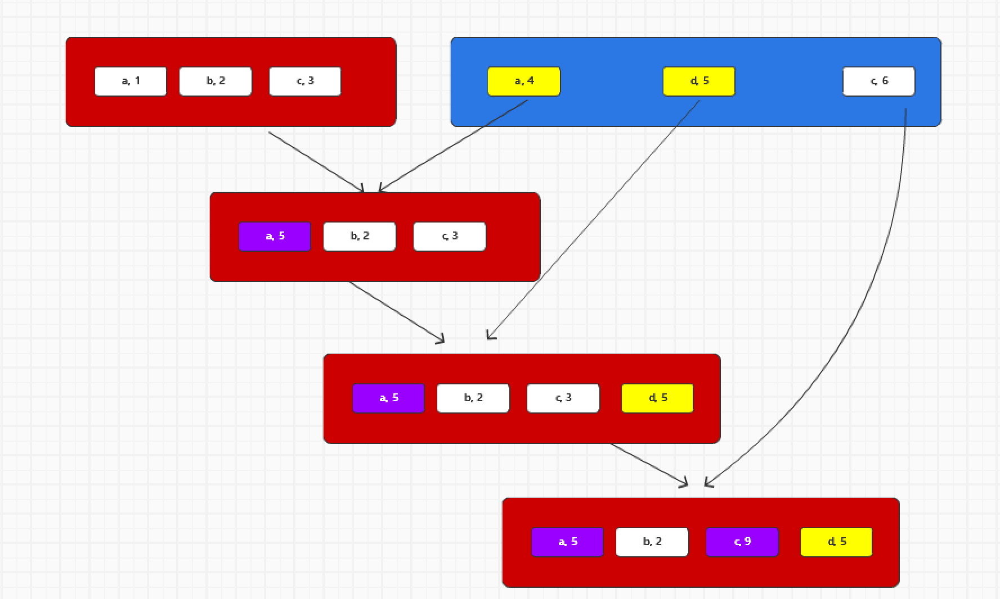

1. 当传入的集合中有不同的数据类型的时候，可以使用case模式匹配进行操作
2. 针对不同的数据类型进行不同的操作，可以改变数据的数量
3. flatmap要求返回的为一个容器类型，如果遍历循的元素本身有类型，可以返回元素本身，默认使用元素本身的类型
4. 如果元素不是容器类型，需要对非容器累类型进行包装，包装为容器类型
5. 同一个flatmap中可以返回不同的容器类型（根据元素的情况）

```scala
package rdd.opration.transform

import org.apache.spark.rdd.RDD
import org.apache.spark.{SparkConf, SparkContext}

object Scala05_Transform_2 {
  def main(args: Array[String]): Unit = {
    val conf: SparkConf = new SparkConf().setMaster("local[*]").setAppName("RDDInstance")

    val sc = new SparkContext(conf)

    val rdd = sc.makeRDD(
      List(
        List(1, 2, 3), 99, List(4, 5, 6)
      )
    )

    // 概念与应用是两个东西
    // 偏函数， 全函数， ;
    rdd.flatMap{
      case list:List[_] => list
      case num: Int => Seq(num)
    }.collect().foreach(println)

    sc.stop()

  }
}
```

##### groupby：函数化简

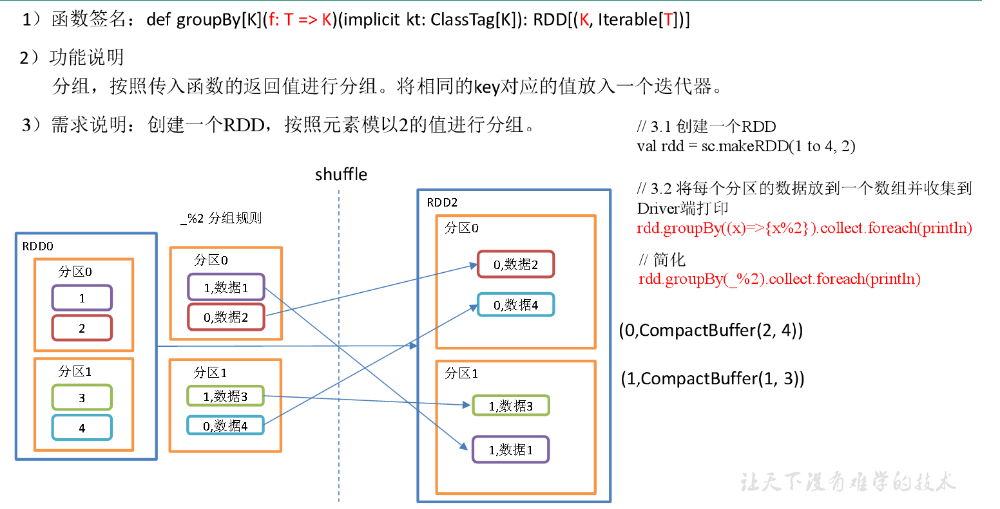


```scala
package rdd.opration.transform

import org.apache.spark.rdd.RDD
import org.apache.spark.{SparkConf, SparkContext}

object Scala06_Transform {
  def main(args: Array[String]): Unit = {
    val conf: SparkConf = new SparkConf().setMaster("local[*]").setAppName("RDDInstance")

    val sc = new SparkContext(conf)

    val rdd: RDD[Int] = sc.makeRDD(
      List(1, 2, 3, 4, 'a', 'A'), 2
    )

    // TODO 将数据区分奇数偶数
    //  groupby： 数据分组；

    // 函数化简
    rdd.groupBy(
      num => {
        if (num % 2 == 0) {
          "偶数"
        } else {
          "奇数"
        }
      }
    ).collect().foreach(println)
    /*
        rdd.groupBy(
          num => {
            if (num % 2 == 0) {
              1
            } else {
              0
            }
          }
        ).collect().foreach(println)
        
       rdd.groupBy(
          num => {
            (num % 2 == 0) 
        ).collect().foreach(println)
        
        rdd.groupBy(
          num => {
            (num % 2) 
        ).collect().foreach(println)
    
    */

    // 下划线代表 处理的数据集中的每一条数据
    rdd.groupBy(_ % 2).collect().foreach(println)

    sc.stop()

  }
}

```

##### groupby：返回值类型（key， （集合））

```scala
package rdd.opration.transform

import org.apache.spark.rdd.RDD
import org.apache.spark.{SparkConf, SparkContext}

object Scala06_Transform_1 {
  def main(args: Array[String]): Unit = {
    val conf: SparkConf = new SparkConf().setMaster("local[*]").setAppName("RDDInstance")

    val sc = new SparkContext(conf)

    val rdd: RDD[Int] = sc.makeRDD(
      List(1, 2, 3, 4, 'a', 'A'), 2
    )

    // 下划线代表 处理的数据集中的每一条数据
    // groupBy返回的数值类型为： K-V  （组名， 相同标记的数据集合）
    val newRDD: RDD[(Int, Iterable[Int])] = rdd.groupBy(_ % 2)

      // .collect().foreach(println)
    sc.stop()
  }
}
```

##### groupby：按照首字母分组

```scala
package rdd.opration.transform

import org.apache.spark.rdd.RDD
import org.apache.spark.{SparkConf, SparkContext}

object Scala06_Transform_2 {
  def main(args: Array[String]): Unit = {
    val conf: SparkConf = new SparkConf().setMaster("local[*]").setAppName("RDDInstance")

    val sc = new SparkContext(conf)

    val rdd: RDD[String] = sc.makeRDD(
      List("hadoop", "hadoop", "spark", "scala")
    )
    rdd.groupBy(_.head).collect().foreach(println)


    // 下划线代表 处理的数据集中的每一条数据
    // groupBy返回的数值类型为： K-V  （组名， 相同标记的数据集合）

      // .collect().foreach(println

    sc.stop()
  }
}

```


##### groupby实现WordCount

1. mapValues： 输入的是 k - v 键值对， 只会对集合（v）进行操作

```scala
package com.atguigu.bigdata.spark.core.rdd.operate.transform

import org.apache.spark.{SparkConf, SparkContext}

object Spark06_RDD_Oper_Transform_3 {

    def main(args: Array[String]): Unit = {

        val conf = new SparkConf().setMaster("local[2]").setAppName("RDDInstance")
        val sc = new SparkContext(conf);

        // TODO RDD - 转换算子 - flatMap
        val rdd = sc.makeRDD(
            List(
                "hello", "hello", "hello", "world"
            )
        )
        // (hello, 5), (world, 4)
        // (word, Iterator( word, word, word ))
        // TODO groupBy算子可以实现 WordCount ( 1 / 10 )
        rdd.groupBy(
            word => {
                word
            }
        ).mapValues(
            iter => {
                iter.size
            }
        ).collect().foreach(println)

        sc.stop()

    }
}
```


##### groupBy：设定操作后分区个数

1. groupBy：操作存在shuffle
2. 需要等数据全部落盘后才能读取数据

```scala
package com.atguigu.bigdata.spark.core.rdd.operate.transform

import org.apache.spark.{SparkConf, SparkContext}

object Spark06_RDD_Oper_Transform_4 {

    def main(args: Array[String]): Unit = {

        val conf = new SparkConf().setMaster("local[2]").setAppName("RDDInstance")
        val sc = new SparkContext(conf);

        // TODO RDD - 转换算子 - flatMap
        val rdd = sc.makeRDD(
            List(
                1,2,3,4,5,6
            ),3
        )

            // 当存在shuffle机制的时候， 过程会分为两段，
    		// 前一阶段操作没有处理完， 后续阶段不能操作
    		// 所有带有shuffle功能的算子， 都可以改变分区；
        //rdd.groupBy(_%2).saveAsTextFile("output")//.collect().foreach(println)
        rdd.groupBy(_%2, 2).saveAsTextFile("output")//.collect().foreach(println)

        rdd.map((_, 1)).reduceByKey(_+_,2)
        // map:将所有单词变为元组，
        // 相同key的元组做 value 相加操作， 设置分区数为2

        sc.stop()

    }
}

```

##### 获取每个分区的最大值

1. mapPartitions： 按照分区进行操作，
2. 要返回值是一个iterrater， 将返回值类型进行包装

```scala
package rdd.opration.transform

import org.apache.spark.rdd.RDD
import org.apache.spark.{SparkConf, SparkContext}

object Scala06_Transform_Test {
  def main(args: Array[String]): Unit = {
    val conf: SparkConf = new SparkConf().setMaster("local[*]").setAppName("RDDInstance")

    val sc = new SparkContext(conf)

    val rdd: RDD[Int] = sc.makeRDD(
      List(1, 2, 3, 4, 'a', 'A'), 3
    )

    // TODO 获取每个分区的最大值
    rdd.mapPartitions(
      iter =>{
        List(iter.max).iterator
          // 使用传进来的iter拿到最大值， 包装为List类型，返回新的iterrater对象
      }
    ).collect().foreach(println)

    sc.stop()

  }
}
```

##### filter

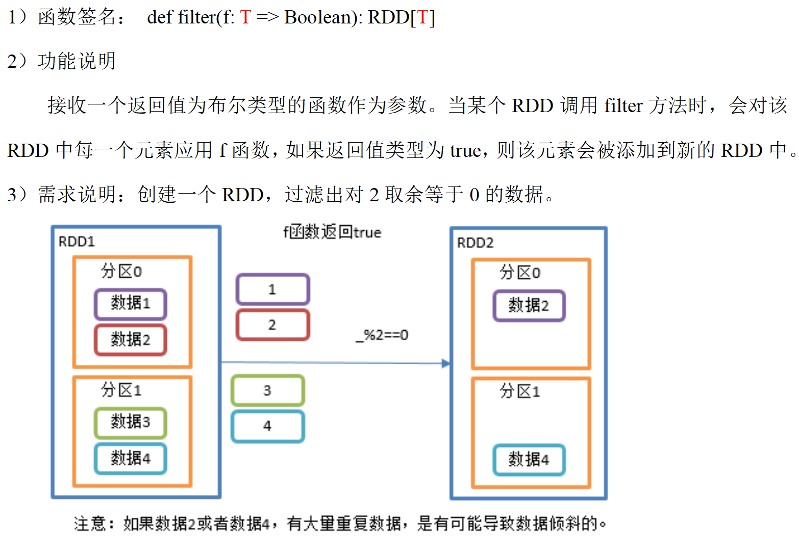

1. 过滤之后数据可能会出现数据倾斜

```scala
package rdd.opration.transform

import org.apache.spark.rdd.RDD
import org.apache.spark.{SparkConf, SparkContext}

object Scala07_Transform_Filter {
  def main(args: Array[String]): Unit = {
    val conf: SparkConf = new SparkConf().setMaster("local[*]").setAppName("RDDInstance")

    val sc = new SparkContext(conf)

    val rdd: RDD[Int] = sc.makeRDD(
      List(1, 2, 3, 4), 2
    )

    // TODO 将数据中的每一条数据进行判断，根据结果判断是否要保存
    //  结果为true 就保存， 为 false 就丢弃;

    // 过滤操作可能会产生数据倾斜
    rdd.filter(
      num => num % 2 == 0
    ).collect().foreach(println)
      

    sc.stop()
  }
}
```

##### distinct： 去重

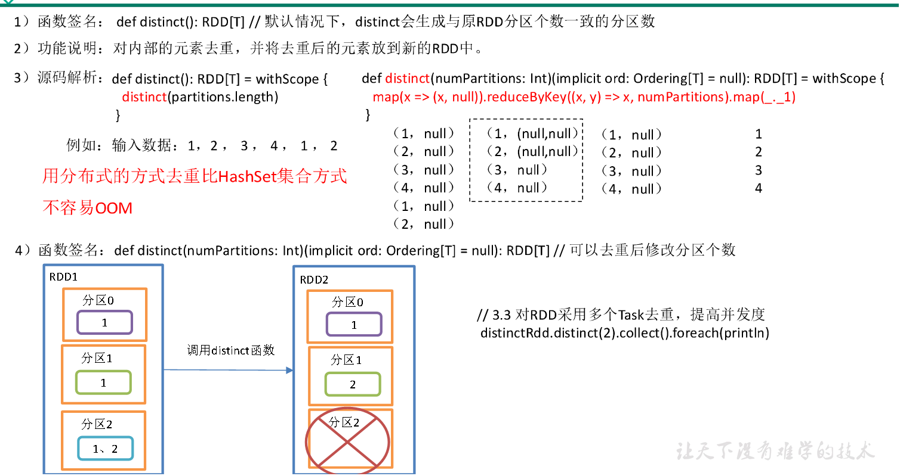

1. reduceByKey((x, _) => x, numPartitions)： 按照相同的key对v进行操作
2. (x, _) => x： 这个匿名函数是对v进行的操作， 将v组成的集合，只留下第一个v， 不关心其他的v
3. 分布式去重

```scala
package com.atguigu.bigdata.spark.core.rdd.operate.transform

import org.apache.spark.{SparkConf, SparkContext}

object Spark08_RDD_Oper_Transform {

    def main(args: Array[String]): Unit = {

        val conf = new SparkConf().setMaster("local[2]").setAppName("RDDInstance")
        val sc = new SparkContext(conf);

        // TODO RDD - 转换算子 - filter
        val rdd = sc.makeRDD(
            List(1,1,1,1)
        )

        // map(x => (x, null)).reduceByKey((x, _) => x, numPartitions).map(_._1)
        // 1,1,1,1
        // (1, null), (1, null), (1, null), (1, null)
        // (1, (null, null, null, null))
        // (1, (   null,    null, null))
        // (1, (         null   , null))
        // (1, (               null))
        // (1, null)
        // 1
        rdd.distinct().collect().foreach(println)

        sc.stop()

    }
}
```

##### coalesce： 缩减分区

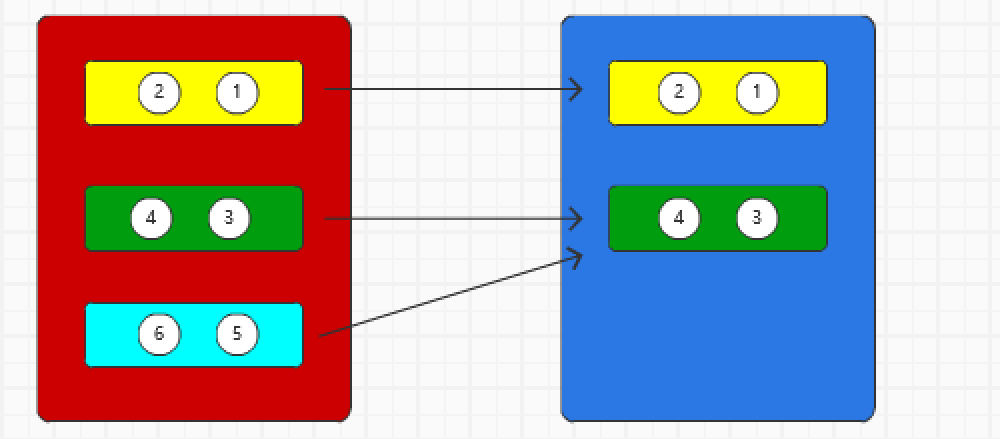

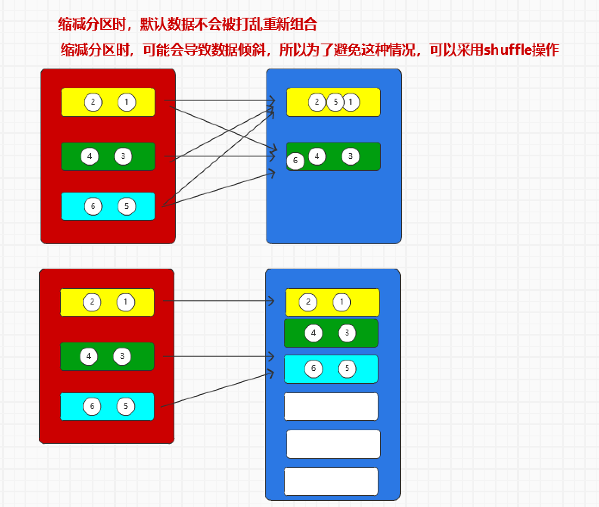


1. 默认没有进行shuffle操作， 需要指定第二个参数为true

```scala
package rdd.opration.transform

import org.apache.spark.rdd.RDD
import org.apache.spark.{SparkConf, SparkContext}

object Scala09_Transform_Coaless {
  def main(args: Array[String]): Unit = {
    val conf: SparkConf = new SparkConf().setMaster("local[*]").setAppName("RDDInstance")

    val sc = new SparkContext(conf)

    val rdd: RDD[Int] = sc.makeRDD(
      List(1, 1, 2, 2, 3, 4), 2
    )


    // TODO 缩减分区就用coaleccs
    //  对分区进行操作 可能会造成数据倾斜， 需要进进行shuffle操作
    //  coalesce 默认没有shuffle操作；
    rdd.coalesce(2, true).saveAsTextFile("output")
    // TODO 扩大分区： repartition:

    sc.stop()
  }
}

```

##### 扩大分区：repartition

1. repartition： 扩大分区
2. 底层默认调用的是coalesce， 默认开启shuffle
3. 数据倾斜可以烤扩大分区解决一部分问题，

```scala
package rdd.opration.transform

import org.apache.spark.rdd.RDD
import org.apache.spark.{SparkConf, SparkContext}

object Scala09_Transform_1 {
  def main(args: Array[String]): Unit = {
    val conf: SparkConf = new SparkConf().setMaster("local[*]").setAppName("RDDInstance")

    val sc = new SparkContext(conf)

    val rdd: RDD[Int] = sc.makeRDD(
      List(1, 1, 2, 2, 3, 4), 2
    )


    // TODO 扩大分区： repartition:
    rdd.repartition(6).saveAsTextFile("output")

    sc.stop()


  }
}
```

##### sortBy：排序

1. 默认按照字典顺序升序排列
2. 第二个参数可以指定升序或者降序

```scala
package com.atguigu.bigdata.spark.core.rdd.operate.transform

import org.apache.spark.{SparkConf, SparkContext}

object Spark10_RDD_Oper_Transform {

    def main(args: Array[String]): Unit = {

        val conf = new SparkConf().setMaster("local[2]").setAppName("RDDInstance")
        val sc = new SparkContext(conf);

        // TODO RDD - 转换算子 - 排序
        val rdd = sc.makeRDD(
            List(
                "1", "11", "3", "2", "22"
            )
        )

        // "1"   => 1   => 1
        // "11"  => 11  => 1
        // "3"   => 3   => 1
        // "2"   => 2   => 0
        // "22"  => 22  => 0
        // sortBy算子是将每一条数据增加排序标记，然后根据标记进行排序，默认为升序
//        rdd.sortBy(
//            str => str.toInt % 2
//        ).collect().foreach(println)

        // "1"   => "1"
        // "11"  => "11"
        // "3"   => "3"
        // "2"   => "2"
        // "22"  => "22"
        // sortBy算子的第二个参数就是设定排序方式，默认取值为true，表示升序，可以设定为false
        rdd.sortBy(
            str => str, false
        ).collect().foreach(println)

        sc.stop()

    }
}

```

##### 自定义类排序

1. 样例类的声明：case
2. 多个排序条件：元组排序

```scala
package rdd.opration.transform

import org.apache.spark.{SparkConf, SparkContext}

object Scala11_Transform {
  def main(args: Array[String]): Unit = {
    val conf: SparkConf = new SparkConf().setMaster("local[*]").setAppName("RDDInstance")

    val sc = new SparkContext(conf)

    val rdd = sc.makeRDD(
      List(
        User(1001, "zhangsan", 1000),
        User(1002, "zhangsan", 5000),
        User(1003, "zhangsan", 4000),
        User(1004, "zhangsan", 3000)
      )
    )

    // TODO 元组的排序， 先按照元组排第一个， 后按照元组排第二个
    // 特殊对象的排序， 声明case的样例类
    rdd.sortBy(
      user => {
        (user.amount, user.name)
      },
      false
    ).collect().foreach(println)

    // 元组的排序
    
    sc.stop()
    
  }
  // 样例类， 完全可以当做普通类来用
  // 可以直接应用在模式匹配中
  // 编译器给样例类生成了很丰富的方法和功能;
  case class User(id: Int, name: String, amount: Int){

  }
}
```

