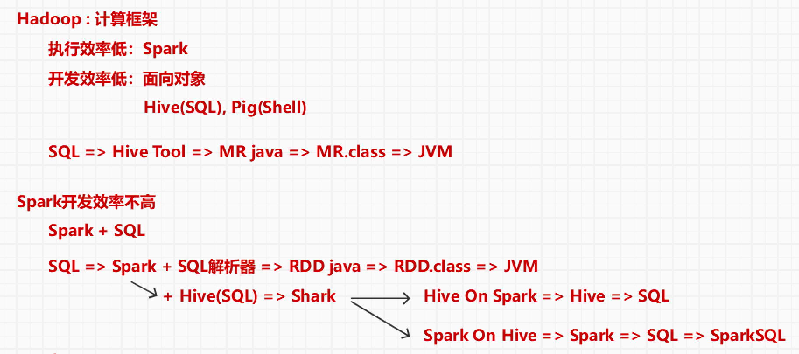
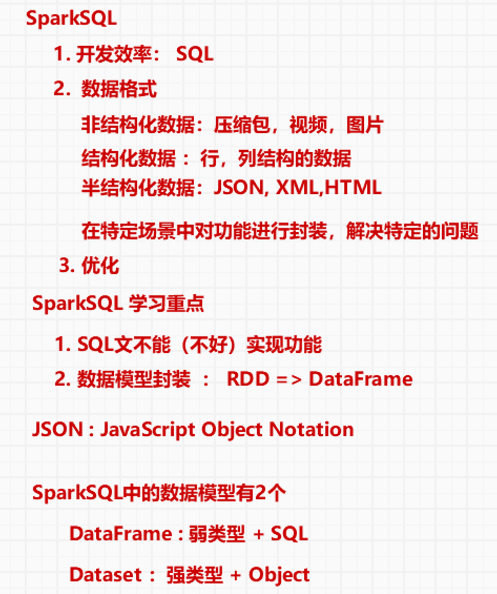
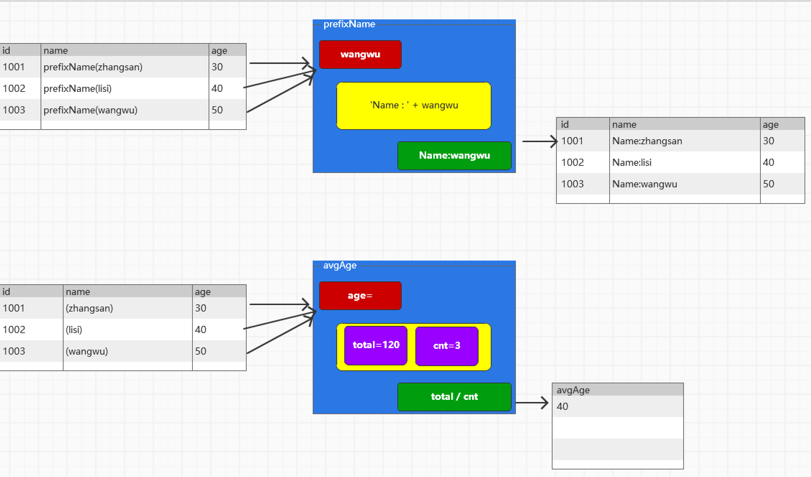
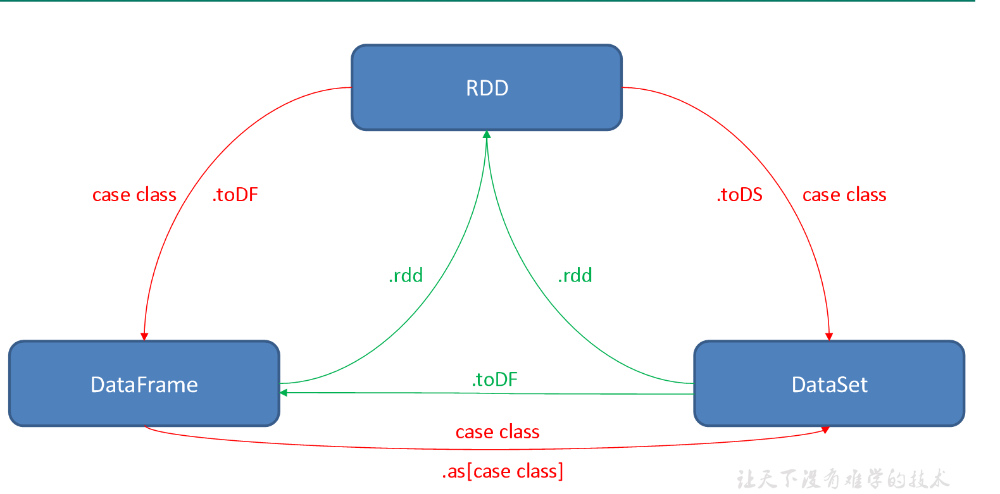

##### 笔记








1. 画图：Spark-SQL
2. Java 主要是在嵌入式，解决业务逻辑，面向对象，解决问题的时候效率低
3. SQL：人工语言，只能在数据库中使用

##### Spark-SQL

1. 数据格式
   1. 非结构化数据： 压缩包，视频，图片
   2. 结构化数据：有行，列，的数据结构
   3. 半结构化数据：JSON， xml， HTML
2. 在特定场景中对特定的功能进行封装，解决特定的问题
3. 数据模型： 两个，【Data Frame, Dataset】
   1. Data Frame: 是弱类型的
   2. Dataset： 是强类型的

##### Spark-SQL重点

1. SQL： SQL文不能实现的功能
2. **封装：对数据模型的封装，RDD => Data Frame**

##### JSON

- JavaScript Object Notation 

**练习模型转换**

##### Data Frame Work 中的SQL两种用法

1. 转换为视图
2. 隐式转换记得加上

```scala
package sql

import org.apache.spark.sql.{DataFrame, SparkSession}

object SparkSQL_01_Data {

  def main(args: Array[String]): Unit = {

    // 获取环境对象
    // Builder ： 构建器模式

    val spark: SparkSession = SparkSession.builder
      .master("local")
      .appName("Spark SQL")
      // .config("spark.some.config.option", "some-value")
      .getOrCreate()

    // RDD 与两种模型之间的相互转换，需要使用到隐式转化，将其导入
    import spark.implicits._

    // TODO 构建模型
    val df: DataFrame = spark.read.json("data/user.json")
    // df.show()

    // TODO 使用SQL方式访问 DataFrame
    // df.createTempView("user")
    // spark.sql("select * from user").show()

    // TODO 使用DSL  访问DAtaFrame


      spark.stop()


  }
}
```

##### 模型之间的相互转换



1. RDD转化为DS需要使用到反射， 定义样例类

```java
// TODO 将RDD 模型转换为 DataFrame
//  RDD模型侧重于数据本身， 没有结构信息， 想要转换，要增加结构信息
//  RDD 模型出现的早，二次编译转换, 需要使用隐式转换, 顺序按照指定的顺序;
```
```scala
    val spark: SparkSession = SparkSession.builder()
      .master("local[*]")
      .appName("sparksql")
      .getOrCreate()

    // TODO SparkSQL中存在大量转换的操作，需要引入转换规则
    //  这里的spark 是环境的对象名称， 上边 new 出来的对象
    //      Scala语言的导入对象的内容===【对象只能 val 声明】;
    import spark.implicits._

    val df: DataFrame = spark.read.json("data/user.json")

    // df.show()
    df.createTempView("user")

    // spark.sql("select * from user").show()

    // df.select("name").show()

    val rdd0: RDD[(Int, String, Int)] = spark.sparkContext.makeRDD(
      List(
        (1, "zhangsan", 19),
        (2, "lisi", 27),
        (3, "wangwu", 32),
      )
    )


    // -----------01-----------rdd转换为df
    // TODO 将RDD 模型转换为 DataFrame
    //  RDD模型侧重于数据本身， 没有结构信息， 想要转换，要增加结构信息
    //  RDD 模型出现的早，二次编译转换, 需要使用隐式转换, 顺序按照指定的顺序;
    val df1: DataFrame = rdd0.toDF("id", "name", "age")
    // df.show()


    // ------------------------02-- df转换为rdd--
    val rdd12: RDD[Row] = df1.rdd
    // rdd12.collect().foreach(println)

    // -----------03 df 转换为ds--
    val ds31: Dataset[User] = df1.as[User]
    // ds31.show()

    // --------------04-- ds转换为df---
    val df41: DataFrame = ds31.toDF()
    val df42: DataFrame = ds31.toDF("id1", "name1", "age1")
    // df41.show()
    // df42.show()

    // ---------05 ---ds转 rdd
    val rdd51: RDD[User] = ds31.rdd
    // rdd51.collect().foreach(println)

    val ds61: Dataset[(Int, String, Int)] = rdd0.toDS()


    // ================06---mapRDD转换ds
    val mapRDD: RDD[User] = rdd0.map {
      case (id, name, age) => {
        User(id, name, age)
      }
    }
    val ds62: Dataset[User] = mapRDD.toDS()
    // ds62.show()
```

##### UDF与UDAF函数

1. UDAF函数

```scala
package sql

import org.apache.spark.sql.expressions.Aggregator
import org.apache.spark.sql.{DataFrame, Encoder, Encoders, SparkSession, functions}

object SparkSQL_07_RDD_DataFrame_UDAF {
  def main(args: Array[String]): Unit = {

    val spark: SparkSession = SparkSession.builder
      .master("local")
      .appName("Spark SQL")
      // .config("spark.some.config.option", "some-value")
      .getOrCreate()

    val df: DataFrame = spark.read.json("data/user.json")

    df.createTempView("user")

    // -------------------------------07-2-----------------------
    // TODO 用户定义的聚合函数， UDAF【User Define Aggragate Function】
    //  需要曹勇函数类来实现;

    spark.udf.register("avgAge", (age: Int) => {
      "Name:  ==> " + age
    })

    spark.udf.register("avgAge", functions.udaf(new MyAvgUDAF))

    spark.sql("select avgAge(age) from user").show


    spark.stop()
  }

  case class AvgAgeBuffer(var total: Long, var cnt: Int)
  case class User(id: Long, name: String, age: Long)

  // TODO 自定义聚合函数 UDAF
  //    1. 继承类
  //    2. 定义泛型
  //      IN： Long
  //      BUFFER： 缓冲区类型， （long， long）
  //      OUT： Long
  //    3. 重写方法 （4+2）;
  class MyAvgUDAF extends Aggregator[Long, AvgAgeBuffer, Long]{

    // TODO zero： 表示计算的初始值，
    override def zero: AvgAgeBuffer = {
      AvgAgeBuffer(0L, 0)
    }

    // TODO 聚合数据，
    override def reduce(buffer: AvgAgeBuffer, age: Long): AvgAgeBuffer = {
      buffer.total += age
      buffer.cnt += 1
      buffer
    }

    // 分布式计算，合并多个分区的缓冲区
    override def merge(b1: AvgAgeBuffer, b2: AvgAgeBuffer): AvgAgeBuffer = {
      b1.total += b2.total
      b1.cnt += b2.cnt
      b1
    }

    // TODO 完成计算
    override def finish(buffer: AvgAgeBuffer): Long = {

      buffer.total / buffer.cnt
    }

    override def bufferEncoder: Encoder[AvgAgeBuffer] = Encoders.product

    override def outputEncoder: Encoder[Long] = Encoders.scalaLong
  }

}
```

2. UDF函数

```scala
package sql

import org.apache.spark.sql.{DataFrame, SparkSession}

object SparkSQL_07_RDD_DataFrame_UDF {
  def main(args: Array[String]): Unit = {

    val spark: SparkSession = SparkSession.builder
      .master("local")
      .appName("Spark SQL")
      // .config("spark.some.config.option", "some-value")
      .getOrCreate()

    val df: DataFrame = spark.read.json("data/user.json")

    df.createTempView("user")

    // -------------------------------07-1-----------------------
    // TODO 在Spark中添加自定义函数UDF
    //    每一行都会执行函数， 类似于 map 函数 ;
    spark.udf.register("prefixName", (name: String) => {
      "Name:  ==> " + name
    })

    spark.sql("select prefixName(name) from user").show


    spark.stop()
  }

  case class User(id: Long, name: String, age: Long)

}
```

##### 今天的代码

```scala
package sql

import org.apache.spark.SparkConf
import org.apache.spark.rdd.RDD
import org.apache.spark.sql.expressions.Aggregator
import org.apache.spark.sql.{DataFrame, Dataset, Encoder, Encoders, Row, SparkSession, functions}

object SparkSQL_00_Test_01 {

  def main(args: Array[String]): Unit = {

    // 1 创建上下文环境配置对象
    val conf: SparkConf = new SparkConf().setAppName("SparkSQLTest").setMaster("local[*]")

    // 2 创建SparkSession对象
    val spark: SparkSession = SparkSession.builder().config(conf).getOrCreate()

    // TODO SparkSQL中含有大量的转换操作，这个转换过程是隐式完成的，所以需要引入转换规则
    import spark.implicits._

    val rdd0: RDD[(Int, String, Int)] = spark.sparkContext.makeRDD(List(
      (1, "zhangsan", 22),
      (2, "zhangsan", 27),
      (3, "zhangsan", 29),
    ))


    val df11: DataFrame = rdd0.toDF("id", "name", "age")
    df11.show()
    println("---------------")

    val rdd22: RDD[Row] = df11.rdd
    rdd22.collect().foreach(println)
    println("---------------")

    val mapRDD0: RDD[User] = rdd0.map {
      case (id, name, age) => {
        User(id, name, age)
      }
    }

    val ds33: Dataset[User] = mapRDD0.toDS()
    ds33.show()
    println("---------------")

    val rdd44: RDD[User] = ds33.rdd
    rdd44.collect().foreach(println)
    println("--------------")

    val ds55: Dataset[User] = df11.as[User]
    ds55.show()
    println("-------------")

    val df66: DataFrame = ds55.toDF("id11", "name11", "age11")
    df66.show()

    println("================================")

    val dfmy1: DataFrame = spark.read.json("data/user.json")

    dfmy1.createTempView("user")

    spark.udf.register("myavg", functions.udaf(new MyAvg))
    spark.udf.register("prefix", (name: String) =>{
      "name ==== >> " + name
    })

    spark.sql("select myavg(age) from user").show()
    spark.sql("select prefix(name) from user").show()

    // 5 释放资源
    spark.stop()
  }

  case class User(var id: Long, var name: String, var age: Long)

  case class MyBuffer(var total: Long, var cnt: Int)

  class MyAvg extends Aggregator[Long, MyBuffer, Long] {
    override def zero: MyBuffer = {
      MyBuffer(0L, 0)
    }

    override def reduce(b: MyBuffer, a: Long): MyBuffer = {
      b.total += a
      b.cnt += 1
      b
    }

    override def merge(b1: MyBuffer, b2: MyBuffer): MyBuffer = {
      b1.total += b2.total
      b1.cnt += b2.cnt
      b1
    }

    override def finish(reduction: MyBuffer): Long = {
      reduction.total / reduction.cnt
    }

    override def bufferEncoder: Encoder[MyBuffer] = Encoders.product

    override def outputEncoder: Encoder[Long] = Encoders.scalaLong
  }
}
```

hive数据库启动

```
hadoop_services.sh start
hive_services.sh start
```


